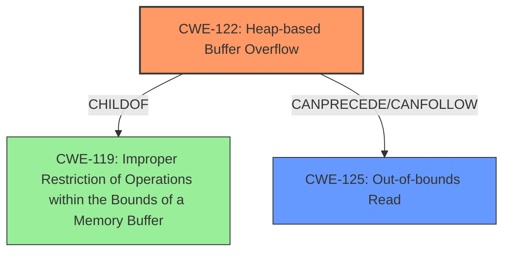

# Final Resolution for CVE-2021-46527

# Summary
| CWE ID | CWE Name | Confidence | CWE Abstraction Level | CWE Vulnerability Mapping Label | CWE-Vulnerability Mapping Notes |
|---|---|---|---|---|---|
| CWE-122 | Heap-based Buffer Overflow | 0.95 | Variant | Allowed | Primary CWE: Root cause |
| CWE-125 | Out-of-bounds Read | 0.70 | Base | Allowed | Secondary CWE: Related effect |
| CWE-193 | Off-by-one Error | 0.10 | Base | Not Applicable | Rejected: The overflow is not the result of an off-by-one calculation, but rather a lack of bounds checking. |
| CWE-190 | Integer Overflow or Wraparound | 0.10 | Base | Not Applicable | Rejected: There is no evidence of integer overflows being involved in calculating the buffer size. |
| CWE-131 | Incorrect Calculation of Buffer Size | 0.10 | Base | Not Applicable | Rejected: The buffer allocation is not a result of miscalculating the buffer size. |
| CWE-170 | Improper Null Termination | 0.10 | Base | Not Applicable | Rejected: The overflow is writing past the end of the buffer before the null terminator. |

## Evidence and Confidence

*   **Confidence Score:** 0.92
*   **Evidence Strength:** HIGH

## Relationship Analysis
The primary relationship influencing the decision is the parent-child relationship between CWE-119 (Improper Restriction of Operations within the Bounds of a Memory Buffer) and CWE-122 (Heap-based Buffer Overflow). CWE-122 is a variant of CWE-119, offering a more specific classification for heap-based overflows. CWE-125 (Out-of-bounds Read) can be a consequence of or contributor to a buffer overflow, establishing a chain relationship. The abstraction levels (Variant for CWE-122, Base for CWE-125) helped ensure appropriate granularity.

## Vulnerability Chain
The vulnerability chain starts with a **heap buffer overflow** (**CWE-122**) in the `mjs_get_cstring` function. This occurs due to improper bounds checking or memory allocation. As a result, the function attempts to read beyond the allocated memory buffer, leading to an **out-of-bounds read** (**CWE-125**). The initial flaw is the missing or inadequate bounds checking, which allows the overflow to occur. The consequence is a crash (as stated in the initial analysis). The chain is fairly complete based on the provided information.

## Summary of Analysis
The initial analysis correctly identifies the primary weakness as **CWE-122 (Heap-based Buffer Overflow)**. The evidence directly supports this classification, with the vulnerability description clearly stating "heap buffer overflow" and the CVE summary confirming the same. The confidence score of 0.95 is maintained due to this strong evidence.

The inclusion of **CWE-125 (Out-of-bounds Read)** as a secondary effect is also justified, based on the statement that "`mjs_get_cstring` function attempts to read beyond the allocated memory buffer." This suggests an out-of-bounds read as a consequence or contributing factor. The confidence score of 0.70 is maintained because this is considered a secondary effect.

The retriever results were considered, specifically **CWE-193 (Off-by-one Error)**, **CWE-190 (Integer Overflow or Wraparound)**, **CWE-131 (Incorrect Calculation of Buffer Size)**, and **CWE-170 (Improper Null Termination)**. These were explicitly rejected as follows:
*   **CWE-193** was rejected because the overflow is not the result of an off-by-one calculation, but rather a lack of bounds checking.
*   **CWE-190** was rejected as there is no evidence of integer overflows being involved in calculating the buffer size.
*   **CWE-131** was rejected because the buffer allocation is not a result of miscalculating the buffer size.
*   **CWE-170** was rejected because the overflow is writing past the end of the buffer before the null terminator.

The graph relationships support the primary classification of CWE-122, as it is a more specific variant of the broader CWE-119. The chain relationship between CWE-122 and CWE-125 further clarifies the vulnerability's progression.

The selected CWEs are at the optimal level of specificity, with CWE-122 being a Variant that accurately describes the **heap-based buffer overflow**, and CWE-125 being a Base-level CWE that captures the **out-of-bounds read** aspect.