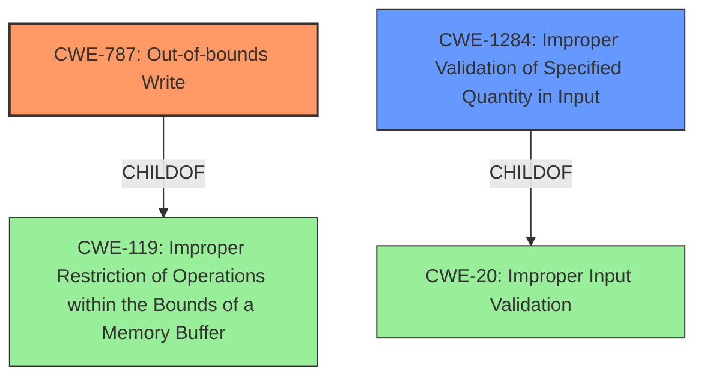

# Final Resolution for CVE-2021-46598

# Summary
| CWE ID | CWE Name | Confidence | CWE Abstraction Level | CWE Vulnerability Mapping Label | CWE-Vulnerability Mapping Notes |
|---|---|---|---|---|---|
| CWE-787 | Out-of-bounds Write | 0.95 | Base | Allowed | Primary CWE |
| CWE-1284 | Improper Validation of Specified Quantity in Input | 0.75 | Base | Allowed | Secondary Candidate |

## Evidence and Confidence

*   **Confidence Score:** 0.90
*   **Evidence Strength:** HIGH

## Relationship Analysis
The primary CWE is CWE-787 (**Out-of-bounds Write**), which is a child of CWE-119 (**Improper Restriction of Operations within the Bounds of a Memory Buffer**). The initial analysis correctly identified this hierarchical relationship. The secondary CWE is CWE-1284 (**Improper Validation of Specified Quantity in Input**), which is a child of CWE-20 (**Improper Input Validation**).

## Vulnerability Chain
The vulnerability chain starts with a lack of proper validation of user-supplied data (CWE-1284). This leads to a condition where data is written past the end of the intended buffer, resulting in memory corruption (CWE-787). The final impact is arbitrary code execution in the context of the current process.

## Summary of Analysis
The initial analysis correctly identified CWE-787 as the primary **WEAKNESS**, given the explicit mention of "memory corruption" in the vulnerability description. The criticism correctly pointed out that CWE-20 is too general and discouraged by MITRE. The vulnerability description mentions "lack of proper validation of user-supplied data", and the criticism notes that CWE-1284 (**Improper Validation of Specified Quantity in Input**) could be a better fit. The details state that the software parsing the JT files does not check for the length of the data and then writes the user-supplied data to the memory. Therefore, CWE-1284 is more specific and accurately captures the root cause of the vulnerability. My assessment is based on the evidence provided in the vulnerability description and the CWE specifications. I've replaced CWE-20 with CWE-1284, which is at the optimal level of specificity for this vulnerability.