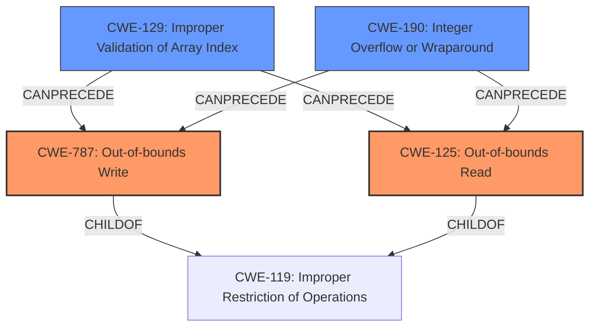

# Analysis Report for CVE-2021-46814

# Vulnerability Analysis Report: CVE-2021-46814

## Description

The video framework has an out-of-bounds memory read/write vulnerability. Successful exploitation of this vulnerability may affect system availability.

## Vulnerability Description Key Phrases

**Rootcause:** out-of-bounds memory read/write
**Component:** video framework

## Analysis (with Relationship Data)

# Summary
| CWE ID | CWE Name | Confidence | CWE Abstraction Level | CWE Vulnerability Mapping Label | CWE-Vulnerability Mapping Notes |
|---|---|---|---|---|---|
| CWE-125 | Out-of-bounds Read | 0.9 | Base | Allowed | Primary CWE |
| CWE-787 | Out-of-bounds Write | 0.9 | Base | Allowed | Primary CWE |

## Evidence and Confidence

*   **Confidence Score:** 0.9
*   **Evidence Strength:** HIGH

- **Analysis and Justification:**  
  - *Explanation:* The vulnerability description explicitly states an **out-of-bounds memory read/write** vulnerability exists in the video framework. This directly corresponds to CWE-125 (Out-of-bounds Read) and CWE-787 (Out-of-bounds Write). The CVE Reference Links Content Summary further reinforces this by stating the root cause is an **out-of-bounds memory read and write** vulnerability. Successful exploitation impacts system availability. Given the explicit nature of the vulnerability and the direct match with the CWE descriptions, both CWE-125 and CWE-787 are highly appropriate. They are at the Base level of abstraction, which is preferred. The MITRE mapping guidance indicates both are ALLOWED.
  
  - *Relationship Analysis:* CWE-125 and CWE-787 are related to CWE-119 (Improper Restriction of Operations within the Bounds of a Memory Buffer), but CWE-125 and CWE-787 are more specific. CWE-125 and CWE-787 can precede other weaknesses like CWE-825 (Expired Pointer Dereference) or CWE-824 (Access of Uninitialized Pointer), but without further information, this is speculative.

- **Confidence Score:**  
  - Confidence: 0.9 (High confidence due to the clear description and supporting CVE reference)
---

## Criticism of Analysis

Okay, I've reviewed the provided analysis and the full CWE specifications. Here's my critique:

**Overall Assessment:**

The analysis is generally good and correctly identifies CWE-125 and CWE-787 as the primary weaknesses. The confidence level of 0.9 is justified given the explicit nature of the vulnerability description. The justification provided is also sound. However, there are areas where the analysis could be improved, particularly in considering potential cascading or related weaknesses, even if they are considered speculative.

**Detailed Review:**

1.  **CWE-125 and CWE-787 Identification and Justification:**

    *   **Strengths:** The direct mapping of "out-of-bounds memory read/write" to CWE-125 and CWE-787 is accurate and well-supported by the vulnerability description. The explanation clearly articulates the relationship between the vulnerability and the CWE definitions. Inclusion of both CWE-125 and CWE-787 is appropriate because the vulnerability description includes both a read and a write. The choice of Base level is also appropriate.
    *   **Areas for Improvement:** While the analysis notes that CWE-125 and CWE-787 are more specific than CWE-119, it could elaborate slightly more on why CWE-119 is *not* the best choice. Specifically, the CWE specifications themselves recommend against using CWE-119 if more specific CWEs are available. Also, consider elaborating the "Attack Vectors" point of the CVE Reference Links Content Summary. Is there a particular file format or codec that's most vulnerable, for example?

2.  **Relationship Analysis:**

    *   **Strengths:** The discussion of the relationship between CWE-125/787 and CWE-119 is accurate.
    *   **Areas for Improvement:** The analysis briefly mentions potential cascading weaknesses like CWE-825 (Expired Pointer Dereference) or CWE-824 (Access of Uninitialized Pointer). While it's stated that this is speculative without further information, it would be beneficial to explore common scenarios where these cascading weaknesses might occur in the context of video processing. For example:

        *   *Scenario 1:* The out-of-bounds read could occur when accessing an element of a video frame buffer after the buffer has been deallocated (potentially leading to CWE-825).
        *   *Scenario 2:* The out-of-bounds write could corrupt a pointer used later in the code, causing an attempt to access an uninitialized pointer (CWE-824) or a write to an unexpected memory location.

        Even if these are speculative, mentioning them adds value and shows a deeper understanding of the potential implications. It also highlights areas for further investigation. The retriever results suggest some other, more probable chains. The following seem most relevant:

            * CWE-129: Improper Validation of Array Index: This is a very plausible root cause, especially if the video data is being parsed or processed using array indexing. A failure to properly validate the index could lead to the out-of-bounds read/write.
            * CWE-193: Off-by-one Error: This type of error often occurs in loop boundaries or when calculating buffer sizes, and it's a common cause of out-of-bounds access.

3.  **CWE Examples from Database:**

    *   **Strengths:** The provided examples of CWE-119 are relevant and illustrate common buffer overflow scenarios.
    *   **Areas for Improvement:** It would strengthen the analysis to include examples that are more specific to multimedia or video processing. While the CWE database examples are helpful for general understanding, examples from similar contexts (e.g., image processing, audio processing) would be more impactful.

4.  **Mitigation Considerations:**

    *   **Strengths:** The analysis acknowledges that CWE-125 and CWE-787 are both covered.
    *   **Areas for Improvement:** The analysis could include suggestions for specific mitigations relevant to video processing.
        *   *Input Validation:* Implement robust input validation to ensure that video files conform to expected formats and that metadata (e.g., dimensions, frame sizes) is within acceptable limits. This directly addresses CWE-129.
        *   *Bounds Checking:* Enforce strict bounds checking on all array and pointer accesses to prevent out-of-bounds reads and writes.
        *   *Safe Memory Management:* Consider using safer memory management techniques, such as smart pointers or garbage collection, to reduce the risk of memory corruption.
        *    *Fuzzing:* Implement robust fuzzing strategies to identify edge cases.

5.  **Retriever Results**

    *   CWE-190: Integer Overflow or Wraparound: The retriever results suggest this is related. If integer values are used to calculate buffer sizes or offsets, this is a high probability root cause that should be mentioned.
    *   CWE-823: Use of Out-of-range Pointer Offset: If pointer arithmetic is used, this is also a probable root cause.
    *   CWE-129: Improper Validation of Array Index: As mentioned previously, it is a good idea to mention this if array indexes are used.
    *    CWE-1285: Improper Validation of Specified Index, Position, or Offset in Input. If a position or offset is taken as input, this should be mentioned.

**Recommendations:**

1.  **Expand the Justification:** While the current justification is good, elaborate on why CWE-119 is *not* the best choice and highlight the specific benefits of using CWE-125 and CWE-787.
2.  **Explore Cascading Weaknesses:** Even if speculative, discuss potential cascading weaknesses (e.g., CWE-824, CWE-825) in the context of common video processing scenarios.
3.  **Include Multimedia-Specific Examples:** Add examples of out-of-bounds read/write vulnerabilities in multimedia applications or video codecs to illustrate the real-world impact of these weaknesses.
4.  **Detail Targeted Mitigations:** Include more specific mitigation strategies that are relevant to video processing, such as input validation of video file formats and bounds checking on frame buffer accesses.
5.  **Discuss Probability Chains based on Retriever Results:** For the other related CWEs in the retriever results, mention the probability, and what conditions will cause this to be more likely.

By incorporating these suggestions, the analysis can become even more comprehensive and provide a more valuable assessment of the vulnerability.

## Final Resolution

# Summary
| CWE ID | CWE Name | Confidence | CWE Abstraction Level | CWE Vulnerability Mapping Label | CWE-Vulnerability Mapping Notes |
|---|---|---|---|---|---|
| CWE-787 | Out-of-bounds Write | 0.9 | Base | Allowed | Primary CWE |
| CWE-125 | Out-of-bounds Read | 0.9 | Base | Allowed | Primary CWE |
| CWE-129 | Improper Validation of Array Index | 0.6 | Variant | Allowed | Secondary Candidate |
| CWE-190 | Integer Overflow or Wraparound | 0.5 | Base | Allowed | Secondary Candidate |

## Evidence and Confidence

*   **Confidence Score:** 0.8
*   **Evidence Strength:** MEDIUM

## Relationship Analysis
The primary relationship is the direct match between the vulnerability description ("out-of-bounds memory read/write") and the definitions of CWE-125 (**Out-of-bounds Read**) and CWE-787 (**Out-of-bounds Write**). These are child relationships of the more general CWE-119 (**Improper Restriction of Operations within the Bounds of a Memory Buffer**), but CWE-125 and CWE-787 are more specific and therefore preferred. The retriever results suggest CWE-129 (**Improper Validation of Array Index**) and CWE-190 (**Integer Overflow or Wraparound**) as potential root causes that could precede CWE-787 and CWE-125.

## Vulnerability Chain
The vulnerability chain starts with a potential root cause like CWE-129 (**Improper Validation of Array Index**) or CWE-190 (**Integer Overflow or Wraparound**), which leads to an out-of-bounds access, manifesting as either CWE-125 (**Out-of-bounds Read**) or CWE-787 (**Out-of-bounds Write**). The impact is system availability.

*   **Root Cause:** CWE-129 or CWE-190
*   **Weakness:** CWE-787 or CWE-125
*   **Impact:** System availability

## Summary of Analysis
The initial analysis correctly identifies CWE-125 and CWE-787 as the primary weaknesses, given the explicit "out-of-bounds memory read/write" description in the vulnerability report. This assessment is based directly on the provided evidence. The criticism highlights the importance of considering potential cascading weaknesses and providing more context-specific examples and mitigations. The retriever results point to CWE-129 (**Improper Validation of Array Index**) and CWE-190 (**Integer Overflow or Wraparound**) as possible root causes. While the description doesn't explicitly state these, they are plausible given the context of video processing, where array indexing and size calculations are common. Therefore, I am adding these as secondary candidates.

The graph relationships influenced the decision by highlighting the parent-child relationship between CWE-119 and the more specific CWE-125 and CWE-787. It also illustrates the potential chain relationship with CWE-129 and CWE-190 as preceding causes.

The selected CWEs are at the optimal level of specificity. CWE-125 and CWE-787 are base-level CWEs that directly describe the observed behavior. CWE-129 and CWE-190 are added as secondary candidates because they are plausible root causes within the context of video processing, but their presence cannot be confirmed without further information.

Relevant evidence from the vulnerability description: "The video framework has an out-of-bounds memory read/write vulnerability. Successful exploitation of this vulnerability may affect system availability."

*Report generated on 2025-03-18 05:18:48*
