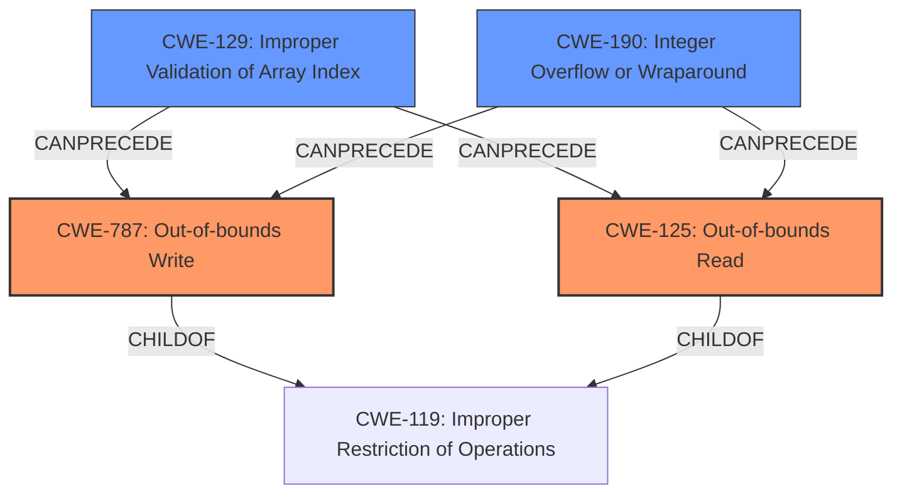

# Final Resolution for CVE-2021-46814

# Summary
| CWE ID | CWE Name | Confidence | CWE Abstraction Level | CWE Vulnerability Mapping Label | CWE-Vulnerability Mapping Notes |
|---|---|---|---|---|---|
| CWE-787 | Out-of-bounds Write | 0.9 | Base | Allowed | Primary CWE |
| CWE-125 | Out-of-bounds Read | 0.9 | Base | Allowed | Primary CWE |
| CWE-129 | Improper Validation of Array Index | 0.6 | Variant | Allowed | Secondary Candidate |
| CWE-190 | Integer Overflow or Wraparound | 0.5 | Base | Allowed | Secondary Candidate |

## Evidence and Confidence

*   **Confidence Score:** 0.8
*   **Evidence Strength:** MEDIUM

## Relationship Analysis
The primary relationship is the direct match between the vulnerability description ("out-of-bounds memory read/write") and the definitions of CWE-125 (**Out-of-bounds Read**) and CWE-787 (**Out-of-bounds Write**). These are child relationships of the more general CWE-119 (**Improper Restriction of Operations within the Bounds of a Memory Buffer**), but CWE-125 and CWE-787 are more specific and therefore preferred. The retriever results suggest CWE-129 (**Improper Validation of Array Index**) and CWE-190 (**Integer Overflow or Wraparound**) as potential root causes that could precede CWE-787 and CWE-125.

## Vulnerability Chain
The vulnerability chain starts with a potential root cause like CWE-129 (**Improper Validation of Array Index**) or CWE-190 (**Integer Overflow or Wraparound**), which leads to an out-of-bounds access, manifesting as either CWE-125 (**Out-of-bounds Read**) or CWE-787 (**Out-of-bounds Write**). The impact is system availability.

*   **Root Cause:** CWE-129 or CWE-190
*   **Weakness:** CWE-787 or CWE-125
*   **Impact:** System availability

## Summary of Analysis
The initial analysis correctly identifies CWE-125 and CWE-787 as the primary weaknesses, given the explicit "out-of-bounds memory read/write" description in the vulnerability report. This assessment is based directly on the provided evidence. The criticism highlights the importance of considering potential cascading weaknesses and providing more context-specific examples and mitigations. The retriever results point to CWE-129 (**Improper Validation of Array Index**) and CWE-190 (**Integer Overflow or Wraparound**) as possible root causes. While the description doesn't explicitly state these, they are plausible given the context of video processing, where array indexing and size calculations are common. Therefore, I am adding these as secondary candidates.

The graph relationships influenced the decision by highlighting the parent-child relationship between CWE-119 and the more specific CWE-125 and CWE-787. It also illustrates the potential chain relationship with CWE-129 and CWE-190 as preceding causes.

The selected CWEs are at the optimal level of specificity. CWE-125 and CWE-787 are base-level CWEs that directly describe the observed behavior. CWE-129 and CWE-190 are added as secondary candidates because they are plausible root causes within the context of video processing, but their presence cannot be confirmed without further information.

Relevant evidence from the vulnerability description: "The video framework has an out-of-bounds memory read/write vulnerability. Successful exploitation of this vulnerability may affect system availability."