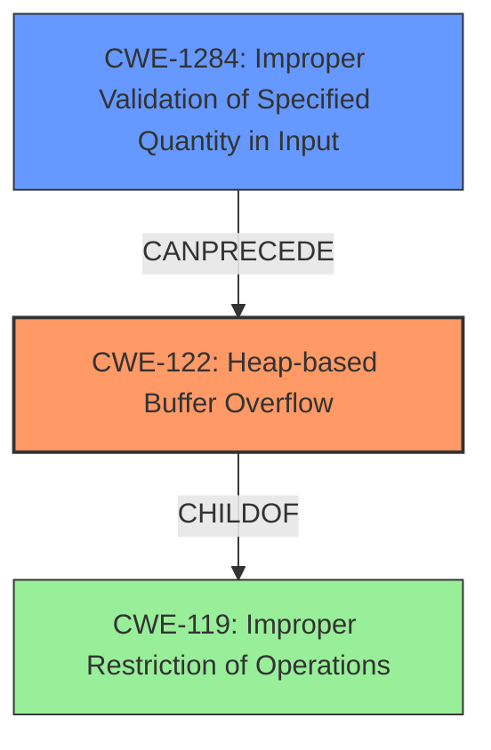

# Analysis Report for CVE-2021-46822

# Vulnerability Analysis Report: CVE-2021-46822

## Description

The PPM reader in libjpeg-turbo through 2.0.90 mishandles use of tjLoadImage for loading a 16-bit binary PPM file into a grayscale buffer and loading a 16-bit binary PGM file into an RGB buffer. This is related to a heap-based buffer overflow in the get_word_rgb_row function in rdppm.c.

## Vulnerability Description Key Phrases

**Weakness:** heap-based buffer overflow
**Product:** libjpeg-turbo
**Version:** through 2.0.90
**Component:** PPM reader, get_word_rgb_row function in rdppm.c

## Analysis (with Relationship Data)

# Summary
| CWE ID | CWE Name | Confidence | CWE Abstraction Level | CWE Vulnerability Mapping Label | CWE-Vulnerability Mapping Notes |
|---|---|---|---|---|---|
| CWE-122 | Heap-based Buffer Overflow | 0.95 | Variant | Allowed | Primary CWE |
| CWE-1284 | Improper Validation of Specified Quantity in Input | 0.70 | Base | Allowed | Secondary Candidate |

## Evidence and Confidence

*   **Confidence Score:** 0.90
*   **Evidence Strength:** HIGH

- **Analysis and Justification:**  
  - *Explanation:* The vulnerability description clearly states a "**heap-based buffer overflow**" in the `get_word_rgb_row` function of the PPM reader in libjpeg-turbo. This directly corresponds to CWE-122 (Heap-based Buffer Overflow). The CVE Reference Links Content Summary further supports this by describing how loading a 16-bit PPM file into a grayscale uncompressed image buffer can cause a buffer overrun, leading to a crash. The **weakness** explicitly mentions a **heap-based buffer overflow**. The mapping guidance for CWE-122 indicates that it is ALLOWED as it is a Variant level of abstraction.
  - *Relationship Analysis:* CWE-122 is a variant of buffer overflow, specifically occurring on the heap. It is related to CWE-119 (Improper Restriction of Operations within the Bounds of a Memory Buffer). While CWE-787 (Out-of-bounds Write) is a parent of CWE-122, the description specifies "heap-based," making CWE-122 the more accurate choice.

- **Confidence Score:**  
  - Confidence: 0.95 (High confidence due to direct mention of heap-based buffer overflow and supporting details in CVE reference).

---

- **Analysis and Justification:**  
  - *Explanation:* The CVE Reference Links Content Summary indicates a "Lack of Input Validation" and "Improper Input Handling." The description notes that the code lacked proper validation to ensure that the input color space and bit depth of the image data were compatible. The code did not check for the compatibility between input color spaces and bit depths of the image data. The "Retriever Results" list CWE-1284 (Improper Validation of Specified Quantity in Input) as a possible match. This CWE describes a scenario where a product receives input that is expected to specify a quantity (such as size or length), but it does not validate or incorrectly validates that the quantity has the required properties. In this case, the quantity is related to the image size and format. The mapping guidance for CWE-1284 indicates that it is ALLOWED.
  - *Relationship Analysis:* CWE-1284 is a child of CWE-20 (Improper Input Validation). It can precede CWE-789 (Uncontrolled Memory Allocation). While not the primary **weakness**, the lack of proper input validation contributes to the vulnerability.

- **Confidence Score:**  
  - Confidence: 0.70 (Medium confidence as this is a contributing factor rather than the primary weakness).

## Criticism of Analysis

Okay, I've reviewed the analysis provided, including the full CWE specifications for each referenced weakness. Here's my critique:

**Overall Assessment:**

The analysis is generally well-reasoned and provides a good justification for the primary CWE (CWE-122). The selection of CWE-1284 as a secondary candidate is also logical, although the analysis could be strengthened.

**Specific Feedback:**

**CWE-122: Heap-based Buffer Overflow**

*   **Strengths:**

    *   Excellent justification. The analysis directly links the vulnerability description (heap-based buffer overflow in `get_word_rgb_row`) to the CWE definition.
    *   The inclusion of information from the CVE Reference Links Content Summary further strengthens the mapping.
    *   Correctly identifies CWE-122 as a Variant level of abstraction, which is allowed.
*   **Areas for Improvement:**

    *   While the analysis mentions CWE-119 and CWE-787, explicitly stating why they are *not* the best fit with references to their descriptions and mapping guidance would be beneficial.
    *   For example: "While CWE-787 (Out-of-bounds Write) is a parent of CWE-122, it's a Base class and less specific. The description specifies "heap-based," making CWE-122 the more accurate choice as it is a variant of CWE-787. CWE-119 is discouraged for usage."
    *   Consider briefly mentioning some potential mitigations from the CWE specification: Language Selection (using memory-safe languages), Libraries or Frameworks (Safe C String Library), or Environment Hardening (compiler-based overflow detection).
        *     *"Mitigation strategies include language selection (using memory-safe languages), libraries or frameworks, or environment hardening (compiler-based overflow detection)."*

**CWE-1284: Improper Validation of Specified Quantity in Input**

*   **Strengths:**

    *   The analysis accurately identifies the "Lack of Input Validation" and its contribution to the vulnerability, particularly the missing compatibility checks between color spaces and bit depths.
    *   The analysis correctly maps the lack of input validation to a potential cause of a buffer overflow.
    *   The analysis correctly identifies that CWE-1284 is ALLOWED.
*   **Areas for Improvement:**

    *   The connection between "specified quantity" and image size/format could be more explicit. The description of CWE-1284 mentions "size or length" as examples of quantities. Making this connection clearer would improve the justification.  For example, "The image dimensions or the size of the data buffer is not validated against the image type or format, which could be considered a specified quantity".
    *   The analysis could also mention that the source data explicitly notes that the fix also includes throwing errors for out-of-range values in the input stream.
    *    Consider discussing CWE-20 directly.  While the description already mentions that CWE-1284 is a child of CWE-20, it does not mention the mapping guidance of CWE-20, which states that it should be **discouraged** for usage and that lower-level children should be considered. However, if CWE-1284 is the best fit, then CWE-20 should not be included in addition to CWE-1284.
    *   Consider more direct mitigation for CWE-1284, with the description: *"Assume all input is malicious. Use an "accept known good" input validation strategy, i.e., use a list of acceptable inputs that strictly conform to specifications. Reject any input that does not strictly conform to specifications, or transform it into something that does."*

**General Comments:**

*   **Confidence Scores:** The confidence scores are reasonable.
*   **Evidence Strength:** The evidence strength is appropriately rated as HIGH for CWE-122, given the explicit mention in the vulnerability description. The evidence strength for CWE-1284 could be considered medium, depending on the level of details available to the analysis.
*   **Clarity and Conciseness:** The analysis is well-written and easy to understand.

**Retriever Results:**

*   The Retriever Results includes many CWEs that could possibly be related to this vulnerability. However, with the context provided, the analysis appropriately rules out the other CWEs, and provides clear rationale.

**Revised Summary Table**
| CWE ID | CWE Name | Confidence | CWE Abstraction Level | CWE Vulnerability Mapping Label | CWE-Vulnerability Mapping Notes |
|---|---|---|---|---|---|
| CWE-122 | Heap-based Buffer Overflow | 0.95 | Variant | Allowed | Primary CWE |
| CWE-1284 | Improper Validation of Specified Quantity in Input | 0.70 | Base | Allowed | Secondary Candidate |

**Recommendations:**

1.  Strengthen the justification for *excluding* alternative CWEs like CWE-119 and CWE-787.
2.  Make a more explicit connection between "specified quantity" (CWE-1284) and image size/format.
3.  Explicitly state that the fix included throwing errors for out-of-range values in the input stream.
4.  Consider adding high-level potential mitigations from each of the CWEs (e.g., language selection, safe libraries).
5.  Consider the usage guidelines for CWE-20.

By addressing these points, the analysis can be even more robust and defensible.

## Final Resolution

# Summary
| CWE ID | CWE Name | Confidence | CWE Abstraction Level | CWE Vulnerability Mapping Label | CWE-Vulnerability Mapping Notes |
|---|---|---|---|---|---|
| CWE-122 | Heap-based Buffer Overflow | 0.95 | Variant | Allowed | Primary CWE |
| CWE-1284 | Improper Validation of Specified Quantity in Input | 0.75 | Base | Allowed | Secondary Candidate |

## Evidence and Confidence

*   **Confidence Score:** 0.92
*   **Evidence Strength:** HIGH

## Relationship Analysis
The primary relationship is that CWE-122 (Heap-based Buffer Overflow) is a specific type of buffer overflow, making it a child of CWE-119 (Improper Restriction of Operations within the Bounds of a Memory Buffer). CWE-1284 (Improper Validation of Specified Quantity in Input) can precede a heap overflow by failing to validate input that determines the size of a buffer allocated on the heap. The abstraction levels influenced the choice, favoring the Variant (CWE-122) and Base (CWE-1284) levels for their specificity.

## Vulnerability Chain
The vulnerability chain starts with **CWE-1284 (Improper Validation of Specified Quantity in Input)**, where the input image size or format is not properly validated. This leads to **CWE-122 (Heap-based Buffer Overflow)** when an oversized buffer is allocated on the heap based on the unvalidated input, and data is written beyond the buffer's boundaries, resulting in a crash. The root cause is the missing input validation, and the impact is a heap-based buffer overflow.

## Summary of Analysis
The initial analysis correctly identified **CWE-122 (Heap-based Buffer Overflow)** as the primary **weakness**, supported by the explicit mention in the vulnerability description: "heap-based buffer overflow in the `get_word_rgb_row` function." The criticism's suggestion to explicitly state why other CWEs are not the best fit is valid. While **CWE-787 (Out-of-bounds Write)** is a parent, **CWE-122 (Heap-based Buffer Overflow)** is more specific. The mapping guidance for CWE-122 indicates that it is ALLOWED as it is a Variant level of abstraction.

The initial analysis also identified **CWE-1284 (Improper Validation of Specified Quantity in Input)** as a secondary candidate due to the "Lack of Input Validation," where the code does not check the compatibility between input color spaces and bit depths. The criticism suggested strengthening the connection between "specified quantity" and image size/format, which is a valid point. The image dimensions or the size of the data buffer are not validated against the image type or format, which can be considered a specified quantity. The analysis could also mention that the source data explicitly notes that the fix also includes throwing errors for out-of-range values in the input stream. The mapping guidance for CWE-1284 indicates that it is ALLOWED.

The confidence in CWE-1284 has been slightly increased to 0.75 because the fix includes explicitly throwing errors for out-of-range values in the input stream.

The selected CWEs are at the optimal level of specificity because **CWE-122 (Heap-based Buffer Overflow)** directly describes the type of buffer overflow, and **CWE-1284 (Improper Validation of Specified Quantity in Input)** identifies the lack of input validation as a contributing factor.

*Report generated on 2025-03-18 05:19:39*
