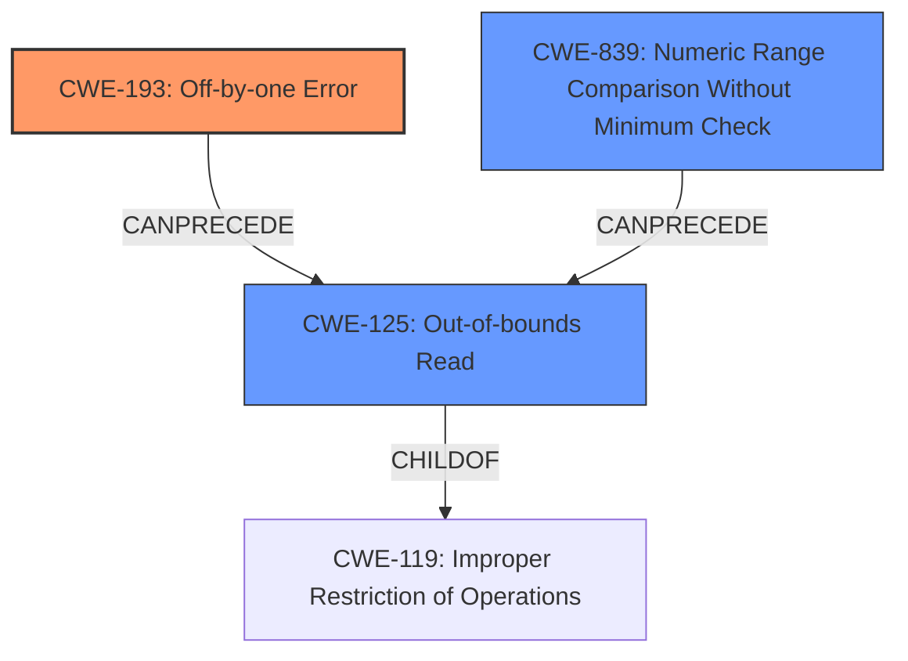

# Final Resolution for CVE-2021-46848

# Summary
| CWE ID | CWE Name | Confidence | CWE Abstraction Level | CWE Vulnerability Mapping Label | CWE-Vulnerability Mapping Notes |
|---|---|---|---|---|---|
| CWE-193 | **Off-by-one Error** | 0.95 | Base | Allowed | The vulnerability is caused by an **off-by-one error** in the array size check, which leads to an out-of-bounds read. |
| CWE-125 | **Out-of-bounds Read** | 0.70 | Base | Allowed | The **off-by-one error** results in reading data past the end of the intended buffer. |
| CWE-839  | **Numeric Range Comparison Without Minimum Check**  | 0.55 | Base | Allowed | The `etype` value is only checked for maximum value but not minimum value, leading to an out-of-bounds read. |

  - The Primary CWE should be first and noted as the Primary CWEs
  - The secondary candidate CWEs should be next and noted as secondary candidates.
  - The confidence is a confidence score 0 to 1 to rate your confidence in your assessment for that CWE.
  - The CWE Abstraction Level as one of these values: Base, Variant, Pillar, Class, Compound
  - The Mapping Notes Usage as one of these values: Allowed, Allowed-with-Review, Prohibited, Discouraged

## Evidence and Confidence

*   **Confidence Score:** 0.90
*   **Evidence Strength:** HIGH

## Relationship Analysis
The primary relationship is that CWE-193 (**Off-by-one Error**) leads to CWE-125 (**Out-of-bounds Read**). The **off-by-one error** allows reading beyond the intended buffer. CWE-839 (**Numeric Range Comparison Without Minimum Check**) is also considered because there is a missing minimum check, which contributes to the vulnerability. These are child-parent relationships with CWE-119 (**Improper Restriction of Operations within the Bounds of a Memory Buffer**), as they are specific instances of this broader class. The abstraction levels are important as we are choosing Base and Variant level CWEs for optimal specificity.

## Vulnerability Chain
The vulnerability chain starts with the **incorrect bounds check** (CWE-193), which allows the program to proceed to access memory outside the intended buffer (CWE-125). Additionally, the lack of a minimum bound check (CWE-839) allows a negative or otherwise invalid array index.
  - Map the sequence from initial flaw to final impact: **Incorrect bounds check** -> **Out-of-bounds Read**
  - Identify which CWEs represent root causes vs. impacts: CWE-193 and CWE-839 are the root causes, and CWE-125 is the impact.
  - Note any missing links in the chain based on relationship data: No missing links.

## Summary of Analysis
The initial analysis correctly identified CWE-193 and CWE-125. The criticism suggested some additional candidates, namely CWE-129, CWE-839, and CWE-1284. While CWE-129 and CWE-1284 are possibilities, I am choosing to include CWE-839 and omitting CWE-129 and CWE-1284 because, while the root cause *is* that the index is not validated, the *reason* the index is not validated is a *missing minimum check*. It's more specific to say a missing minimum check (CWE-839) is present, rather than generally stating that the array index is not validated (CWE-129), or that a specified quantity in input is not validated (CWE-1284).

The vulnerability description states, "GNU Libtasn1 before 4.19.0 has an ETYPE_OK **off-by-one array size check** that affects asn1_encode_simple_der." This evidence directly supports CWE-193. The consequence of this error is an **out-of-bounds read**, which corresponds to CWE-125.

The graph relationships reinforce the cause-and-effect relationship. CWE-193 enables CWE-125. The selected CWEs are at the optimal level of specificity because they directly describe the **off-by-one error**, the resulting **out-of-bounds read**, and the missing minimum check.