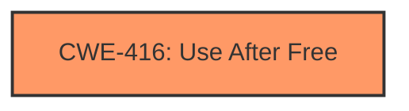

# Analysis Report for CVE-2022-0096

# Vulnerability Analysis Report: CVE-2022-0096

## Description

Use after free in Storage in Google Chrome prior to 97.0.4692.71 allowed a remote attacker to potentially exploit heap corruption via a crafted HTML page.

## Vulnerability Description Key Phrases

**Rootcause:** use after free
**Weakness:** heap corruption
**Vector:** crafted HTML page
**Attacker:** remote attacker
**Product:** Google Chrome
**Version:** prior to 97.0.4692.71
**Component:** Storage

## Analysis (with Relationship Data)

# Summary
| CWE ID | CWE Name | Confidence | CWE Abstraction Level | CWE Vulnerability Mapping Label | CWE-Vulnerability Mapping Notes |
|---|---|---|---|---|---|
| CWE-416 | Use After Free | 1.0 | Variant | Primary | Allowed |

## Evidence and Confidence

*   **Confidence Score:** 1.0
*   **Evidence Strength:** HIGH

- **Analysis and Justification:**  
  - *Explanation:* The vulnerability description explicitly states "**use after free** in Storage" as the **rootcause**, leading to **heap corruption**. The CVE Reference Links Content Summary also confirms the **root cause** as "Use-after-free in the Storage component of the Chrome browser". CWE-416 (Use After Free) perfectly aligns with this description, as it describes the condition where a product reuses or references memory after it has been freed. The description directly matches the definition of CWE-416. The retriever results also strongly suggest CWE-416 as the primary mapping with a high score. CWE-416 is a Variant level CWE, which is the preferred level of abstraction for mapping to the root causes of vulnerabilities, further supporting its selection. MITRE mapping guidance for CWE-416 indicates that its usage is ALLOWED.
  
  - *Relationship Analysis:* CWE-416 is a variant and has no direct relationships.

- **Confidence Score:**  
  - Confidence: 1.0 (The vulnerability description and CVE reference strongly support this mapping.)

## Criticism of Analysis

## Critique of the Analysis

The analysis provided is very thorough and arrives at the correct conclusion: **CWE-416 (Use After Free)**. The confidence level of 1.0 is well-justified. Here's a breakdown of the strengths and minor points for consideration:

**Strengths:**

*   **Clear and Concise Justification:** The analysis provides a strong argument for selecting CWE-416, directly linking the vulnerability description ("use after free in Storage") to the CWE definition.
*   **Comprehensive Use of Provided Information:** The analysis leverages both the vulnerability description and the CVE reference links content summary to reinforce the mapping.
*   **Consideration of Abstraction Level:** The analysis correctly notes the importance of using a Variant-level CWE when possible and accurately identifies CWE-416 as such.
*   **Adherence to Mapping Guidance:** The analysis explicitly mentions the "Allowed" usage according to the mapping guidance for CWE-416.
*   **Accurate Relationship Analysis:** The analysis correctly states that CWE-416 is a variant and has no direct relationships
*   **Good use of Retriever Results:** The analysis correctly uses the retriever results as a supporting factor for selecting CWE-416.
*   **Considered all the provided information:** The analysis considered every piece of information that was provided, both in the original analyzer input, the retriever results, and the CWE specifications.

**Minor Points for Consideration (Enhancements):**

*   **Elaborate on Heap Corruption Link:** While the description mentions "heap corruption," the analysis could briefly explain how a use-after-free can lead to heap corruption. This involves explaining that writing to freed memory can overwrite other allocated memory, leading to unpredictable behavior and potentially a security vulnerability. However, the primary cause was directly stated in the description as a Use-After-Free, so heap corruption is more of a symptom.
*   **Potential Mitigations (Optional):** Although not explicitly required, mentioning potential mitigations from the CWE specifications could add value. For example, highlighting the mitigation strategy of "Language Selection" (choosing a language with automatic memory management) or "Attack Surface Reduction" (setting freed pointers to NULL) could provide further context.
*   **Chain Analysis (Optional):** While CWE-416 is the primary weakness, briefly discussing what might *cause* the use-after-free could be beneficial. For instance, is it due to a race condition (CWE-362), improper resource locking (CWE-413), or another issue? The observed examples in the CWE specification highlight common chains. However, without more context, this would be speculative. The analysis appropriately avoided speculation.
*   **Alternative CWE Considerations:** While CWE-416 is the most accurate, briefly addressing why other top CWEs from the retriever results (CWE-787, CWE-362) are *not* the primary mapping could strengthen the analysis. In this case:
    *   **CWE-787 (Out-of-bounds Write):** While a use-after-free *can* lead to an out-of-bounds write (heap corruption), the initial cause is the use of freed memory, not the write itself.
    *   **CWE-362 (Race Condition):** A race condition *could* be a contributing factor leading to the use-after-free (as demonstrated in several observed examples), but it's not explicitly mentioned in the description and would be a secondary cause.

**Specific Comments on Retriever Results:**

The Retriever Results provide useful context and reinforce the selection of CWE-416. The high scores for CWE-416 from the different retrievers (dense, sparse, graph) provide strong support for the primary mapping. The analysis appropriately uses this information as supporting evidence.

**In conclusion, the analysis is excellent and well-justified. The suggestions above are minor enhancements that could further strengthen the analysis, but the core mapping to CWE-416 is correct and well-supported.**

## Final Resolution

# Summary
| CWE ID | CWE Name | Confidence | CWE Abstraction Level | CWE Vulnerability Mapping Label | CWE-Vulnerability Mapping Notes |
|---|---|---|---|---|---|
| CWE-416 | **Use After Free** | 1.0 | Variant | Primary | Allowed |

## Evidence and Confidence

*   **Confidence Score:** 1.0
*   **Evidence Strength:** HIGH

## Relationship Analysis
The primary **WEAKNESS**, CWE-416 (**Use After Free**), is a Variant level CWE. As such, it does not have any direct parent or child relationships. The analysis correctly identified this lack of direct relationships. While CWE-416 can be part of a vulnerability chain, the provided information does not give enough context to identify any preceding or following CWEs. The selection of CWE-416 is based on its direct match to the vulnerability description.

## Vulnerability Chain
The vulnerability chain starts with a memory allocation and subsequent freeing of that memory. Later, the program attempts to access the freed memory, leading to **CWE-416 (Use After Free)**. The final impact is heap corruption due to the use of the invalid memory location. The specific cause that leads to the memory being accessed after being freed is not explicitly defined, so it is not possible to define a complete chain.

## Summary of Analysis
The initial analysis and criticism both agree on the primary **WEAKNESS**: **CWE-416 (Use After Free)**. The vulnerability description explicitly states "use after free in Storage," which aligns perfectly with the definition of **CWE-416 (Use After Free)**. The high confidence score of 1.0 is justified due to the direct match between the vulnerability description and the CWE definition.

The analysis is based on the provided evidence, specifically the vulnerability description: "Use after free in Storage in Google Chrome prior to 97.0.4692.71 allowed a remote attacker to potentially exploit heap corruption via a crafted HTML page." The retriever results provide further support for the selection of **CWE-416 (Use After Free)**.

The graph relationships confirm that **CWE-416 (Use After Free)** is a Variant level CWE, which is the desired level of specificity. The absence of direct relationships reinforces the decision to focus on the direct match to the vulnerability description.

The selected CWE is at the optimal level of specificity because it directly represents the **root cause** described in the vulnerability. Higher-level CWEs would be too general, while lower-level CWEs would require more specific information that is not available in the provided description.

*Report generated on 2025-03-18 05:31:40*
