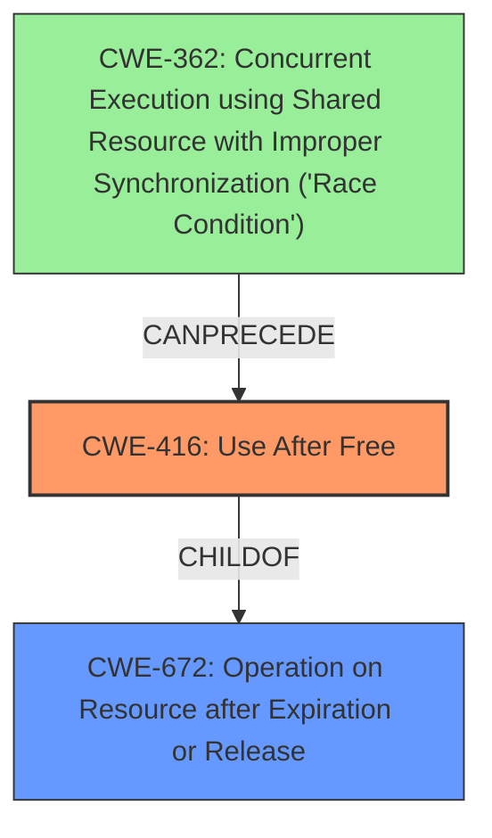

# Analysis Report for CVE-2022-0098

# Vulnerability Analysis Report: CVE-2022-0098

## Description

Use after free in Screen Capture in Google Chrome on Chrome OS prior to 97.0.4692.71 allowed an attacker who convinced a user to perform specific user gestures to potentially exploit heap corruption via specific user gestures.

## Vulnerability Description Key Phrases

**Rootcause:** use after free
**Weakness:** heap corruption
**Vector:** specific user gestures
**Attacker:** attacker
**Product:** Google Chrome on Chrome OS
**Version:** prior to 97.0.4692.71
**Component:** Screen Capture

## Analysis (with Relationship Data)

# Summary
| CWE ID | CWE Name | Confidence | CWE Abstraction Level | CWE Vulnerability Mapping Label | CWE-Vulnerability Mapping Notes |
|---|---|---|---|---|---|
| CWE-416 | Use After Free | 1.0 | Variant | Allowed | Primary CWE |

## Evidence and Confidence

*   **Confidence Score:** 1.0
*   **Evidence Strength:** HIGH

- **Analysis and Justification:**  
  - *Explanation:* The vulnerability description explicitly states "**Use after free** in Screen Capture". The CVE Reference Links Content Summary confirms the "**root_cause**" as "Use after free vulnerability" and lists "Use after free" as one of the "**weaknesses**". This aligns perfectly with CWE-416 (Use After Free), which is a Variant-level CWE. The description of CWE-416 accurately describes the vulnerability: "The product reuses or references memory after it has been freed." The retriever results also list CWE-416 as the top match.

  - *Relationship Analysis:* CWE-416 is a variant of CWE-672 (Operation on Resource after Expiry). The weakness occurs when memory is accessed after being freed, leading to unpredictable behavior and potential security vulnerabilities.

- **Confidence Score:**  
  - Confidence: 1.0 (Explicit mention of "Use after free" in both the vulnerability description and CVE reference)

## Criticism of Analysis

## Critique of CWE Analysis

Overall, the analysis is excellent and demonstrates a strong understanding of the CWE specifications. The identification of CWE-416 (Use After Free) as the primary CWE is correct and justified. The confidence score of 1.0 is appropriate given the explicit mention of "Use after free" in the vulnerability description and CVE details.

Here's a more detailed breakdown:

**Strengths:**

*   **Correct Primary CWE:**  The selection of CWE-416 is accurate. The vulnerability description and CVE references clearly point to a use-after-free condition.
*   **Strong Justification:** The explanation for choosing CWE-416 is thorough and well-supported by evidence from the provided information. The analysis references the description of CWE-416 and correctly relates it to the vulnerability.
*   **Abstraction Level:** The analysis correctly identifies CWE-416 as a Variant-level CWE, which is a preferred level of abstraction for vulnerability mapping.
*   **Relationship Analysis:** The mention of the parent CWE CWE-672 (Operation on Resource after Expiration or Release) provides additional context and shows a good understanding of the CWE hierarchy.
*   **Example CVEs:** The inclusion of known examples of CWE-416 helps to further illustrate the nature of the vulnerability.
*   **Mitigations:** The reproduction of potential mitigations directly from the CWE specification reinforces the severity, scope, and potential resolution of the vulnerability.
*   **Thoroughness:** The analysis is comprehensive and considers multiple factors in determining the appropriate CWE mapping.

**Potential Improvements (Minor):**

*   **Heap Corruption Connection:** While the analysis focuses on the 'use after free' aspect (root cause), it could benefit from briefly explaining the connection to "heap corruption" (weakness) mentioned in the original vulnerability description. It's important to acknowledge the heap as the memory management area where the UAF leads to exploitable corruption. This is indirectly covered in the description of CWE-416: "At some point afterward, the memory may be allocated again and saved in another pointer, while the original pointer references a location somewhere within the new allocation." This could be made more explicit.
*   **Attack Vector Context:** While the attack vector is mentioned, the analysis could benefit from a sentence or two explaining how "specific user gestures" trigger the vulnerability within the screen capture component. The CVE description summary hints at this:  "Successful exploitation of the vulnerability requires a crafted HTML/JavaScript page that leverages the vulnerable screen capture component within a chromium based browser."  This adds context to the vulnerability.
*   **Retriever Results:** The analysis could mention that the Retriever results align well with the final CWE choice, specifically highlighting the high score given to CWE-416 by the dense, sparse and graph retrievers. This provides additional confidence in the analysis.
*   **Chain Analysis (Optional):**  While CWE-416 is the primary weakness, the analysis could optionally explore potential relationships with other CWEs as part of a chain. For example:
    *   A race condition (CWE-362 or CWE-366) could lead to the use-after-free if a resource is freed by one thread while another thread is still using it.  CVE-2021-0920 and CVE-2022-2621 in the example CVEs for CWE-416 show exactly this pattern.
    *   Improper input validation could allow an attacker to control the size or allocation of memory in such a way as to make the use-after-free more likely to occur.
*   **Mitigation Specificity:**  While the mitigations are directly from the CWE, noting which mitigations are *most* relevant to a screen capture implementation within a browser would increase practical value. For example, while language selection is listed, that's impractical. Setting freed pointers to NULL is *more* immediately actionable.

**Response to Retriever Results:**

The analysis appropriately identified CWE-416 as the primary weakness, aligning with the top combined result from the retrievers. While the retrievers also suggested other CWEs like CWE-366 (Race Condition within a Thread), CWE-843 (Type Confusion), and CWE-415 (Double Free), the analysis correctly focused on the direct cause, which is the use of freed memory. The retriever scores are useful for understanding the AI's perspective, but the final decision is always based on accurate analysis of the details. The Retriever results are supporting information, not the primary driver of the decision.

**Summary:**

The analysis is strong and well-justified.  The suggestions above are minor and aim to provide additional context and completeness rather than correct any errors. The analyst demonstrates a sound understanding of CWE and its application to vulnerability analysis.

## Final Resolution

# Summary
| CWE ID | CWE Name | Confidence | CWE Abstraction Level | CWE Vulnerability Mapping Label | CWE-Vulnerability Mapping Notes |
|---|---|---|---|---|---|
| CWE-416 | Use After Free | 1.0 | Variant | Allowed | Primary CWE |

## Evidence and Confidence

*   **Confidence Score:** 1.0
*   **Evidence Strength:** HIGH

## Relationship Analysis
The primary CWE identified is CWE-416 (**CWE-416: Use After Free**), which is a variant of CWE-672 (**CWE-672: Operation on Resource after Expiration or Release**). This hierarchical relationship supports the selection of CWE-416 because it represents the specific instance of using a resource (memory) after it has been freed. There's also a potential chain relationship where a race condition (e.g., CWE-362 (**CWE-362: Concurrent Execution using Shared Resource with Improper Synchronization ('Race Condition')**)) could precede the use-after-free.

## Vulnerability Chain
The vulnerability chain starts with a **ROOTCAUSE** (likely a race condition or improper resource management) that leads to memory being freed prematurely. Subsequently, the program attempts to access this freed memory (**WEAKNESS**: CWE-416). This **WEAKNESS** results in heap corruption and potentially allows an attacker to execute arbitrary code.

## Summary of Analysis
The initial analysis correctly identified CWE-416 (**CWE-416: Use After Free**) as the primary CWE. This is strongly supported by the vulnerability description, which explicitly states "Use after free". The CVE reference links confirm this, listing "Use after free vulnerability" as the "**root_cause**" and "Use after free" as one of the "**weaknesses**". The analysis also correctly notes the hierarchical relationship to CWE-672 (**CWE-672: Operation on Resource after Expiration or Release**). The criticism offers valuable suggestions, such as explicitly connecting the use-after-free to heap corruption and elaborating on the attack vector involving user gestures. Considering a potential race condition (CWE-362 (**CWE-362: Concurrent Execution using Shared Resource with Improper Synchronization ('Race Condition')**)) as a preceding factor adds depth to the analysis, though it's not explicitly stated in the provided vulnerability description. The confidence remains high (1.0) due to the clear evidence supporting CWE-416 as the direct cause.
The selection of CWE-416 (**CWE-416: Use After Free**) is at the optimal level of specificity because it directly reflects the identified vulnerability.

*Report generated on 2025-03-18 05:32:17*
