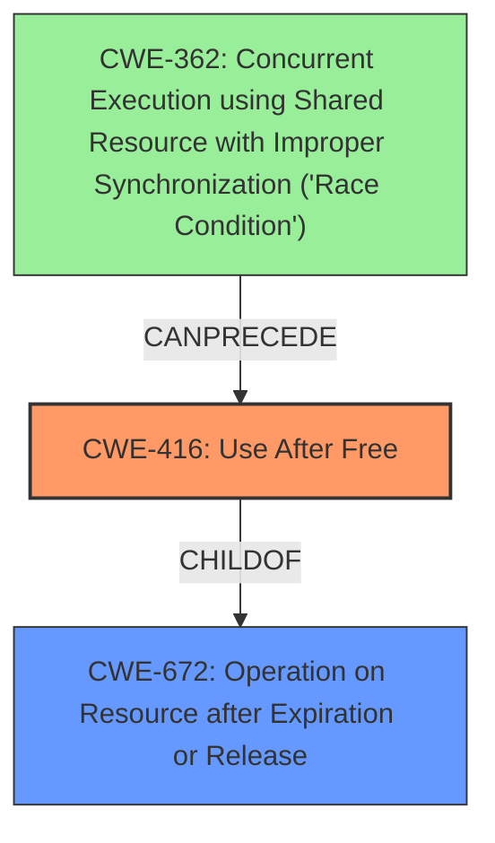

# Final Resolution for CVE-2022-0098

# Summary
| CWE ID | CWE Name | Confidence | CWE Abstraction Level | CWE Vulnerability Mapping Label | CWE-Vulnerability Mapping Notes |
|---|---|---|---|---|---|
| CWE-416 | Use After Free | 1.0 | Variant | Allowed | Primary CWE |

## Evidence and Confidence

*   **Confidence Score:** 1.0
*   **Evidence Strength:** HIGH

## Relationship Analysis
The primary CWE identified is CWE-416 (**CWE-416: Use After Free**), which is a variant of CWE-672 (**CWE-672: Operation on Resource after Expiration or Release**). This hierarchical relationship supports the selection of CWE-416 because it represents the specific instance of using a resource (memory) after it has been freed. There's also a potential chain relationship where a race condition (e.g., CWE-362 (**CWE-362: Concurrent Execution using Shared Resource with Improper Synchronization ('Race Condition')**)) could precede the use-after-free.

## Vulnerability Chain
The vulnerability chain starts with a **ROOTCAUSE** (likely a race condition or improper resource management) that leads to memory being freed prematurely. Subsequently, the program attempts to access this freed memory (**WEAKNESS**: CWE-416). This **WEAKNESS** results in heap corruption and potentially allows an attacker to execute arbitrary code.

## Summary of Analysis
The initial analysis correctly identified CWE-416 (**CWE-416: Use After Free**) as the primary CWE. This is strongly supported by the vulnerability description, which explicitly states "Use after free". The CVE reference links confirm this, listing "Use after free vulnerability" as the "**root_cause**" and "Use after free" as one of the "**weaknesses**". The analysis also correctly notes the hierarchical relationship to CWE-672 (**CWE-672: Operation on Resource after Expiration or Release**). The criticism offers valuable suggestions, such as explicitly connecting the use-after-free to heap corruption and elaborating on the attack vector involving user gestures. Considering a potential race condition (CWE-362 (**CWE-362: Concurrent Execution using Shared Resource with Improper Synchronization ('Race Condition')**)) as a preceding factor adds depth to the analysis, though it's not explicitly stated in the provided vulnerability description. The confidence remains high (1.0) due to the clear evidence supporting CWE-416 as the direct cause.
The selection of CWE-416 (**CWE-416: Use After Free**) is at the optimal level of specificity because it directly reflects the identified vulnerability.