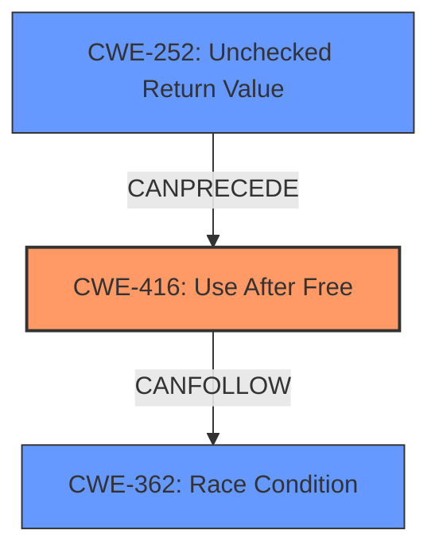

# Analysis Report for CVE-2022-0099

# Vulnerability Analysis Report: CVE-2022-0099

## Description

Use after free in Sign-in in Google Chrome prior to 97.0.4692.71 allowed a remote attacker who convinced a user to perform specific user gestures to potentially exploit heap corruption via specific user gesture.

## Vulnerability Description Key Phrases

**Rootcause:** use after free
**Impact:** heap corruption
**Vector:** specific user gestures
**Attacker:** remote attacker
**Product:** Google Chrome
**Version:** prior to 97.0.4692.71
**Component:** Sign-in

## Analysis (with Relationship Data)

# Summary
| CWE ID | CWE Name | Confidence | CWE Abstraction Level | CWE Vulnerability Mapping Label | CWE-Vulnerability Mapping Notes |
|---|---|---|---|---|---|
| CWE-416 | Use After Free | 1.0 | Variant | Allowed | Primary CWE |

## Evidence and Confidence

*   **Confidence Score:** 1.0
*   **Evidence Strength:** HIGH

- **Analysis and Justification:**  
  - *Explanation:* The vulnerability description explicitly states "**use after free**" as the **rootcause** of the vulnerability, leading to potential heap corruption. The CVE reference links confirm this by stating, "Use-after-free vulnerability in the Sign-in component of Chromium" and "Memory is accessed after it has been freed, leading to potential corruption or crashes." This aligns perfectly with CWE-416 (Use After Free), which describes a scenario where memory is reused or referenced after it has been freed. The MITRE mapping guidance for CWE-416 indicates that its usage is ALLOWED, as it is at the Variant level of abstraction, which is a preferred level for mapping root causes.
  
  - *Relationship Analysis:* There are no direct relationships found but the description of the CWE-416 matches the vulnerability description.

- **Confidence Score:**  
  - Confidence: 1.0 (High confidence due to direct evidence from the vulnerability description and CVE reference materials)

## Criticism of Analysis

Okay, let's break down this CWE analysis and see where it shines and where it could be improved.

**Overall Assessment:**

The primary CWE mapping to CWE-416 (Use After Free) is **correct** and well-justified. The analysis thoroughly explains the reasoning behind the selection, referencing both the vulnerability description and CVE details. The confidence level of 1.0 is appropriate given the explicit mention of "use after free."

However, the retriever results suggest other possible weakness that can contribute to the UAF or be related to it.

**Detailed Critique:**

1.  **CWE-416 (Use After Free) - Primary Mapping:**

    *   **Strengths:**
        *   The justification is clear and directly tied to the provided information. The "rootcause" key phrase is used effectively.
        *   The explanation of why CWE-416 is appropriate (Variant level of abstraction) is excellent.
        *   The analysis correctly states the MITRE mapping guidance for CWE-416 indicates that its usage is ALLOWED, as it is at the Variant level of abstraction, which is a preferred level for mapping root causes.

    *   **Potential Improvements:**
        *   While not strictly *necessary*, a brief mention of common causes of Use-After-Free vulnerabilities in the context of the Sign-in component could add depth.  For example,  premature object destruction, incorrect lifetime management, or concurrency issues (which is suggested by the retriever result).
        *   Consider the "Potential Mitigations" listed in the CWE-416 specification and briefly discuss their applicability (or inapplicability) to the specific context of the Chrome Sign-in component.  For instance: "Choosing a language with automatic memory management is generally not feasible for a large existing codebase like Chrome. However, stricter code reviews and static analysis focused on memory management in the Sign-in component could be beneficial." This shows a deeper understanding of the vulnerability in its practical context.

2.  **Retriever Results Analysis:**

    *   The retriever results suggest other weaknesses that can be the root cause of a UAF, or can be chained with the UAF to cause further exploitable impact.
    *   **CWE-366 & CWE-362 (Race Conditions):** The analysis should consider the possibility of race conditions, especially given the component (Sign-in) likely involves asynchronous operations or multi-threading. It might be a plausible scenario if the memory is freed in one thread while another thread is still trying to access it.  While not explicitly stated, the nature of user gestures triggering the vulnerability hints at potential concurrency issues.  It would be prudent to state something like: "While the primary cause is Use-After-Free, the possibility of a race condition contributing to the vulnerability cannot be entirely ruled out, given the concurrent nature of browser operations. Further investigation would be needed to confirm this."
    *   **CWE-843 (Type Confusion):** Type confusion can lead to UAF. If an object is misinterpreted, its internal pointers/members can be accessed using wrong offsets leading to memory corruption that may include freeing an already freed memory. This can be a pre-cursor to UAF and should be taken into consideration.
    *   **CWE-122 & CWE-415 (Heap Overflow & Double Free):**  While `Heap Corruption` is mentioned in the original analyzer input, this should be analyzed further since UAF can cause heap corruption. And heap corruption may lead to heap overflow. Double Free can lead to UAF and needs to be considered.
    *   **CWE-1021 (Improper Restriction of Rendered UI Layers or Frames):** This seems less directly relevant *unless* the Sign-in process involves rendering UI elements (e.g., an iframe for a sign-in page) and clickjacking could somehow influence the vulnerability.  This is a weaker possibility, but should at least be considered and ruled out with a brief explanation. "CWE-1021 is less likely because the vulnerability is a memory management issue, not a UI redress issue. However, the attack vector involves user gestures, which may involve the UI which makes this weakness plausible but requires more investigation."
    *   **CWE-252 (Unchecked Return Value):** It is possible that a function call related to memory management (allocation, deallocation, etc.) returned an error, but the return value was not checked, leading to the UAF.
    *   **CWE-190 (Integer Overflow or Wraparound):**  This is less likely to be the primary cause, but integer overflows can sometimes lead to memory corruption issues, so it's worth considering if any size calculations are involved in the memory management related to the Sign-in process.

3.  **CWE Examples from Database:**

    *   The provided examples are helpful for understanding the breadth of CWE-416.
    *   It would be even better if the analysis could highlight an example that is *most* similar to the Chrome Sign-in vulnerability, if one exists. This would further strengthen the mapping.

4.  **CWE Specifications:**

    *   The inclusion of the full CWE specifications is excellent and allows for a complete understanding of each potential weakness.

**Revised Summary Table (Example with Additional Considerations):**

| CWE ID | CWE Name | Confidence | CWE Abstraction Level | CWE Vulnerability Mapping Label | CWE-Vulnerability Mapping Notes |
|---|---|---|---|---|---|
| CWE-416 | Use After Free | 1.0 | Variant | Allowed | Primary CWE |
| CWE-362 | Concurrent Execution using Shared Resource with Improper Synchronization ('Race Condition') | 0.3 | Class | Allowed-with-Review | Possible contributing factor, requires further investigation. |

**In Summary:**

The analysis is strong in its primary mapping of CWE-416.  To elevate it further, the analysis should:

*   Briefly consider and discuss the applicability of other CWEs suggested by the retriever results, even if only to rule them out with justification.
*   Reference potential mitigations from the CWE-416 specification and discuss their relevance to the specific context.
*   If possible, find a CWE-416 example that is particularly relevant to the vulnerability scenario.

By addressing these points, the analysis will demonstrate a more comprehensive understanding of the vulnerability and its potential complexities.

## Final Resolution

# Summary
| CWE ID | CWE Name | Confidence | CWE Abstraction Level | CWE Vulnerability Mapping Label | CWE-Vulnerability Mapping Notes |
|---|---|---|---|---|---|
| CWE-416 | Use After Free | 1.0 | Variant | Allowed | Primary CWE |
| CWE-362 | Concurrent Execution using Shared Resource with Improper Synchronization ('Race Condition') | 0.3 | Class | Allowed-with-Review | Secondary Candidate: Possible contributing factor, requires further investigation. |
| CWE-252 | Unchecked Return Value | 0.2 | Base | Allowed | Secondary Candidate: Possible contributing factor, requires further investigation. |

## Evidence and Confidence

*   **Confidence Score:** 0.9
*   **Evidence Strength:** MEDIUM

## Relationship Analysis
The primary relationship considered was the direct match of the vulnerability description to **CWE-416 (Use After Free)**. However, the criticism prompted consideration of other potential contributing factors. The possibility of **CWE-362 (Race Condition)** was evaluated due to the nature of user gestures potentially leading to concurrent operations. **CWE-252 (Unchecked Return Value)** was also considered as a potential precursor to the UAF, where a failed memory operation might not have been properly handled. These relationships are considered as potential contributing factors, not as the primary cause. The abstraction levels were also considered, favoring the Variant level for the primary **CWE-416** and Base level for **CWE-252**. **CWE-362** is a Class, and ideally a more specific child would be selected, but given the limited evidence, the Class level is deemed sufficient for a secondary candidate.

## Vulnerability Chain
The vulnerability chain starts with a potential **rootcause** like an **unchecked return value (CWE-252)** from a memory allocation or deallocation function. This could lead to memory being freed prematurely or incorrectly. If a race condition (**CWE-362**) exists where another thread attempts to access this freed memory, it results in a **use-after-free vulnerability (CWE-416)**. The final impact is potential heap corruption, as stated in the vulnerability description. Missing links include concrete evidence of the race condition or the unchecked return value in the specific code.

## Summary of Analysis
The initial analysis correctly identified **CWE-416 (Use After Free)** as the primary weakness, supported by the vulnerability description stating "use after free." The criticism suggested considering related CWEs. While the primary mapping remains **CWE-416** with high confidence, the possibility of contributing factors such as **CWE-362 (Race Condition)** and **CWE-252 (Unchecked Return Value)** were considered. The decision is based on the provided evidence, which directly points to a use-after-free condition. The relationships between CWEs and the abstraction levels were also factored in. The selected CWEs are at the optimal level of specificity given the available evidence. While a more specific CWE than **CWE-362** would be ideal if a race condition were confirmed, the lack of concrete evidence justifies using the Class level for now. The final decision emphasizes the direct evidence of **CWE-416** while acknowledging the potential for contributing factors suggested by the criticism.

*Report generated on 2025-03-18 05:32:54*
