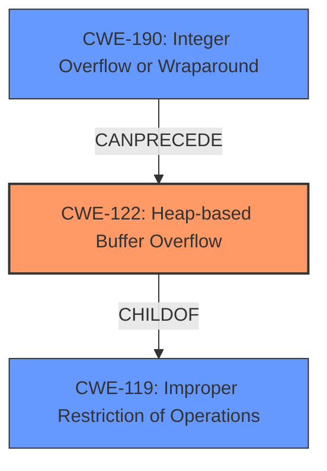

# Final Resolution for CVE-2022-0100

# Summary
| CWE ID | CWE Name | Confidence | CWE Abstraction Level | CWE Vulnerability Mapping Label | CWE-Vulnerability Mapping Notes |
|---|---|---|---|---|---|
| CWE-122 | Heap-based Buffer Overflow | 0.95 | Variant | Primary | Allowed. Direct mapping based on the vulnerability description explicitly stating "heap buffer overflow." While other CWEs like CWE-190 were considered, CWE-122 provides the most accurate and direct representation of the **root cause**. |
| CWE-190 | Integer Overflow or Wraparound | 0.4 | Base | Secondary Candidate | Allowed. A potential contributing factor to the heap buffer overflow if it leads to an incorrect size calculation. |

## Evidence and Confidence

*   **Confidence Score:** 0.90
*   **Evidence Strength:** MEDIUM

## Relationship Analysis
The primary relationship impacting the decision is that CWE-122 (Heap-based Buffer Overflow) is a variant of CWE-119 (Improper Restriction of Operations within the Bounds of a Memory Buffer). This hierarchical relationship supports the selection of CWE-122 as it provides a more specific classification. The potential chain relationship is that CWE-190 (Integer Overflow or Wraparound) could precede CWE-122 if an integer overflow leads to an incorrect size calculation, ultimately causing the heap overflow. The abstraction levels influenced the selection by prioritizing the most specific CWE available, with CWE-122 being a Variant and CWE-119 being a Base.

## Vulnerability Chain
The vulnerability chain starts with a potential **CWE-190 (Integer Overflow or Wraparound)**, which, if present, leads to an incorrect size calculation when allocating memory on the heap. This incorrect size calculation then results in **CWE-122 (Heap-based Buffer Overflow)**, where data can be written beyond the allocated buffer's boundaries. The final impact is heap corruption, which can lead to code execution, denial of service, or data corruption. A missing link is definitive proof that **CWE-190** is present but it is a possibility that should be noted.

## Summary of Analysis
The initial analysis correctly identified **CWE-122 (Heap-based Buffer Overflow)** as the primary weakness, based on the explicit mention of "heap buffer overflow" in the vulnerability description: "Heap buffer overflow in Media streams API in Google Chrome prior to 97.0.4692.71 allowed a remote attacker to potentially exploit heap corruption via a crafted HTML page."

The criticism correctly pointed out the need to consider other CWEs from the retriever results, particularly **CWE-190 (Integer Overflow or Wraparound)**. While the primary evidence points directly to CWE-122, the possibility of an integer overflow contributing to the incorrect size calculation cannot be dismissed.

The graph relationships influenced the final selection by highlighting the hierarchical relationship between **CWE-122** and **CWE-119**, reinforcing the specificity of CWE-122. The potential chain relationship with **CWE-190** added a secondary dimension to the analysis, acknowledging a possible underlying **root cause**.

The decision to include **CWE-190** as a secondary candidate is based on the understanding that integer overflows can often lead to buffer overflows by causing incorrect size calculations. However, without more specific evidence, it remains a possibility rather than a certainty.
The selected CWEs are at the optimal level of specificity, with CWE-122 being a Variant that directly describes the heap overflow, and CWE-190 being a Base that represents a potential contributing factor. This provides a more comprehensive understanding of the vulnerability while adhering to the available evidence.