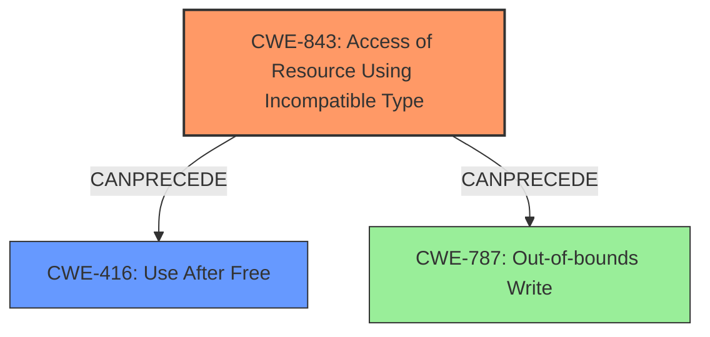

# Final Resolution for CVE-2022-0102

# Summary
| CWE ID | CWE Name | Confidence | CWE Abstraction Level | CWE Vulnerability Mapping Label | CWE-Vulnerability Mapping Notes |
|---|---|---|---|---|---|
| CWE-843 | Access of Resource Using Incompatible Type ('Type Confusion') | 0.95 | Base | Allowed | Primary CWE: The vulnerability is caused by type confusion in the V8 engine. |
| CWE-416 | Use After Free | 0.65 | Variant | Allowed | Secondary Candidate: Type confusion can lead to use-after-free scenarios. |
| CWE-787 | Out-of-bounds Write | 0.50 | Base | Allowed | Tertiary Candidate: Type confusion could cause writing outside buffer bounds. |

## Evidence and Confidence

*   **Confidence Score:** 0.90
*   **Evidence Strength:** HIGH

## Relationship Analysis
The primary relationship considered was the potential chain reaction from **CWE-843 (Type Confusion)** to **CWE-416 (Use After Free)** or **CWE-787 (Out-of-Bounds Write)**. While **CWE-843** doesn't have direct relationships in the provided data, the analysis correctly identified that type confusion is a common precursor to memory corruption issues. The inclusion of **CWE-416** and **CWE-787** as secondary and tertiary candidates, respectively, acknowledges these potential consequences. The abstraction levels (Base and Variant) were also considered to ensure appropriate specificity.

## Vulnerability Chain
The vulnerability chain starts with **CWE-843 (Type Confusion)** in the V8 engine. This **WEAKNESS** allows a remote attacker to craft a malicious HTML page. The type confusion can then lead to either **CWE-416 (Use After Free)** or **CWE-787 (Out-of-Bounds Write)**, resulting in heap corruption. The **ROOTCAUSE** is the initial type confusion, and the impact is heap corruption, which could lead to arbitrary code execution.

## Summary of Analysis
The initial analysis correctly identified **CWE-843 (Access of Resource Using Incompatible Type)** as the primary **ROOTCAUSE** of the vulnerability, supported by the vulnerability description explicitly stating "type confusion in V8." The criticism suggested adding **CWE-787 (Out-of-bounds Write)** as a tertiary candidate.

The vulnerability description explicitly mentions "heap corruption," which could be a direct result of type confusion leading to an out-of-bounds write. Therefore, including **CWE-787** as a tertiary candidate provides a more complete picture of the potential consequences.

The decision to keep **CWE-843** as the primary **WEAKNESS** is based on the fact that it's the most direct and specific cause mentioned in the vulnerability description. The abstraction level (Base) is also appropriate for a root cause analysis.

The inclusion of **CWE-416 (Use After Free)** and **CWE-787 (Out-of-bounds Write)** acknowledges the potential downstream effects of the type confusion. These secondary and tertiary classifications help to illustrate the complete vulnerability chain. The selected CWEs are at the optimal level of specificity, providing a clear and accurate representation of the vulnerability.