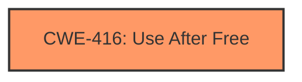

# Final Resolution for CVE-2022-0103

# Summary
| CWE ID | CWE Name | Confidence | CWE Abstraction Level | CWE Vulnerability Mapping Label | CWE-Vulnerability Mapping Notes |
|---|---|---|---|---|---|
| CWE-416 | Use After Free | 1.0 | Variant | Allowed | Primary CWE. Mitigation strategies include using memory-safe languages or setting pointers to NULL after freeing, but these may not be feasible given SwiftShader's performance requirements. |

## Evidence and Confidence

*   **Confidence Score:** 1.0
*   **Evidence Strength:** HIGH

## Relationship Analysis
The primary relationship considered was the lack of any direct relationships for CWE-416. While it can CANFOLLOW or CANPRECEDE other CWEs, none of those relationships are directly indicated in the vulnerability description. The analysis focused on rejecting alternatives based on a lack of evidence, rather than identifying a vulnerability chain.

## Vulnerability Chain
The vulnerability chain is straightforward: The **ROOTCAUSE** is a **CWE-416 (Use After Free)**. The consequence is potential heap corruption, exploitable via a crafted HTML page. No other CWEs are explicitly part of this chain based on the provided information.

## Summary of Analysis
The initial analysis and the criticism both converge on the same conclusion: **CWE-416 (Use After Free)** is the most appropriate classification for this vulnerability. The vulnerability description clearly states "use after free" making it a direct match. The criticism strengthens the analysis by methodically ruling out alternative CWEs suggested by the retriever results, further solidifying the confidence in the primary classification.

The classification is based heavily on the direct evidence from the vulnerability description: "Use after free in SwiftShader in Google Chrome prior to 97.0.4692.71 allowed a remote attacker to potentially exploit heap corruption via a crafted HTML page."

The graph relationships did not influence the *selection* of CWE-416, but rather the *rejection* of alternative CWEs by highlighting the absence of related conditions such as race conditions or integer overflows.

The selected CWE is at the optimal level of specificity. While other CWEs might be indirectly related (e.g., a race condition *could* lead to a UAF), **CWE-416 (Use After Free)** directly addresses the **WEAKNESS** described in the vulnerability.