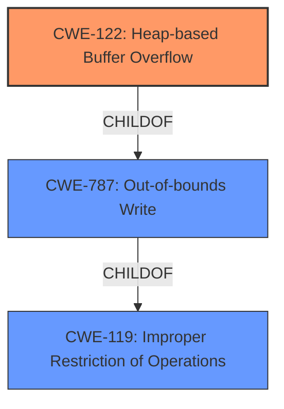

# Final Resolution for CVE-2022-0104

# Summary
| CWE ID | CWE Name | Confidence | CWE Abstraction Level | CWE Vulnerability Mapping Label | CWE-Vulnerability Mapping Notes |
|---|---|---|---|---|---|
| CWE-122 | Heap-based Buffer Overflow | 0.95 | Variant | Allowed | Acceptable-Use |
| CWE-787 | Out-of-bounds Write | 0.70 | Base | Allowed | Acceptable-Use |

## Evidence and Confidence

*   **Confidence Score:** 0.95
*   **Evidence Strength:** HIGH

## Relationship Analysis
The primary relationship impacting the decision is the parent-child relationship between CWE-119 (**Improper Restriction of Operations within the Bounds of a Memory Buffer**), CWE-787 (**Out-of-bounds Write**), and CWE-122 (**Heap-based Buffer Overflow**). CWE-122 is a variant of CWE-119 and a more specific type of CWE-787. The vulnerability description explicitly mentions "heap buffer overflow," so selecting CWE-122 offers the most accurate and specific classification.

## Vulnerability Chain
The vulnerability chain consists of a heap buffer overflow due to a crafted HTML page.
  - Root Cause: Crafted HTML page leading to a heap buffer overflow.
  - Weakness: **CWE-122: Heap-based Buffer Overflow** or **CWE-787: Out-of-bounds Write** due to improper bounds checking when handling the crafted HTML.
  - Impact: Potential heap corruption and exploitation by a remote attacker.

## Summary of Analysis
The initial analysis and the criticism both agree that the primary weakness is **CWE-122: Heap-based Buffer Overflow**. The vulnerability description explicitly states "Heap buffer overflow," making CWE-122 the most specific and appropriate classification. CWE-787 is a broader classification for out-of-bounds writes, and while it applies, CWE-122 provides more context by specifying that the overflow occurs in the heap.

The evidence provided in the vulnerability description is strong: "Heap buffer overflow in ANGLE in Google Chrome prior to 97.0.4692.71 allowed a remote attacker to potentially exploit heap corruption via a crafted HTML page."

The graph relationships reinforce this decision. CWE-122 is a variant of CWE-787, meaning it's a more specialized case. Since the description clearly indicates a heap **buffer overflow**, the more specific CWE-122 is preferred.

The selected CWEs are at the optimal level of specificity because CWE-122 directly reflects the described vulnerability. Choosing a more general CWE like CWE-787 would lose the important detail that the overflow occurs on the heap.