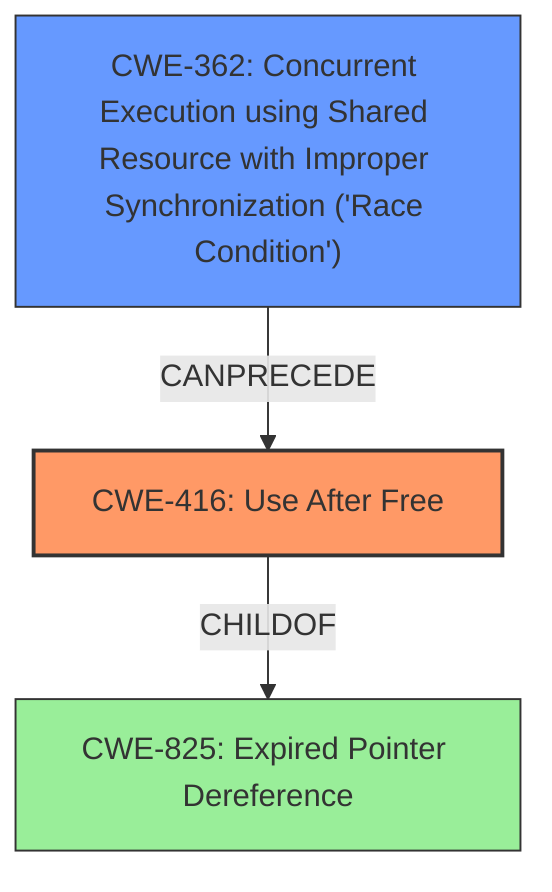

# Final Resolution for CVE-2022-0106

# Summary
| CWE ID | CWE Name | Confidence | CWE Abstraction Level | CWE Vulnerability Mapping Label | CWE-Vulnerability Mapping Notes |
|---|---|---|---|---|---|
| CWE-416 | Use After Free | 1.0 | Variant | Allowed | Primary CWE |
| CWE-362 | Concurrent Execution using Shared Resource with Improper Synchronization ('Race Condition') | 0.4 | Class | Allowed-with-Review | Secondary Candidate |

## Evidence and Confidence

*   **Confidence Score:** 0.9
*   **Evidence Strength:** MEDIUM

## Relationship Analysis
The primary relationship is that **CWE-362** (Concurrent Execution using Shared Resource with Improper Synchronization ('Race Condition')) can precede **CWE-416** (Use After Free). This suggests a potential vulnerability chain where a race condition leads to the use of freed memory. While the vulnerability description doesn't explicitly mention concurrency, the autofill functionality might involve multiple threads. **CWE-416** is a variant of **CWE-825** (Expired Pointer Dereference), but **CWE-416** is more specific and thus a better choice.

## Vulnerability Chain
The vulnerability chain starts with a potential race condition (**CWE-362**) in the autofill functionality. This race condition leads to a situation where memory is freed while still being accessed, resulting in a use-after-free vulnerability (**CWE-416**). The consequence of this **WEAKNESS** is heap corruption, which can potentially lead to arbitrary code execution.

## Summary of Analysis
The initial analysis correctly identified **CWE-416** (Use After Free) as the primary **ROOTCAUSE**. The vulnerability description explicitly mentions "use after free," providing strong evidence for this classification. The criticism suggested considering **CWE-362** (Concurrent Execution using Shared Resource with Improper Synchronization ('Race Condition')) as a secondary CWE, which is a valid consideration given the nature of autofill functionality and the potential for concurrent processing. While there is no explicit mention of multi-threading, I'm adding this as a secondary finding with a lower confidence score. The final decision is based on the provided evidence and the understanding of potential vulnerability chains. **CWE-416** is the most specific CWE that directly addresses the vulnerability, and **CWE-362** is a potential contributing factor. The selected CWEs are at the optimal level of specificity because they accurately represent the **ROOTCAUSE** and potential contributing factors to the vulnerability.