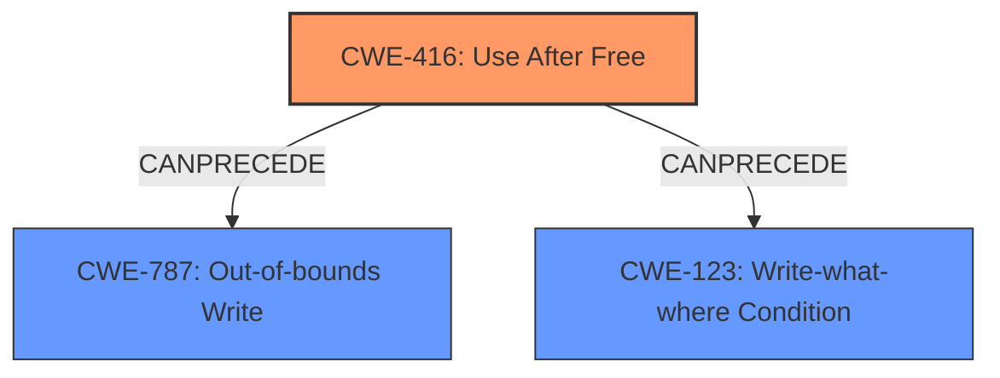

# Final Resolution for CVE-2022-0107

# Summary
| CWE ID | CWE Name | Confidence | CWE Abstraction Level | CWE Vulnerability Mapping Label | CWE-Vulnerability Mapping Notes |
|---|---|---|---|---|---|
| CWE-416 | Use After Free | 0.95 | Variant | Allowed | Primary CWE |
| CWE-787 | Out-of-bounds Write | 0.6 | Base | Allowed | Secondary CWE, resulting from the UAF causing heap corruption|

## Evidence and Confidence

*   **Confidence Score:** 0.8
*   **Evidence Strength:** MEDIUM

## Relationship Analysis
The primary relationship considered is that a **CWE-416 (Use After Free)** can **CANPRECEDE** a **CWE-787 (Out-of-bounds Write)**, leading to heap corruption. The vulnerability description mentions "heap corruption," suggesting that the **USE AFTER FREE** might have resulted in an out-of-bounds write. While **CWE-123 (Write-what-where Condition)** is also a possibility, **CWE-787** is a more likely outcome given the mention of heap corruption, which often involves writing beyond the boundaries of allocated memory.

## Vulnerability Chain
The vulnerability chain starts with the **CWE-416 (Use After Free)**. After the memory is freed, a malicious extension triggers the use of this freed memory. This leads to heap corruption, which is best represented by **CWE-787 (Out-of-bounds Write)**. The initial flaw is the improper memory management leading to the **USE AFTER FREE**. The consequence is the ability to overwrite heap memory, leading to potential arbitrary code execution.

## Summary of Analysis
The initial analysis correctly identifies **CWE-416 (Use After Free)** as the primary weakness. The criticism highlights the importance of exploring relationships, particularly how the **USE AFTER FREE** leads to heap corruption. The vulnerability description explicitly states "Use after free in File Manager API in Google Chrome on Chrome OS prior to 97.0.4692.71 allowed an attacker who convinced a user to install a malicious extension to potentially exploit heap corruption via a crafted HTML page."

Based on the vulnerability description and the relationship analysis, adding **CWE-787 (Out-of-bounds Write)** as a secondary CWE is justified. The **USE AFTER FREE** allows the attacker to potentially overwrite heap memory, leading to **OUT-OF-BOUNDS WRITE**.

The selected CWEs are at the optimal level of specificity. **CWE-416** is a Variant, which is a preferred level. **CWE-787** is a Base level, also a preferred level.