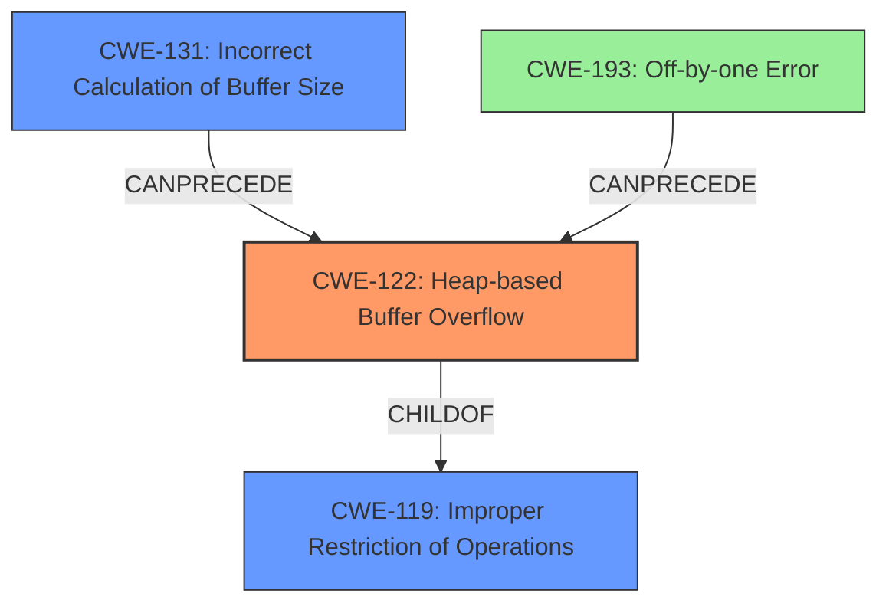

# Final Resolution for CVE-2022-0137

# Summary
| CWE ID | CWE Name | Confidence | CWE Abstraction Level | CWE Vulnerability Mapping Label | CWE-Vulnerability Mapping Notes |
|---|---|---|---|---|---|
| CWE-122 | Heap-based Buffer Overflow | 0.95 | Variant | Allowed | Primary CWE |
| CWE-131 | Incorrect Calculation of Buffer Size | 0.7 | Base | Allowed | Secondary Candidate |
| CWE-193 | Off-by-one Error | 0.4 | Base | Allowed | Tertiary Candidate |

## Evidence and Confidence

*   **Confidence Score:** 0.9
*   **Evidence Strength:** HIGH

## Relationship Analysis
The primary relationship influencing the decision is the parent-child relationship between CWE-119 (**CWE-119: Improper Restriction of Operations within the Bounds of a Memory Buffer**) and CWE-122 (**CWE-122: Heap-based Buffer Overflow**). CWE-122 is a variant of CWE-119, making it more specific and appropriate for this case. CWE-131 (**CWE-131: Incorrect Calculation of Buffer Size**) can precede CWE-119 as an incorrect size calculation can lead to an out-of-bounds write. CWE-193 (**CWE-193: A product calculates or uses an incorrect maximum or minimum value that is 1 more, or 1 less, than the correct value**) is considered a more distant contributing factor and hence assigned a lower confidence score. Abstraction levels guided the selection, favoring the Variant (CWE-122) and Base (CWE-131, CWE-193) levels for specific root cause identification.

## Vulnerability Chain
The vulnerability chain starts with an **incorrect calculation of the buffer size** (CWE-131). This leads to a heap buffer being allocated with an insufficient size. When the `image_set_mask` function writes data to the buffer using potentially larger image dimensions, a **heap-based buffer overflow** (CWE-122) occurs, allowing an attacker to write outside the buffer boundaries. A potential contributing factor, though less direct, could be an **off-by-one error** (CWE-193) in the size calculation.

## Summary of Analysis
The initial analysis and criticism both correctly identify CWE-122 (**CWE-122: Heap-based Buffer Overflow**) as the primary **weakness**. The vulnerability description clearly states a heap buffer overflow in the `image_set_mask` function. The evidence provided indicates that the `img->mask` buffer is allocated based on smaller initial image dimensions, leading to an overflow when `image_set_mask` uses modified, larger dimensions. This directly aligns with the characteristics of a heap-based buffer overflow.

CWE-131 (**CWE-131: Incorrect Calculation of Buffer Size**) is a valid secondary **weakness**, as the root cause involves an **incorrect calculation** of the buffer size. The evidence supports this, stating that the initial image dimensions are used to allocate the buffer, but these dimensions are later modified, making the initial allocation too small. The MITRE mapping guidance allows its use.

CWE-193 (**CWE-193: A product calculates or uses an incorrect maximum or minimum value that is 1 more, or 1 less, than the correct value**) is a less direct contributing factor. An off-by-one error *could* contribute to the calculation, however, the vulnerability is caused by a broader miscalculation rather than a simple +/- 1 error. The confidence score for CWE-193 is therefore reduced.

The selected CWEs are at the optimal level of specificity. CWE-122 is a variant of CWE-119 (**CWE-119: Improper Restriction of Operations within the Bounds of a Memory Buffer**), making it more specific. CWE-131 and CWE-193 are at the base level, providing specific details about the root cause. More general CWEs like CWE-682 (**CWE-682: Incorrect Calculation**) would be too abstract.