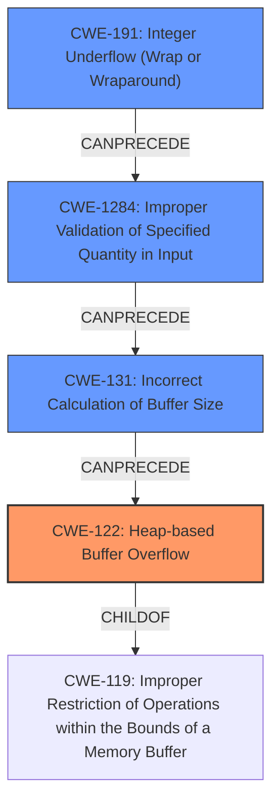

# Analysis Report for CVE-2022-0185

# Vulnerability Analysis Report: CVE-2022-0185

## Description

A heap-based buffer overflow flaw was found in the way the legacy_parse_param function in the Filesystem Context functionality of the Linux kernel verified the supplied parameters length. An unprivileged (in case of unprivileged user namespaces enabled, otherwise needs namespaced CAP_SYS_ADMIN privilege) local user able to open a filesystem that does not support the Filesystem Context API (and thus fallbacks to legacy handling) could use this flaw to escalate their privileges on the system.

## Vulnerability Description Key Phrases

**Rootcause:** heap-based buffer overflow
**Impact:** privilege escalation
**Attacker:** unprivileged local user
**Product:** Linux kernel
**Component:** legacy_parse_param function in Filesystem Context functionality

## Analysis (with Relationship Data)

# Summary
| CWE ID | CWE Name | Confidence | CWE Abstraction Level | CWE Vulnerability Mapping Label | CWE-Vulnerability Mapping Notes |
|---|---|---|---|---|---|
| CWE-122 | Heap-based Buffer Overflow | 0.95 | Variant | Allowed | Primary |
| CWE-191 | Integer Underflow (Wrap or Wraparound) | 0.80 | Base | Allowed | Secondary |

## Evidence and Confidence

*   **Confidence Score:** 0.90
*   **Evidence Strength:** HIGH

- **Analysis and Justification:**  
  - *Explanation:* The vulnerability is described as a **heap-based buffer overflow** in the `legacy_parse_param` function. The CVE Reference Links Content Summary confirms this, stating that the vulnerability allows an attacker to write beyond the allocated buffer on the heap due to an incorrect size calculation. This aligns directly with CWE-122 (Heap-based Buffer Overflow), which is a Variant-level CWE, providing a specific type of buffer overflow. The description notes that `size` is an unsigned integer. If `size` is close to `PAGE_SIZE`, the subtraction results in an **integer underflow** and a large positive value instead of the expected negative value, bypassing the size check. This aligns with CWE-191.

  - *Relationship Analysis:* CWE-122 is a variant of CWE-119 (Improper Restriction of Operations within the Bounds of a Memory Buffer). CWE-191 can precede CWE-119 as the integer underflow leads to the incorrect size calculation, eventually causing the heap overflow.

- **Confidence Score:**
  - Confidence: 0.95 (High confidence due to explicit mention of heap-based buffer overflow and integer underflow in the vulnerability description and CVE details.)

---
# Summary
| CWE ID | CWE Name | Confidence | CWE Abstraction Level | CWE Vulnerability Mapping Label | CWE-Vulnerability Mapping Notes |
|---|---|---|---|---|---|
| CWE-122 | Heap-based Buffer Overflow | 0.95 | Variant | Allowed | Primary |
| CWE-191 | Integer Underflow (Wrap or Wraparound) | 0.80 | Base | Allowed | Secondary |

## Evidence and Confidence

*   **Confidence Score:** 0.90
*   **Evidence Strength:** HIGH

- **Analysis and Justification:**  
  - *Explanation:* The vulnerability is described as a **heap-based buffer overflow** in the `legacy_parse_param` function. The CVE Reference Links Content Summary confirms this, stating that the vulnerability allows an attacker to write beyond the allocated buffer on the heap due to an incorrect size calculation. This aligns directly with CWE-122 (Heap-based Buffer Overflow), which is a Variant-level CWE, providing a specific type of buffer overflow. The description notes that `size` is an unsigned integer. If `size` is close to `PAGE_SIZE`, the subtraction results in an **integer underflow** and a large positive value instead of the expected negative value, bypassing the size check. This aligns with CWE-191.

  - *Relationship Analysis:* CWE-122 is a variant of CWE-119 (Improper Restriction of Operations within the Bounds of a Memory Buffer). CWE-191 can precede CWE-119 as the integer underflow leads to the incorrect size calculation, eventually causing the heap overflow.

- **Confidence Score:**
  - Confidence: 0.95 (High confidence due to explicit mention of heap-based buffer overflow and integer underflow in the vulnerability description and CVE details.)

---

## Criticism of Analysis

Okay, here's a review of the provided analysis, incorporating the full CWE specifications:

**Overall Assessment:**

The analysis is generally good and identifies the core issues.  The primary CWE mappings (CWE-122 and CWE-191) are accurate and well-supported by the vulnerability description and CVE details. The explanation and justification are clear. The confidence scores are also justified. However, we can refine the analysis further based on the full CWE specifications.

**Detailed Review:**

**1. CWE-122: Heap-based Buffer Overflow (Primary)**

*   **Mapping:** Correct. The vulnerability results in writing past the allocated buffer on the heap.
*   **Abstraction Level:** Variant, which is the preferred level.
*   **Mapping Guidance:** Adhered to - the analysis maps to a specific type of buffer overflow rather than a more general category.
*   **Potential Mitigations:**  The analysis could be strengthened by mentioning potential mitigations.  Consider:
    *   **Language Choice:** The analysis could mention using a language with automatic bounds checking or memory management (e.g., Rust, Java).
    *   **Safe Libraries:** Mention using safe string handling functions or libraries designed to prevent buffer overflows.
    *   **Compiler Flags:** Suggest using compiler flags like `/GS` (Microsoft Visual Studio) or `FORTIFY_SOURCE` (GCC) to enable buffer overflow detection.

**2. CWE-191: Integer Underflow (Wrap or Wraparound) (Secondary)**

*   **Mapping:** Correct. The integer underflow is the mechanism that bypasses the size check and *enables* the buffer overflow.
*   **Abstraction Level:** Base, which is preferred.
*   **Mapping Guidance:** Adhered to.
*   **Potential Mitigations:**
    *   The analysis can be improved by adding specific mitigations related to integer handling.
    *   **Input Validation:** Stricter input validation to ensure `size` is within a safe range *before* the subtraction.  This is key.  Specifically, ensure the `len` is within an acceptable range.
    *   **Safe Integer Libraries:** Using libraries that provide safe integer arithmetic with overflow/underflow detection.
    *   **Type Checking:**  Ensure the variable type used for size is appropriate. While the code used an unsigned integer, ensuring `size` does not become large enough to underflow `PAGE_SIZE - 2 - size`

**3. Considerations from Retriever Results:**

The Retriever Results suggest several other CWEs that should be considered. Let's address the most relevant:

*   **CWE-190: Integer Overflow or Wraparound:**  While the primary issue is *underflow*, integer overflow can sometimes be related in buffer overflow contexts (e.g., causing a smaller buffer to be allocated than expected).  However, in *this specific case*, underflow is more directly related. Therefore, CWE-190 is *not* as relevant but it highlights the importance of reviewing the code for *any* integer handling issues.
*   **CWE-126: Buffer Over-read:** This is *not* the primary issue here, which is a write, not a read. It should not be mapped to this issue.
*   **CWE-1284: Improper Validation of Specified Quantity in Input:** This is relevant. The code *attempts* to validate the input length (`len`), but this validation is flawed due to the integer underflow. The quantity that isn't properly validated is `len`. Consider adding this as a tertiary CWE.
*   **CWE-131: Incorrect Calculation of Buffer Size:** While the heap is allocated with a certain size, the incorrect size check leads to writing data outside of the expected bound. This is definitely a part of the issue. Consider adding as a tertiary CWE.

**Revised Analysis Summary Table:**

| CWE ID  | CWE Name                                  | Confidence | CWE Abstraction Level | CWE Vulnerability Mapping Label | CWE-Vulnerability Mapping Notes                                                                                                                                                                                                                                                                                                                                                          |
| :------ | :---------------------------------------- | :--------- | :---------------------- | :------------------------------ | :--------------------------------------------------------------------------------------------------------------------------------------------------------------------------------------------------------------------------------------------------------------------------------------------------------------------------------------------------------------------------------------------- |
| CWE-122 | Heap-based Buffer Overflow                  | 0.95       | Variant                | Allowed                       | Primary                                                                                                                                                                                                                                                                                                                                                             |
| CWE-191 | Integer Underflow (Wrap or Wraparound)    | 0.80       | Base                   | Allowed                       | Secondary - This leads to the incorrect size calculation that allows the heap overflow.                                                                                                                                                                                                                                                                                       |
| CWE-1284 | Improper Validation of Specified Quantity in Input | 0.60       | Base                   | Allowed                       | Tertiary - The code attempts to validate the length `len`, but fails because the integer underflow bypasses the intended check.                                                                                                                                                                                                                                       |
| CWE-131 | Incorrect Calculation of Buffer Size | 0.60       | Base                   | Allowed                       | Tertiary - The incorrect integer math leads to the code writing data out of the allocated heap bounds.                                                                                                                                                                                                                                       |

**Refined Justification:**

The vulnerability is a heap-based buffer overflow (CWE-122) caused by an integer underflow (CWE-191) in the `legacy_parse_param` function. The integer underflow occurs when calculating the available space in the buffer (`PAGE_SIZE - 2 - size`). Since `size` is unsigned, if it is close to `PAGE_SIZE`, the subtraction wraps around, leading to a large positive value and bypassing the intended bounds check. This improper validation of the length `len` (CWE-1284), coupled with the resulting incorrect calculation of the buffer's available size (CWE-131) then allows the subsequent memory copy operation to write beyond the allocated buffer on the heap, resulting in a heap-based buffer overflow.

**Revised Potential Mitigations (Combining all CWEs)**

*   **Language Choice:** Use languages or compilers with built-in memory safety features.
*   **Safe Libraries:** Employ safe string handling libraries to prevent buffer overflows.
*   **Compiler Flags:** Utilize compiler flags for buffer overflow detection (e.g., `/GS`, `FORTIFY_SOURCE`).
*   **Input Validation:**
    *   Thoroughly validate all input lengths (`len`) before calculations.
    *   Ensure length values are within acceptable ranges.
    *   Consider using "accept known good" validation strategies.
*   **Integer Handling:**
    *   Use safe integer arithmetic libraries.
    *   Carefully manage signed/unsigned types.  Use appropriate types to prevent underflow/overflow.
*   **Range Checks:** Always perform both minimum and maximum range checks.

**Conclusion:**

The initial analysis was accurate, but the addition of the specifications of various CWEs enables us to refine the analysis and strengthens the mapping. Specifically, adding CWE-1284 and CWE-131 as tertiary CWEs provides a more complete and detailed description. Including a more robust list of potential mitigations based on these specifications will allow developers to better understand how to prevent this vulnerability from occurring in the future.

## Final Resolution

# Summary
| CWE ID | CWE Name | Confidence | CWE Abstraction Level | CWE Vulnerability Mapping Label | CWE-Vulnerability Mapping Notes |
|---|---|---|---|---|---|
| CWE-122 | Heap-based Buffer Overflow | 0.95 | Variant | Allowed | Primary CWE |
| CWE-191 | Integer Underflow (Wrap or Wraparound) | 0.80 | Base | Allowed | Secondary Candidate |
| CWE-1284 | Improper Validation of Specified Quantity in Input | 0.60 | Base | Allowed | Secondary Candidate |
| CWE-131 | Incorrect Calculation of Buffer Size | 0.60 | Base | Allowed | Secondary Candidate |

## Evidence and Confidence

*   **Confidence Score:** 0.92
*   **Evidence Strength:** HIGH

## Relationship Analysis
The primary weakness is a **CWE-122 (Heap-based Buffer Overflow)**, which is a variant of **CWE-119 (Improper Restriction of Operations within the Bounds of a Memory Buffer)**. The vulnerability chain starts with **CWE-191 (Integer Underflow)**, leading to **CWE-1284 (Improper Validation of Specified Quantity in Input)** and **CWE-131 (Incorrect Calculation of Buffer Size)** which ultimately results in **CWE-122 (Heap-based Buffer Overflow)**. These relationships help to clarify the root cause and the progression of the vulnerability. The abstraction levels (Variant for CWE-122 and Base for CWE-191, CWE-1284, and CWE-131) are appropriate for the level of detail available.

## Vulnerability Chain
The vulnerability chain starts with an **integer underflow (CWE-191)** during the calculation of the buffer size. This leads to **improper validation of the specified quantity in input (CWE-1284)** because the underflowed value bypasses the intended checks. This results in an **incorrect calculation of the buffer size (CWE-131)**, ultimately causing a **heap-based buffer overflow (CWE-122)** when data is written beyond the allocated buffer.

*   **Root Cause:** **CWE-191 (Integer Underflow)**
*   **Weakness 1:** **CWE-1284 (Improper Validation of Specified Quantity in Input)**
*   **Weakness 2:** **CWE-131 (Incorrect Calculation of Buffer Size)**
*   **Impact:** **CWE-122 (Heap-based Buffer Overflow)**, leading to potential privilege escalation.

## Summary of Analysis
The initial analysis correctly identified **CWE-122 (Heap-based Buffer Overflow)** and **CWE-191 (Integer Underflow)**. The criticism correctly suggests considering **CWE-1284 (Improper Validation of Specified Quantity in Input)** and **CWE-131 (Incorrect Calculation of Buffer Size)**, which are added as tertiary CWEs.

The graph relationships clearly show how **CWE-191 (Integer Underflow)** can precede **CWE-1284 (Improper Validation of Specified Quantity in Input)** and **CWE-131 (Incorrect Calculation of Buffer Size)** which then leads to **CWE-122 (Heap-based Buffer Overflow)**.

The selected CWEs are at the optimal level of specificity. **CWE-122 (Heap-based Buffer Overflow)** is a variant that accurately describes the type of buffer overflow. **CWE-191 (Integer Underflow)**, **CWE-1284 (Improper Validation of Specified Quantity in Input)** and **CWE-131 (Incorrect Calculation of Buffer Size)** are base-level CWEs that provide a clear understanding of the root cause and contributing factors.

The evidence from the vulnerability description supports this classification: "A heap-based buffer overflow flaw was found... in the Filesystem Context functionality of the Linux kernel... an unprivileged... local user... could use this flaw to escalate their privileges on the system." Additionally, the description mentions the incorrect size calculation and the **integer underflow**, which directly supports the inclusion of **CWE-191**.

The refined analysis provides a more complete and accurate representation of the vulnerability by including **CWE-1284 (Improper Validation of Specified Quantity in Input)** and **CWE-131 (Incorrect Calculation of Buffer Size)**, which are crucial steps in the vulnerability chain.

*Report generated on 2025-03-18 05:39:18*
