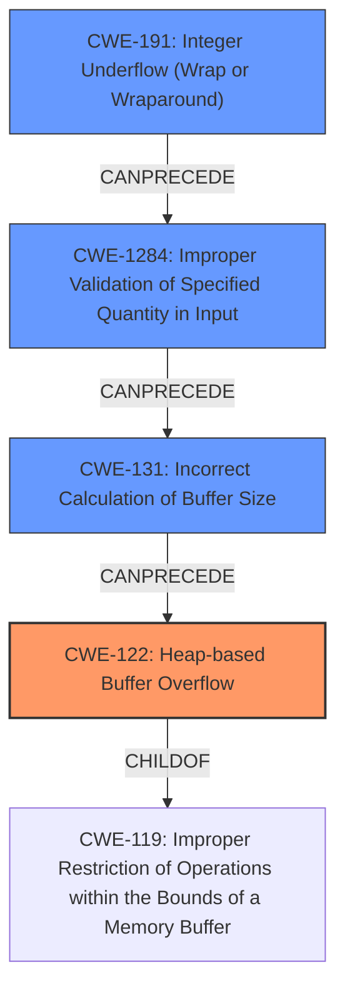

# Final Resolution for CVE-2022-0185

# Summary
| CWE ID | CWE Name | Confidence | CWE Abstraction Level | CWE Vulnerability Mapping Label | CWE-Vulnerability Mapping Notes |
|---|---|---|---|---|---|
| CWE-122 | Heap-based Buffer Overflow | 0.95 | Variant | Allowed | Primary CWE |
| CWE-191 | Integer Underflow (Wrap or Wraparound) | 0.80 | Base | Allowed | Secondary Candidate |
| CWE-1284 | Improper Validation of Specified Quantity in Input | 0.60 | Base | Allowed | Secondary Candidate |
| CWE-131 | Incorrect Calculation of Buffer Size | 0.60 | Base | Allowed | Secondary Candidate |

## Evidence and Confidence

*   **Confidence Score:** 0.92
*   **Evidence Strength:** HIGH

## Relationship Analysis
The primary weakness is a **CWE-122 (Heap-based Buffer Overflow)**, which is a variant of **CWE-119 (Improper Restriction of Operations within the Bounds of a Memory Buffer)**. The vulnerability chain starts with **CWE-191 (Integer Underflow)**, leading to **CWE-1284 (Improper Validation of Specified Quantity in Input)** and **CWE-131 (Incorrect Calculation of Buffer Size)** which ultimately results in **CWE-122 (Heap-based Buffer Overflow)**. These relationships help to clarify the root cause and the progression of the vulnerability. The abstraction levels (Variant for CWE-122 and Base for CWE-191, CWE-1284, and CWE-131) are appropriate for the level of detail available.

## Vulnerability Chain
The vulnerability chain starts with an **integer underflow (CWE-191)** during the calculation of the buffer size. This leads to **improper validation of the specified quantity in input (CWE-1284)** because the underflowed value bypasses the intended checks. This results in an **incorrect calculation of the buffer size (CWE-131)**, ultimately causing a **heap-based buffer overflow (CWE-122)** when data is written beyond the allocated buffer.

*   **Root Cause:** **CWE-191 (Integer Underflow)**
*   **Weakness 1:** **CWE-1284 (Improper Validation of Specified Quantity in Input)**
*   **Weakness 2:** **CWE-131 (Incorrect Calculation of Buffer Size)**
*   **Impact:** **CWE-122 (Heap-based Buffer Overflow)**, leading to potential privilege escalation.

## Summary of Analysis
The initial analysis correctly identified **CWE-122 (Heap-based Buffer Overflow)** and **CWE-191 (Integer Underflow)**. The criticism correctly suggests considering **CWE-1284 (Improper Validation of Specified Quantity in Input)** and **CWE-131 (Incorrect Calculation of Buffer Size)**, which are added as tertiary CWEs.

The graph relationships clearly show how **CWE-191 (Integer Underflow)** can precede **CWE-1284 (Improper Validation of Specified Quantity in Input)** and **CWE-131 (Incorrect Calculation of Buffer Size)** which then leads to **CWE-122 (Heap-based Buffer Overflow)**.

The selected CWEs are at the optimal level of specificity. **CWE-122 (Heap-based Buffer Overflow)** is a variant that accurately describes the type of buffer overflow. **CWE-191 (Integer Underflow)**, **CWE-1284 (Improper Validation of Specified Quantity in Input)** and **CWE-131 (Incorrect Calculation of Buffer Size)** are base-level CWEs that provide a clear understanding of the root cause and contributing factors.

The evidence from the vulnerability description supports this classification: "A heap-based buffer overflow flaw was found... in the Filesystem Context functionality of the Linux kernel... an unprivileged... local user... could use this flaw to escalate their privileges on the system." Additionally, the description mentions the incorrect size calculation and the **integer underflow**, which directly supports the inclusion of **CWE-191**.

The refined analysis provides a more complete and accurate representation of the vulnerability by including **CWE-1284 (Improper Validation of Specified Quantity in Input)** and **CWE-131 (Incorrect Calculation of Buffer Size)**, which are crucial steps in the vulnerability chain.