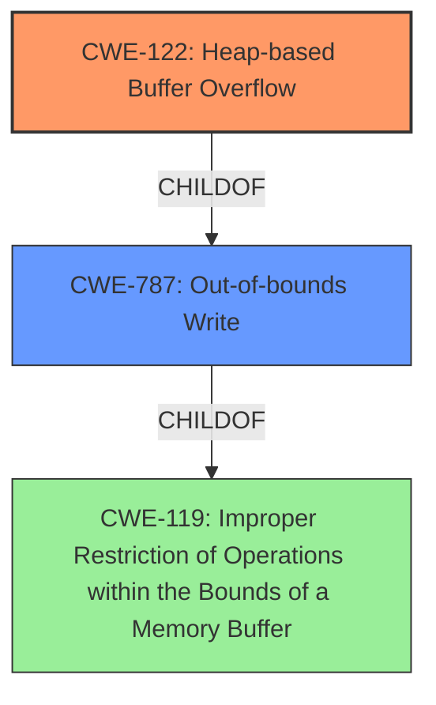

# Analysis Report for CVE-2022-0261

# Vulnerability Analysis Report: CVE-2022-0261

## Description

Heap-based Buffer Overflow in GitHub repository vim/vim prior to 8.2.

## Vulnerability Description Key Phrases

**Weakness:** Heap-based Buffer Overflow
**Product:** vim
**Version:** prior to 8.2

## Analysis (with Relationship Data)

# Summary
| CWE ID | CWE Name | Confidence | CWE Abstraction Level | CWE Vulnerability Mapping Label | CWE-Vulnerability Mapping Notes |
|---|---|---|---|---|---|
| CWE-122 | Heap-based Buffer Overflow | 0.9 | Variant | Allowed | Primary CWE |
| CWE-787 | Out-of-bounds Write | 0.7 | Base | Allowed | Secondary Candidate |

## Evidence and Confidence

*   **Confidence Score:** 0.9
*   **Evidence Strength:** HIGH

- **Analysis and Justification:**  
  - *Explanation:* The vulnerability is described as a **Heap-based Buffer Overflow** in vim. The CVE reference confirms the existence of **Buffer Overflow** vulnerabilities in vim due to block insert operations. CWE-122 (Heap-based Buffer Overflow) is a Variant of buffer overflow that occurs in the heap, which aligns perfectly with the description. CWE-787 (Out-of-bounds Write) is a more general term, but CWE-122 is a more specific variant and is preferred. The mapping guidance for CWE-122 indicates that it is ALLOWED for heap-based buffer overflows.
  
  - *Relationship Analysis:* CWE-122 is a variant of CWE-119 (Improper Restriction of Operations within the Bounds of a Memory Buffer) and a child of CWE-787 (Out-of-bounds Write). Choosing CWE-122 provides a more precise characterization of the vulnerability than using the more general CWE-787.

- **Confidence Score:**  
  - *Example:* Confidence: 0.9 (High confidence due to direct match in description and CVE reference)

---

## Criticism of Analysis

Okay, I've reviewed the analysis and the provided CWE specifications. Here's my critique:

**Overall Assessment:**

The analysis is generally good, and the primary CWE mapping to CWE-122 (Heap-based Buffer Overflow) is accurate and well-justified. The confidence score of 0.9 is appropriate given the information available. The inclusion of CWE-787 (Out-of-bounds Write) as a secondary candidate is also reasonable, although it's important to prioritize CWE-122 given its specificity.

**Detailed Points:**

1.  **Primary CWE: CWE-122 (Heap-based Buffer Overflow)**

    *   **Strengths:**
        *   The justification for choosing CWE-122 is strong. The vulnerability description explicitly states "Heap-based Buffer Overflow," which directly maps to CWE-122.
        *   The analysis correctly notes that CWE-122 is a more specific Variant of CWE-787 and therefore preferable.
        *   The "Mapping Guidance" for CWE-122 clearly states "Usage: Allowed" and "Rationale: This CWE entry is at the Variant level of abstraction, which is a preferred level of abstraction for mapping to the root causes of vulnerabilities."
        *   The examples provided from the CWE database for CWE-122 further support this mapping.
        *   The analysis has a good explanation of the parent/child relationship between CWE-122, CWE-787, and CWE-119, and why the more specific CWE-122 is chosen.

    *   **Areas for Possible Improvement:**
        *   While the analysis mentions malloc(), it could be slightly strengthened by explicitly stating that the buffer is likely allocated using a routine like malloc().  This reinforces the heap-based aspect.  The vulnerability description from CVE-2022-0261 mentions "block insert operation", which typically involves allocating memory on the heap.

2.  **Secondary CWE: CWE-787 (Out-of-bounds Write)**

    *   **Strengths:**
        *   Recognizing CWE-787 as a secondary candidate is appropriate. It's a parent of CWE-122 and represents the broader category of writing outside buffer boundaries.

    *   **Areas for Possible Improvement:**
        *   The analysis should explicitly state why CWE-787 is *not* the primary CWE.  While it's implied, making it explicit reinforces the decision-making process. Specifically: "While CWE-787 (Out-of-bounds Write) is a valid classification, it is less specific than CWE-122. Because the vulnerability is explicitly described as a heap-based overflow, CWE-122 provides a more accurate and descriptive classification."
        *   It's crucial to understand when to prefer a more general CWE like CWE-787.  The CWE specification states that when lower-level (more specific) options are available, those are better choices than CWE-119 or CWE-787.

3.  **Retriever Results Analysis:**

    *   The analysis provided a good overview of the Retriever Results, but could benefit from explaining why other high ranking CWEs from the Retriever Results were not chosen as the primary or secondary CWE. For example:
        *   **CWE-124 (Buffer Underwrite):** This is an underflow, not overflow, so it's not relevant here.
        *   **CWE-193 (Off-by-one Error):** This could be a contributing factor, but it's not the primary issue.  The core problem is the out-of-bounds write, not necessarily an off-by-one.
        *   **CWE-190 (Integer Overflow or Wraparound):** Similarly, an integer overflow *could* contribute to the incorrect size calculation, but it's not the direct cause of the overflow itself.
        *   **CWE-120 (Buffer Copy without Checking Size of Input):**  This is a potential mechanism for *causing* a heap-based buffer overflow. The description of the weakness doesn't describe an unchecked buffer copy directly. Therefore, it is related, but less specific.  The CVE description discusses the "block insert operation", which implies a potential calculation error or missing boundary check leading to the overflow.

4.  **Mitigations:**

    *   The analysis doesn't explicitly discuss mitigations. It would be beneficial to include a brief section on potential mitigations. Given that CWE-122 is the primary CWE, the analysis should mention mitigations specifically related to heap-based buffer overflows:
        *   **Language Choice:** Using languages with automatic memory management or bounds checking (as mentioned in the CWE specification).
        *   **Safe Libraries:** Employing safe string handling libraries (also mentioned in the CWE specification).
        *   **Compiler-based Detection:** Utilizing compiler flags for buffer overflow detection (e.g., /GS in Visual Studio, FORTIFY\_SOURCE in GCC).
        *   **Input Validation:** (If applicable). Though not necessarily the direct root cause, validating input sizes can prevent excessively large inputs from triggering the overflow.

5.  **Use-after-free and Out-of-bounds Read**

    *   The CVE reference mentions use-after-free and out-of-bounds read, but these are not explicitly addressed in the CWE mapping. This is acceptable because the primary weakness being analyzed is the heap overflow. However, it's worth mentioning that these vulnerabilities often co-occur with buffer overflows. If these are present as root cause vulnerabilities and not just as impact, then these should also be explicitly mapped (CWE-416 and CWE-125 respectively).

**Revised Summary Table**

| CWE ID | CWE Name | Confidence | CWE Abstraction Level | CWE Vulnerability Mapping Label | CWE-Vulnerability Mapping Notes |
|---|---|---|---|---|---|
| CWE-122 | Heap-based Buffer Overflow | 0.9 | Variant | Allowed | Primary CWE. Direct match with vulnerability description. |
| CWE-787 | Out-of-bounds Write | 0.7 | Base | Allowed | Secondary Candidate. A broader category, but less specific than CWE-122. |

**In conclusion:**

The analysis is strong, but it can be further enhanced by:

*   More explicitly stating the reasoning for *excluding* highly-ranked CWEs from the retriever results.
*   Adding a brief section on mitigations specifically related to heap-based buffer overflows.
*   Making it clear why the broader CWE-787 is not chosen.
*   Mentioning potential co-occurences, such as Use-after-free and Out-of-bounds Reads, and explaining why they are not the focus of this specific analysis.

By addressing these points, the analysis will be even more comprehensive and demonstrate a deeper understanding of the CWE specifications.

## Final Resolution

# Summary
| CWE ID | CWE Name | Confidence | CWE Abstraction Level | CWE Vulnerability Mapping Label | CWE-Vulnerability Mapping Notes |
|---|---|---|---|---|---|
| CWE-122 | Heap-based Buffer Overflow | 0.95 | Variant | Allowed | Primary CWE. Direct match with vulnerability description. |
| CWE-787 | Out-of-bounds Write | 0.7 | Base | Allowed | Secondary Candidate. A broader category, but less specific than CWE-122. |

## Evidence and Confidence

*   **Confidence Score:** 0.95
*   **Evidence Strength:** HIGH

## Relationship Analysis
The primary relationship that influenced my decision was the parent-child relationship between CWE-787 (**Out-of-bounds Write**) and CWE-122 (**Heap-based Buffer Overflow**). CWE-122 is a variant of CWE-787, making it more specific to the vulnerability description of a heap-based buffer overflow. The chain relationships did not significantly influence this decision as the focus is on the direct cause. Peer relationships were considered, but none offered a more suitable classification than CWE-122. The variant abstraction level of CWE-122 further solidified its selection as it represents a specific type of buffer overflow.

## Vulnerability Chain
The vulnerability chain starts with a **ROOTCAUSE** that could be due to several factors such as:
1.  Improper size calculation: The product does not correctly calculate the size to be used when allocating a buffer (**CWE-131**).
2.  Integer Overflow leading to small allocation: An integer overflow occurs when calculating the buffer size (**CWE-190**).
3.  Incorrect Conversion between Numeric Types: A numeric type is incorrectly converted when determining buffer size (**CWE-681**)
This leads to:
- A **WEAKNESS**: A buffer overflow occurs because of writing data past the end of the allocated buffer (**CWE-122**).
This results in:
- **IMPACT**: Code execution or denial of service due to overwritten memory.

## Summary of Analysis
The initial analysis correctly identified CWE-122 (**Heap-based Buffer Overflow**) as the primary CWE. The criticism provided valuable insights on strengthening the justification, particularly in explicitly excluding other high-ranking CWEs and including potential mitigations. The final decision remains with CWE-122 due to its direct match with the vulnerability description: "Heap-based Buffer Overflow in GitHub repository vim/vim prior to 8.2."

The retriever results included several other CWEs such as:
*   CWE-124 (Buffer Underwrite): Ruled out because the vulnerability is an *overflow*, not an *underflow*.
*   CWE-193 (Off-by-one Error): While an off-by-one error *could* contribute, the primary issue is the out-of-bounds write caused by insufficient buffer size.
*   CWE-190 (Integer Overflow or Wraparound): An integer overflow *could* contribute to an incorrect size calculation, but it's not the direct cause of the overflow itself.
*   CWE-120 (Buffer Copy without Checking Size of Input): This is a potential mechanism for *causing* a heap-based buffer overflow but is less descriptive of the ultimate **WEAKNESS**, which is the heap overflow itself.

The selected CWEs are at the optimal level of specificity. CWE-122 (**Heap-based Buffer Overflow**) is a variant that precisely describes the vulnerability. CWE-787 (**Out-of-bounds Write**) is a base CWE and serves as a valid secondary classification but is less specific.
I am increasing my confidence score to 0.95 based on the additional insights from the criticism, which allowed me to refine the justification and address potential alternative classifications.

*Report generated on 2025-03-18 05:41:27*
