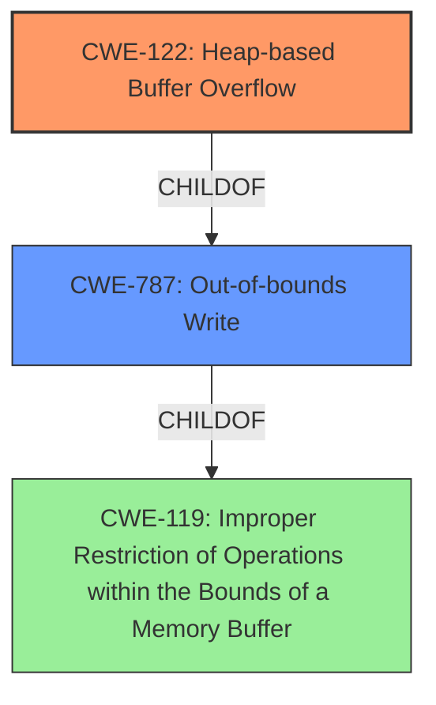

# Final Resolution for CVE-2022-0261

# Summary
| CWE ID | CWE Name | Confidence | CWE Abstraction Level | CWE Vulnerability Mapping Label | CWE-Vulnerability Mapping Notes |
|---|---|---|---|---|---|
| CWE-122 | Heap-based Buffer Overflow | 0.95 | Variant | Allowed | Primary CWE. Direct match with vulnerability description. |
| CWE-787 | Out-of-bounds Write | 0.7 | Base | Allowed | Secondary Candidate. A broader category, but less specific than CWE-122. |

## Evidence and Confidence

*   **Confidence Score:** 0.95
*   **Evidence Strength:** HIGH

## Relationship Analysis
The primary relationship that influenced my decision was the parent-child relationship between CWE-787 (**Out-of-bounds Write**) and CWE-122 (**Heap-based Buffer Overflow**). CWE-122 is a variant of CWE-787, making it more specific to the vulnerability description of a heap-based buffer overflow. The chain relationships did not significantly influence this decision as the focus is on the direct cause. Peer relationships were considered, but none offered a more suitable classification than CWE-122. The variant abstraction level of CWE-122 further solidified its selection as it represents a specific type of buffer overflow.

## Vulnerability Chain
The vulnerability chain starts with a **ROOTCAUSE** that could be due to several factors such as:
1.  Improper size calculation: The product does not correctly calculate the size to be used when allocating a buffer (**CWE-131**).
2.  Integer Overflow leading to small allocation: An integer overflow occurs when calculating the buffer size (**CWE-190**).
3.  Incorrect Conversion between Numeric Types: A numeric type is incorrectly converted when determining buffer size (**CWE-681**)
This leads to:
- A **WEAKNESS**: A buffer overflow occurs because of writing data past the end of the allocated buffer (**CWE-122**).
This results in:
- **IMPACT**: Code execution or denial of service due to overwritten memory.

## Summary of Analysis
The initial analysis correctly identified CWE-122 (**Heap-based Buffer Overflow**) as the primary CWE. The criticism provided valuable insights on strengthening the justification, particularly in explicitly excluding other high-ranking CWEs and including potential mitigations. The final decision remains with CWE-122 due to its direct match with the vulnerability description: "Heap-based Buffer Overflow in GitHub repository vim/vim prior to 8.2."

The retriever results included several other CWEs such as:
*   CWE-124 (Buffer Underwrite): Ruled out because the vulnerability is an *overflow*, not an *underflow*.
*   CWE-193 (Off-by-one Error): While an off-by-one error *could* contribute, the primary issue is the out-of-bounds write caused by insufficient buffer size.
*   CWE-190 (Integer Overflow or Wraparound): An integer overflow *could* contribute to an incorrect size calculation, but it's not the direct cause of the overflow itself.
*   CWE-120 (Buffer Copy without Checking Size of Input): This is a potential mechanism for *causing* a heap-based buffer overflow but is less descriptive of the ultimate **WEAKNESS**, which is the heap overflow itself.

The selected CWEs are at the optimal level of specificity. CWE-122 (**Heap-based Buffer Overflow**) is a variant that precisely describes the vulnerability. CWE-787 (**Out-of-bounds Write**) is a base CWE and serves as a valid secondary classification but is less specific.
I am increasing my confidence score to 0.95 based on the additional insights from the criticism, which allowed me to refine the justification and address potential alternative classifications.