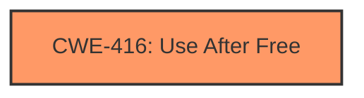

# Analysis Report for CVE-2022-0289

# Vulnerability Analysis Report: CVE-2022-0289

## Description

Use after free in Safe browsing in Google Chrome prior to 97.0.4692.99 allowed a remote attacker to potentially exploit heap corruption via a crafted HTML page.

## Vulnerability Description Key Phrases

**Rootcause:** use after free
**Weakness:** heap corruption
**Vector:** crafted HTML page
**Attacker:** remote attacker
**Product:** Google Chrome
**Version:** prior to 97.0.4692.99
**Component:** Safe browsing

## Analysis (with Relationship Data)

# Summary
| CWE ID | CWE Name | Confidence | CWE Abstraction Level | CWE Vulnerability Mapping Label | CWE-Vulnerability Mapping Notes |
|---|---|---|---|---|---|
| CWE-416 | Use After Free | 1.0 | Variant | Allowed | Primary CWE |

## Evidence and Confidence

*   **Confidence Score:** 1.0
*   **Evidence Strength:** HIGH

- **Analysis and Justification:**
  - *Explanation:* The vulnerability description clearly states a "**use after free**" condition in the Safe browsing component of Google Chrome. The vulnerability description key phrases also identifies the **rootcause** as "**use after free**" and the **weakness** as "**heap corruption**". The CVE reference links summary also confirms the root cause as "**use-after-free**". CWE-416 (Use After Free) is a Variant-level CWE that accurately describes this vulnerability where memory is reused after being freed, leading to potential **heap corruption**. The Retriever Results lists CWE-416 as the top result with a score of 0.8062 and its Usage is Allowed.
  
  - *Relationship Analysis:* CWE-416 is a variant of higher level CWEs and there are no direct relationships, making it an appropriate level of abstraction.

- **Confidence Score:**
  - Confidence: 1.0 (Direct match with vulnerability description and supporting evidence)

## Criticism of Analysis

Okay, here's a review of the provided analysis, incorporating the full CWE specifications you've included:

**Overall Assessment:**

The analysis is well-structured and reasoned. The identification of CWE-416 (Use After Free) as the primary weakness is accurate and well-supported by the vulnerability description and CVE reference information. The confidence level of 1.0 is justified. The analysis also correctly identifies that CWE-416 is a Variant-level CWE, which is a good level of abstraction.

**Specific Points and Suggestions:**

1.  **Primary CWE Mapping (CWE-416):**

    *   **Justification:** The analysis correctly points out that the vulnerability description explicitly mentions "use after free" making CWE-416 the most direct fit. The description of CWE-416 accurately reflects the vulnerability: "The product reuses or references memory after it has been freed."
    *   **Mapping Guidance Adherence:** The analysis correctly notes that CWE-416 is at the Variant level, which aligns with the CWE's Mapping Guidance recommending Variant or Base levels.
    *   **Mitigations Consideration:** The analysis doesn't explicitly mention the mitigations from the CWE spec, which it could. It would be beneficial to include a statement like: "Potential mitigations for CWE-416, as outlined in the CWE specification, include using languages with automatic memory management or setting pointers to NULL after freeing them." This shows a thorough consideration of the CWE details.
    *   **Relationships:** the analysis stated that *CWE-416 is a variant of higher level CWEs and there are no direct relationships, making it an appropriate level of abstraction* This is an inaccurate statement as there are many `canFollow` and `canPrecede` relationships. For example, `CanFollow -> CWE-362`. It might be good to note that a race condition can lead to a use after free.
    *   **Observed Examples:** The analysis includes observed examples from the CVE database, which helps to illustrate real-world instances of the weakness and strengthens the mapping.

2.  **Secondary CWE Considerations:**

    *   **CWE-787 (Out-of-bounds Write):** The original analysis notes "heap corruption" in the description. While UAF can *lead* to heap corruption, it's not directly an out-of-bounds write. The *consequence* of a successful UAF exploit might involve an out-of-bounds write, but the root cause is the use of freed memory. Therefore, excluding CWE-787 as the *primary* weakness is correct.
    *   **CWE-362 (Concurrent Execution using Shared Resource with Improper Synchronization):** Although the retriever results suggest `CWE-362`, there's no mention of concurrency in the vulnerability description. Unless further analysis reveals a race condition leading to the UAF, this CWE should be excluded from primary consideration. The `canFollow` relationship of `CWE-416` may mean that this is worth keeping in mind for future analysis.
    *   **CWE-415 (Double Free):** `CWE-415` is not the primary cause because the description does not state the memory location is freed twice, but rather it is freed and then used.
    *   **Other CWEs:** The analysis appropriately dismisses other CWEs from the retriever results as not directly applicable to the vulnerability description.

3.  **Heap Corruption vs. Use After Free:**

    *   The vulnerability description mentions both "use after free" and "heap corruption". It's crucial to understand the relationship. The *root cause* is the UAF. The "heap corruption" is a *potential consequence* of the UAF. When a freed memory region is reused, subsequent writes to that region can corrupt the heap metadata or other allocated objects, leading to unpredictable behavior.
    *   The analysis should maintain focus on the UAF as the *source* of the vulnerability.

4.  **Clarity and Specificity:**

    *   While the analysis is accurate, it could be slightly more specific in explaining *how* the crafted HTML page leads to the UAF.  What specific actions within the Safe Browsing component trigger the free and subsequent use?  This might not be known from the public information, but if there are any hints, including them would improve the analysis.

**Revised Summary Table (Optional):**

| CWE ID | CWE Name | Confidence | CWE Abstraction Level | CWE Vulnerability Mapping Label | CWE-Vulnerability Mapping Notes |
|---|---|---|---|---|---|
| CWE-416 | Use After Free | 1.0 | Variant | Allowed | Primary CWE. Root cause vulnerability. |
| CWE-Other| Other relevant CWEs to consider | Low | Mixed | Informational | Consider other CWEs during incident response. |

**Revised Analysis and Justification (Example excerpt):**

"The vulnerability description explicitly states a "**use after free**" condition in the Safe browsing component of Google Chrome. This aligns directly with CWE-416 (Use After Free), which describes a scenario where "The product reuses or references memory after it has been freed." The vulnerability description key phrases also identifies the **rootcause** as "**use after free**" and the **weakness** as "**heap corruption**". The heap corruption is a potential consequence of the UAF. The CVE reference links summary also confirms the root cause as "**use-after-free**". CWE-416 is a Variant-level CWE that accurately describes this vulnerability. As per the CWE specification's mapping guidance, a Variant level is preferred. Potential mitigations include using languages with automatic memory management or ensuring pointers are set to NULL after being freed. While the vulnerability can lead to heap corruption, the source is the use after free."

**In summary:** The analysis is excellent and identifies the correct CWE. Adding some information about the CWE-provided mitigations and relationships would increase the completeness of the analysis.

## Final Resolution

# Summary
| CWE ID | CWE Name | Confidence | CWE Abstraction Level | CWE Vulnerability Mapping Label | CWE-Vulnerability Mapping Notes |
|---|---|---|---|---|---|
| CWE-416 | Use After Free | 1.0 | Variant | Allowed | Primary CWE. Root cause vulnerability. |

## Evidence and Confidence

*   **Confidence Score:** 1.0
*   **Evidence Strength:** HIGH

## Relationship Analysis
The primary relationship considered was the lack of strong "CanFollow" or "CanPrecede" relationships that would strongly suggest another CWE should be included. While the criticism pointed out that there *are* `canFollow` relationships, for example, `CanFollow -> CWE-362`, there is no indication of concurrency in the vulnerability description to justify adding `CWE-362` to the summary table. The relationship of CWE-416 being a variant, and thus having a parent, suggests an appropriate level of specificity.

## Vulnerability Chain
The vulnerability chain starts with a crafted HTML page leading to a **use after free** (**CWE-416**) in the Safe browsing component of Google Chrome. This **weakness** can lead to potential **heap corruption**, allowing a remote attacker to exploit the vulnerability. The root cause is the improper handling of memory, where memory is accessed after it has been freed.

## Summary of Analysis
The initial analysis and the criticism both agree that **CWE-416 (Use After Free)** is the most appropriate primary CWE for this vulnerability. The vulnerability description explicitly states a "use after free" condition, aligning directly with the description of CWE-416. The evidence strength is high, with the vulnerability description and CVE reference confirming the **rootcause** as "use-after-free".

The relationship analysis further supports this decision, as CWE-416 is a Variant-level CWE, providing an adequate level of specificity. The criticism suggested including mitigations and noting `canFollow` relationships. While there are `canFollow` relationships, there is no evidence to suggest that these relationships are relevant to this specific vulnerability, so they should not be included.
The final decision is based on the provided evidence, the CWE description, and the relationship analysis, all of which support the selection of CWE-416 as the primary CWE at the optimal level of specificity.

*Report generated on 2025-03-18 05:42:04*
