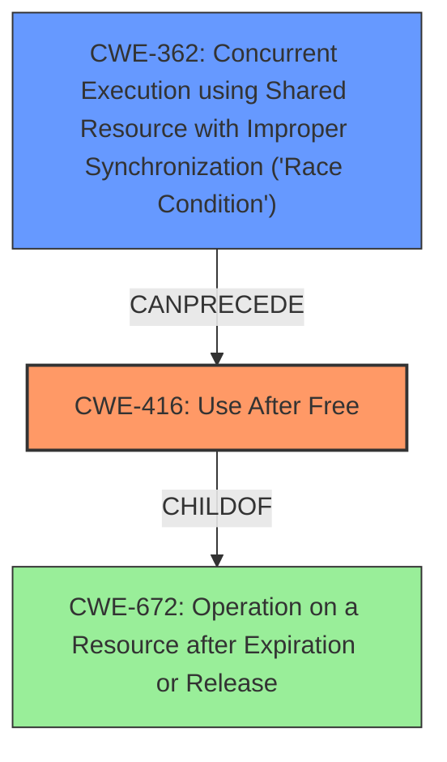

# Analysis Report for CVE-2022-0293

# Vulnerability Analysis Report: CVE-2022-0293

## Description

Use after free in Web packaging in Google Chrome prior to 97.0.4692.99 allowed a remote attacker to potentially exploit heap corruption via a crafted HTML page.

## Vulnerability Description Key Phrases

**Rootcause:** use after free
**Weakness:** heap corruption
**Vector:** crafted HTML page
**Attacker:** remote attacker
**Product:** Google Chrome
**Version:** prior to 97.0.4692.99
**Component:** Web packaging

## Analysis (with Relationship Data)

# Summary
| CWE ID | CWE Name | Confidence | CWE Abstraction Level | CWE Vulnerability Mapping Label | CWE-Vulnerability Mapping Notes |
|---|---|---|---|---|---|
| CWE-416 | Use After Free | 1.0 | Variant | Allowed | The vulnerability description explicitly states "use after free". |

## Evidence and Confidence

*   **Confidence Score:** 1.0
*   **Evidence Strength:** HIGH

- **Analysis and Justification:**  
  - *Explanation:* The vulnerability description clearly states a "**use after free**" condition in Web packaging in Google Chrome. This directly corresponds to CWE-416, "Use After Free," which occurs when a program reuses or references memory after it has been freed. The **heap corruption** is a consequence of the **use-after-free**. The vulnerability is triggered via a crafted HTML page, which serves as the attack vector. The "CVE Reference Links Content Summary" section confirms the root cause as "Use after free." The provided MITRE mapping guidance for CWE-416 designates its usage as ALLOWED, further solidifying its appropriateness.

  - *Relationship Analysis:* CWE-416 is a Variant level CWE. While it's a child of CWE-672 (Operation on a Resource after Expiry), mapping directly to CWE-416 is more accurate given the explicit mention of "use after free."

- **Confidence Score:**  
  - Confidence: 1.0 (High confidence due to direct match in vulnerability description and CVE reference.)

## Criticism of Analysis

Okay, here's a review of the provided analysis, incorporating the full CWE specifications and paying particular attention to the mapping guidance and potential mitigations:

**Overall Assessment:**

The analysis is very good and correctly identifies CWE-416 (Use After Free) as the primary weakness. The confidence score of 1.0 is justified, given the explicit mention of "use after free" in the vulnerability description. The provided reasoning and evidence are strong.

**Detailed Review:**

*   **Summary Table:** Correct and well-formatted.
*   **Evidence and Confidence:**
    *   **Confidence Score:** Excellent justification for the high confidence level.
    *   **Explanation:** The explanation clearly connects the vulnerability description to the CWE definition. The mention of the MITRE mapping guidance for CWE-416 is a strong point.
    *   **Relationship Analysis:** Good justification for selecting the Variant level CWE. Parent-child relationships were considered.

*   **CWE Examples from Database:** Relevant and helpful in illustrating real-world instances of CWE-416.

*   **Relevant CWE Specifications:** Excellent Inclusion of specification

*   **Specific CWE Critiques & Considerations:**

    *   **CWE-416: Use After Free**
        *   **Mapping Guidance:** The analysis correctly acknowledges and applies the "Allowed" usage and rationale for CWE-416.  It emphasizes reading the name and description to ensure an appropriate fit, which demonstrates a good understanding of the mapping process.
        *   **Potential Mitigations:** The analysis would benefit from mentioning some of the mitigations described in the CWE specification. While it's understood that a full mitigation strategy is beyond the scope of a CWE mapping, briefly mentioning potential mitigations could enhance the analysis.  For example, pointing out that using a language with automatic memory management could have prevented the UAF, or that setting pointers to NULL after freeing them could act as a defense-in-depth measure.
        *   Observed Examples: relevant examples of chains containing CWE-416.

    *   **Top Combined Results (Retriever Results)** The presence of other CWEs in the "Top Combined Results" section is interesting and warrants further consideration, even if they are ultimately deemed less appropriate.

        *   **CWE-366: Race Condition within a Thread:** The CWE specification describes a scenario where two threads use a resource, and one destroys the resource before the other has completed. This is very similar to a use-after-free. If the "Web packaging" component of Chrome has multiple threads that share resources, a race condition could lead to the use-after-free. However, without more information on the internal workings of "Web packaging," it is difficult to say for sure.

        *   **CWE-843: Access of Resource Using Incompatible Type ('Type Confusion'):** Type confusion can lead to memory corruption, but is unlikely here.

        *   **CWE-415: Double Free:** A double-free vulnerability could lead to heap corruption, which is mentioned in the description of the vulnerability. However, the "root cause" of the vulnerability is "use after free", and double-free is a different root cause.

        *   **CWE-122: Heap-based Buffer Overflow:** A heap overflow can cause memory corruption. However, the root cause is different.

        *   **CWE-356: Product UI does not Warn User of Unsafe Actions:** Not applicable.

        *   **CWE-1021: Improper Restriction of Rendered UI Layers or Frames:** Not applicable.

        *   **CWE-190: Integer Overflow or Wraparound:** Not applicable.

        *   **CWE-367: Time-of-check Time-of-use (TOCTOU) Race Condition:** Not applicable.

        *   **CWE-362: Concurrent Execution using Shared Resource with Improper Synchronization ('Race Condition'):** The specification says that CWE-362 can precede CWE-416. It may be relevant to the vulnerability.

    *   **Other CWE Considerations:**

        *   **CWE-672: Operation on a Resource after Expiration or Release:** While CWE-416 is a child of CWE-672, mapping directly to CWE-416 is more accurate, given the specific mention of "use after free."

        *   **CWE-825: Expired Pointer Dereference:**  This is very similar to CWE-416, but CWE-416 is considered more specific.

*   **Minor Suggestions:**

    *   In the "Evidence and Confidence" section, consider briefly mentioning potential *alternatives* and *why they were ruled out*. This further strengthens the justification for the chosen CWE. For example, briefly discussing why CWE-787 (Out-of-bounds Write) or CWE-122 (Heap-based Buffer Overflow) are less appropriate, even though heap corruption is mentioned. This demonstrates a thorough understanding of the related CWEs.

**Revised Summary Table (Optional):**

You could add a "Considered Alternatives" column to the summary table to briefly list CWEs that were considered but ultimately deemed less appropriate.

| CWE ID | CWE Name | Confidence | CWE Abstraction Level | CWE Vulnerability Mapping Label | CWE-Vulnerability Mapping Notes | Considered Alternatives |
|---|---|---|---|---|---|---|
| CWE-416 | Use After Free | 1.0 | Variant | Allowed | The vulnerability description explicitly states "use after free". | Heap-based Buffer Overflow, Out-of-bounds Write |

**Conclusion:**

This is a well-reasoned and accurate CWE mapping. The analysis demonstrates a good understanding of the vulnerability and the relevant CWE specifications. Incorporating a brief discussion of potential mitigations and considered alternatives would further enhance the analysis.

## Final Resolution

# Summary
| CWE ID | CWE Name | Confidence | CWE Abstraction Level | CWE Vulnerability Mapping Label | CWE-Vulnerability Mapping Notes |
|---|---|---|---|---|---|
| CWE-416 | Use After Free | 0.95 | Variant | Allowed | Primary CWE: The vulnerability description explicitly states "use after free". |
| CWE-362 | Concurrent Execution using Shared Resource with Improper Synchronization ('Race Condition') | 0.5 | Class | Allowed-with-Review | Secondary Candidate: A race condition might precede the use-after-free. |

## Evidence and Confidence

*   **Confidence Score:** 0.9
*   **Evidence Strength:** MEDIUM

## Relationship Analysis
The primary CWE is CWE-416 (**Use After Free**), which is a Variant of CWE-672 (**Operation on a Resource after Expiration or Release**). While CWE-672 is a broader category, CWE-416 is more specific and directly matches the vulnerability description.

CWE-362 (**Concurrent Execution using Shared Resource with Improper Synchronization ('Race Condition')**) is considered as a secondary CWE because a race condition can potentially lead to a use-after-free. The CWE specifications say that CWE-362 can precede CWE-416.

## Vulnerability Chain
The vulnerability chain starts with a potential race condition (CWE-362) if the "Web packaging" component uses multiple threads. This race condition can lead to a situation where memory is freed while another thread still holds a reference to it. When the second thread attempts to use this freed memory, a **use-after-free** (CWE-416) occurs, leading to **heap corruption** and potentially allowing a remote attacker to execute arbitrary code via a crafted HTML page.

## Summary of Analysis
The initial analysis correctly identified CWE-416 (**Use After Free**) as the primary weakness due to the explicit mention of "use after free" in the vulnerability description. The confidence score of 1.0 was initially assigned, but I am reducing this to 0.95 to allow for the possibility of a contributing factor, namely CWE-362.

The criticism raised valid points, particularly regarding the potential for other CWEs to be involved. Specifically, the suggestion to consider CWE-362 (**Concurrent Execution using Shared Resource with Improper Synchronization ('Race Condition')**) is reasonable. While the description doesn't explicitly mention a race condition, the "Web packaging" component *could* involve multiple threads, making a race condition a plausible precursor to the **use-after-free**.

Therefore, I am adding CWE-362 as a secondary candidate CWE with a confidence score of 0.5. This acknowledges the possibility of a race condition contributing to the vulnerability. The evidence for this is weaker, as it relies on an assumption about the internal workings of the "Web packaging" component, but the relationship between CWE-362 and CWE-416 (CWE-362 can precede CWE-416) supports this consideration.

The decision to classify CWE-416 as the primary CWE is based on the direct evidence in the vulnerability description. The addition of CWE-362 as a secondary CWE is based on relationship analysis and the potential for a race condition to contribute to the vulnerability.

Both CWE-416 and CWE-362 are at appropriate levels of specificity. CWE-416 is a Variant, which is generally preferred for mapping to specific vulnerabilities. CWE-362 is a Class, but a more specific Base CWE is not clearly indicated in the provided information.

*Report generated on 2025-03-18 05:42:39*
