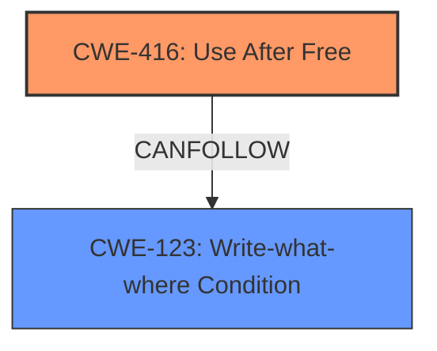

# Final Resolution for CVE-2022-0296

# Summary
| CWE ID | CWE Name | Confidence | CWE Abstraction Level | CWE Vulnerability Mapping Label | CWE-Vulnerability Mapping Notes |
|---|---|---|---|---|---|
| CWE-416 | Use After Free | 1.0 | Variant | Primary | Allowed |
| CWE-123 | Write-what-where Condition | 0.6 | Base | Secondary | Allowed |

## Evidence and Confidence

*   **Confidence Score:** 0.9
*   **Evidence Strength:** MEDIUM

## Relationship Analysis
The primary relationship considered was the potential for **CWE-416 (Use After Free)** to lead to **CWE-123 (Write-What-Where Condition)**. While **CWE-416 (Use After Free)** is the direct cause, the description mentions the possibility of "**heap corruption**" via a crafted HTML page. This indicates the attacker might have some control over what is written to the heap after the memory is freed. Thus, **CWE-123 (Write-What-Where Condition)** is included as a secondary CWE to capture this potential for controlled memory corruption. I am choosing **CWE-123 (Write-What-Where Condition)** over **CWE-122 (Heap-based Buffer Overflow)** because **CWE-123 (Write-What-Where Condition)** is a more general case that applies when the attacker has some control over the write, which aligns better with the phrase "potentially exploit heap corruption via a crafted HTML page".

## Vulnerability Chain
The vulnerability chain starts with a **CWE-416 (Use After Free)** condition in the Printing functionality of Google Chrome. A remote attacker convinces a user to interact with a crafted HTML page, triggering the **use-after-free**. This **use-after-free** can potentially lead to **CWE-123 (Write-What-Where Condition)** on the heap, resulting in arbitrary write capabilities and ultimately, arbitrary code execution.

## Summary of Analysis
The initial analysis correctly identified **CWE-416 (Use After Free)** as the primary **root cause** based on the explicit mention in the vulnerability description: "Use after free in Printing in Google Chrome...allowed a remote attacker...to potentially exploit heap corruption via a crafted HTML page." The criticism suggested adding a secondary CWE to describe the "heap corruption" consequence.

The graph relationships and the "crafted HTML page" evidence from the vulnerability description support including **CWE-123 (Write-What-Where Condition)** as a secondary CWE. This is because the attacker has some influence over the data written to the heap. I am choosing **CWE-123 (Write-What-Where Condition)** over **CWE-122 (Heap-based Buffer Overflow)** because **CWE-123 (Write-What-Where Condition)** is a more general case that applies when the attacker has some control over the write, which aligns better with the phrase "potentially exploit heap corruption via a crafted HTML page". The selected CWEs are at the optimal level of specificity, with **CWE-416 (Use After Free)** being a Variant and **CWE-123 (Write-What-Where Condition)** being a Base.

My confidence is slightly reduced to 0.9 due to the "potential" for heap corruption, which introduces some uncertainty. If the description provided more explicit detail, then the confidence would be 1.0.