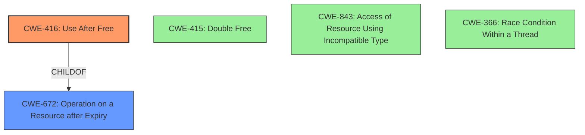

# Analysis Report for CVE-2022-0297

# Vulnerability Analysis Report: CVE-2022-0297

## Description

Use after free in Vulkan in Google Chrome prior to 97.0.4692.99 allowed a remote attacker to potentially exploit heap corruption via a crafted HTML page.

## Vulnerability Description Key Phrases

**Weakness:** Use after free
**Impact:** heap corruption
**Vector:** crafted HTML page
**Attacker:** remote attacker
**Product:** Google Chrome
**Version:** prior to 97.0.4692.99
**Component:** Vulkan

## Analysis (with Relationship Data)

# Summary
| CWE ID | CWE Name | Confidence | CWE Abstraction Level | CWE Vulnerability Mapping Label | CWE-Vulnerability Mapping Notes |
|---|---|---|---|---|---|
| CWE-416 | Use After Free | 1.0 | Variant | Primary | Allowed |

## Evidence and Confidence

*   **Confidence Score:** 1.0
*   **Evidence Strength:** HIGH

- **Analysis and Justification:**  
  - *Explanation:* The vulnerability description clearly states a "**Use after free**" in the Vulkan component of Google Chrome, which directly aligns with CWE-416 (Use After Free). The CVE Reference Links Content Summary reinforces this by explicitly identifying "**Use-after-free**" as the root cause of the vulnerability. The impact, though not specified completely, can be "heap corruption", which is a common consequence of use-after-free. The retriever results also list CWE-416 as the top match with a high score. The CWE description for CWE-416 accurately describes the vulnerability: "The product reuses or references memory after it has been freed." The "Usage: Allowed" mapping guidance further supports this selection.
  
  - *Relationship Analysis:* CWE-416 is a variant of CWE-672 (Operation on a Resource after Expiry). The retriever results show several other CWEs, such as CWE-366 (Race Condition within a Thread), CWE-843 (Access of Resource Using Incompatible Type), and CWE-415 (Double Free). However, none of these are as directly related to the vulnerability as CWE-416, as the primary weakness is the use of memory after it has been freed, not necessarily a race condition, type confusion, or double free.

- **Confidence Score:**  
  - Confidence: 1.0 (Direct evidence from vulnerability description and reference materials)

## Criticism of Analysis

Okay, here's a review of the provided analysis, focusing on its CWE mapping, confidence level, justification, and considering alternative CWEs with the benefit of the full CWE specifications.

**Overall Assessment:**

The analysis correctly identifies CWE-416 (Use After Free) as the primary weakness. The confidence score of 1.0 is justified due to the clear description of the vulnerability and corroborating evidence from the provided information. The provided justification thoroughly covers the reasoning and relationship analysis to other CWEs.

**Detailed Review by Section:**

**1. Summary Table:**

*   **CWE ID:** CWE-416
*   **CWE Name:** Use After Free
*   **Confidence:** 1.0
*   **CWE Abstraction Level:** Variant
*   **CWE Vulnerability Mapping Label:** Primary
*   **CWE-Vulnerability Mapping Notes:** Allowed

This is a good summary. All fields are correctly populated and the chosen values are appropriate.

**2. Evidence and Confidence:**

*   **Confidence Score:** 1.0
*   **Evidence Strength:** HIGH

*   **Analysis and Justification:** This is a well-written explanation. The reasoning clearly articulates why CWE-416 is the best fit.
    *   The explanation highlights the direct alignment of the vulnerability description with the CWE definition.
    *   It correctly notes "heap corruption" as a common consequence of use-after-free.
    *   It acknowledges the retriever results' support for CWE-416.
    *   The justification uses the CWE definition of CWE-416 to validate it further.

*   **Relationship Analysis:** The analysis acknowledges the parent relationship with CWE-672, which is good.
    *   It also appropriately discounts other CWEs like CWE-366, CWE-843, and CWE-415, explaining why they are less directly related to the core weakness.  This demonstrates a good understanding of the distinctions between these related weaknesses.

*   **Confidence Score:** The confidence score of 1.0 is appropriate given the strong evidence.

**3. CWE Examples from Database:**

The provided examples are relevant and illustrate various scenarios where CWE-416 occurs, including chained vulnerabilities.

**4. Relevant CWE Specifications:**

The inclusion of the full CWE specifications for CWE-416 and related CWEs (CWE-415, CWE-843, CWE-366, CWE-672, CWE-787, CWE-665, CWE-122, CWE-1021, CWE-190, CWE-367, CWE-125, CWE-825, CWE-1341, CWE-298, CWE-324, CWE-562, CWE-613, CWE-910, CWE-911, CWE-476, CWE-1284, CWE-675, CWE-479, CWE-710, CWE-758, CWE-664, CWE-691, CWE-118, CWE-703, CWE-480, CWE-681, CWE-1257, CWE-1260, CWE-128, CWE-129, CWE-130, CWE-131, CWE-1339, CWE-193, CWE-195, CWE-466, CWE-786, CWE-788, CWE-805, CWE-822, CWE-823, CWE-824, CWE-839, CWE-1265, CWE-1223, CWE-1298, CWE-364, CWE-368, CWE-421, CWE-61, CWE-689, CWE-831, CWE-667, CWE-591, CWE-295, CWE-828, CWE-20, CWE-273, CWE-354, CWE-394, CWE-252, CWE-253, CWE-680, CWE-432, CWE-754, CWE-119, CWE-772, CWE-170, CWE-231, CWE-456, CWE-1325, CWE-789) provides valuable context and allows for a more informed decision.

**Suggestions for Improvement (Minor):**

*   **Specificity within Vulkan:** Since the vulnerability is within the Vulkan component, it might be beneficial to briefly mention how Vulkan's API or memory management practices might contribute to use-after-free conditions. This would add a layer of context, although it's not strictly necessary for the CWE mapping.
*   **Mitigation Discussion:** Although the core analysis is about CWE mapping, a brief mention of potential mitigations specific to Vulkan could be valuable.  For example, are there Vulkan-specific validation layers or debugging tools that can help detect use-after-free errors? Consider that the descriptions for CWE-416 point to mitigation strategies such as using a language with automatic memory management, or setting pointers to NULL when freed.
*  **Relationship to Memory Corruption:** The text already mentions that heap corruption is a consequence of UAF. However, the analysis can be improved by explicitly stating how using freed memory can lead to memory corruption.
*  **Attack Vector Expansion:** The description mentions the vulnerability is triggered by a "crafted HTML page." Detailing the connection between the HTML page and the Vulkan component would strengthen the description. How does the HTML page trigger the flawed Vulkan code?

**Alternative CWE Considerations (Already Adequately Addressed):**

The analysis correctly dismisses the following alternatives, but here's why, based on the CWE specifications:

*   **CWE-415 (Double Free):** While double-free can also cause memory corruption, the primary issue is *using* memory *after* it has been freed, not freeing it twice.  The description points to use-after-free, not a double free condition.
*   **CWE-843 (Type Confusion):** Type confusion might *lead* to a use-after-free, but it's not the root cause here.  The core issue is accessing freed memory, not interpreting memory as the wrong type.
*   **CWE-366 (Race Condition within a Thread):** A race condition could *contribute* to a use-after-free if it causes memory to be freed prematurely. But without evidence of a race condition as a necessary component of the vulnerability, CWE-416 is still the better fit.
*   **CWE-787 (Out-of-bounds Write):** While the *impact* of a use-after-free can *result* in an out-of-bounds write (because the memory might be reallocated), the root cause is the access of freed memory.
*   **CWE-665 (Improper Initialization):** This is less relevant as the core issue is about accessing freed memory, not about uninitialized values.

**Conclusion:**

The analysis is well-reasoned, accurate, and thorough. The high confidence score is justified. The inclusion of the full CWE specifications further strengthens the analysis by providing the necessary context for understanding the relationships between different weaknesses and validating the chosen mapping. The minor suggestions above are for further enhancement but don't detract from the overall quality of the work.

## Final Resolution

# Summary
| CWE ID | CWE Name | Confidence | CWE Abstraction Level | CWE Vulnerability Mapping Label | CWE-Vulnerability Mapping Notes |
|---|---|---|---|---|---|
| CWE-416 | Use After Free | 1.0 | Variant | Primary CWE | Allowed |

## Evidence and Confidence

*   **Confidence Score:** 1.0
*   **Evidence Strength:** HIGH

## Relationship Analysis
The primary relationship considered was the parent-child relationship between CWE-416 (**Use After Free**) and its parent, CWE-672 (Operation on a Resource after Expiry). The analysis also correctly dismissed other related CWEs like CWE-415 (**Double Free**), CWE-843 (Access of Resource Using Incompatible Type), and CWE-366 (Race Condition within a Thread) because they did not directly address the core weakness of using memory after it has been freed. The choice of CWE-416 as a Variant level CWE provides the appropriate level of specificity, while acknowledging its connection to the more general Class CWE-672.

## Vulnerability Chain
The vulnerability chain starts with a crafted HTML page that triggers the **Vulkan** component in Google Chrome. The **ROOTCAUSE** is the **CWE-416 (Use After Free)**, where the program reuses or references memory after it has been freed. This leads to heap corruption, as the freed memory may be reallocated and used by another part of the program. Any operations using the original pointer are no longer valid, potentially allowing a remote attacker to exploit the **WEAKNESS**. The consequence is potential heap corruption and arbitrary code execution.

## Summary of Analysis
The initial analysis and criticism both converge on the correct classification of CWE-416 (**Use After Free**) as the primary **WEAKNESS**. The vulnerability description explicitly states "**Use after free**" as the issue within **Vulkan** in Google Chrome. This is strong evidence that directly aligns with the CWE description. The high confidence score of 1.0 reflects the clarity of the evidence.

The graph relationships, particularly the parent-child relationship with CWE-672, reinforced the choice of CWE-416 as the most specific and appropriate classification. The analysis also considered and correctly dismissed alternative CWEs based on their relevance to the vulnerability description.

The selected CWE, CWE-416, is at the optimal level of specificity (Variant) because it directly describes the core issue of using memory after it has been freed, rather than a more general class of resource management issues. The evidence from the vulnerability description is sufficient to justify this classification.

*Report generated on 2025-03-18 05:44:52*
