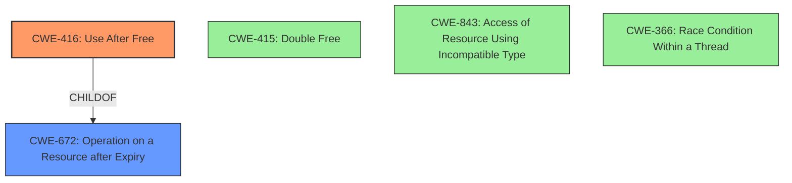

# Final Resolution for CVE-2022-0297

# Summary
| CWE ID | CWE Name | Confidence | CWE Abstraction Level | CWE Vulnerability Mapping Label | CWE-Vulnerability Mapping Notes |
|---|---|---|---|---|---|
| CWE-416 | Use After Free | 1.0 | Variant | Primary CWE | Allowed |

## Evidence and Confidence

*   **Confidence Score:** 1.0
*   **Evidence Strength:** HIGH

## Relationship Analysis
The primary relationship considered was the parent-child relationship between CWE-416 (**Use After Free**) and its parent, CWE-672 (Operation on a Resource after Expiry). The analysis also correctly dismissed other related CWEs like CWE-415 (**Double Free**), CWE-843 (Access of Resource Using Incompatible Type), and CWE-366 (Race Condition within a Thread) because they did not directly address the core weakness of using memory after it has been freed. The choice of CWE-416 as a Variant level CWE provides the appropriate level of specificity, while acknowledging its connection to the more general Class CWE-672.

## Vulnerability Chain
The vulnerability chain starts with a crafted HTML page that triggers the **Vulkan** component in Google Chrome. The **ROOTCAUSE** is the **CWE-416 (Use After Free)**, where the program reuses or references memory after it has been freed. This leads to heap corruption, as the freed memory may be reallocated and used by another part of the program. Any operations using the original pointer are no longer valid, potentially allowing a remote attacker to exploit the **WEAKNESS**. The consequence is potential heap corruption and arbitrary code execution.

## Summary of Analysis
The initial analysis and criticism both converge on the correct classification of CWE-416 (**Use After Free**) as the primary **WEAKNESS**. The vulnerability description explicitly states "**Use after free**" as the issue within **Vulkan** in Google Chrome. This is strong evidence that directly aligns with the CWE description. The high confidence score of 1.0 reflects the clarity of the evidence.

The graph relationships, particularly the parent-child relationship with CWE-672, reinforced the choice of CWE-416 as the most specific and appropriate classification. The analysis also considered and correctly dismissed alternative CWEs based on their relevance to the vulnerability description.

The selected CWE, CWE-416, is at the optimal level of specificity (Variant) because it directly describes the core issue of using memory after it has been freed, rather than a more general class of resource management issues. The evidence from the vulnerability description is sufficient to justify this classification.