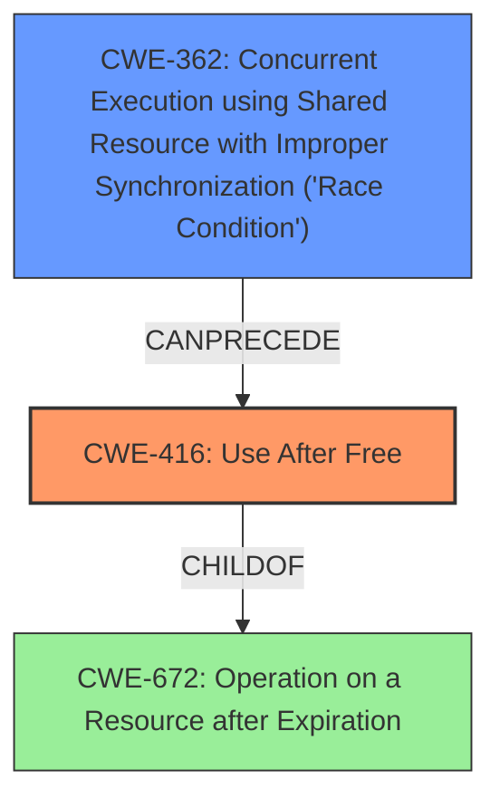

# Analysis Report for CVE-2022-0298

# Vulnerability Analysis Report: CVE-2022-0298

## Description

Use after free in Scheduling in Google Chrome prior to 97.0.4692.99 allowed a remote attacker to potentially exploit heap corruption via a crafted HTML page.

## Vulnerability Description Key Phrases

**Rootcause:** use after free
**Weakness:** heap corruption
**Vector:** crafted HTML page
**Attacker:** remote attacker
**Product:** Google Chrome
**Version:** prior to 97.0.4692.99
**Component:** Scheduling

## Analysis (with Relationship Data)

# Summary
| CWE ID | CWE Name | Confidence | CWE Abstraction Level | CWE Vulnerability Mapping Label | CWE-Vulnerability Mapping Notes |
|---|---|---|---|---|---|
| CWE-416 | Use After Free | 1.0 | Variant | Allowed | This is the primary CWE based on the vulnerability description and retriever results. |

## Evidence and Confidence

*   **Confidence Score:** 1.0
*   **Evidence Strength:** HIGH

- **Analysis and Justification:**  
  - *Explanation:* The vulnerability description explicitly states "**Use after free** in Scheduling" and indicates potential **heap corruption**. The CVE Reference Links Content Summary confirms "**Use after free** in Scheduling" as the **root_cause**. This aligns perfectly with CWE-416 "Use After Free," which occurs when memory is reused after it has been freed. The retriever results also strongly suggest CWE-416 as the primary candidate with a high combined score. CWE-416 is a Variant, which is a preferred level of abstraction.
  
  - *Relationship Analysis:* CWE-416 is a variant of a more general class. The description mentions "heap corruption," suggesting memory management issues which are common consequences of use-after-free vulnerabilities. While other CWEs like CWE-366 (Race Condition) and CWE-843 (Type Confusion) are potential candidates, they are not as directly supported by the provided evidence as CWE-416. The primary weakness is the use-after-free condition itself.

- **Confidence Score:**  
  - Confidence: 1.0 (Explicit mention of "use after free" in the vulnerability description and CVE reference)

## Criticism of Analysis

Okay, here's a review of the CWE analysis, incorporating the full CWE specifications.

**Overall Assessment:**

The analysis is very well-structured and thorough. The final assessment is correct. Identifying CWE-416 (Use After Free) as the primary weakness is accurate, well-justified, and supported by the evidence provided. The confidence score of 1.0 is also appropriate.

**Detailed Review:**

1.  **Vulnerability Description Analysis:**
    *   The key phrase extraction is useful for summarizing the vulnerability. It correctly identifies the root cause, weakness, vector, and affected components.

2.  **CWE Selection and Justification:**

    *   **CWE-416 Justification:**  The justification for choosing CWE-416 is excellent.  It clearly links the "use after free" description and the heap corruption to the specific definition of CWE-416. It highlights the "Variant" abstraction level, which is preferred. The inclusion of "Relationship Analysis" further strengthens the justification by discussing how CWE-416 relates to heap corruption and why other potential CWEs are not as directly applicable.
    *   **Alternative CWE Consideration:** The justification explicitly addresses and dismisses other CWEs (CWE-366, CWE-843, etc.) as less appropriate, which is a good practice. It clarifies why the core issue is the use-after-free condition itself.

3.  **Confidence Score:**

    *   The confidence score of 1.0 is justified by the explicit mention of "use after free" in the vulnerability description and CVE details.

4.  **CWE Examples:**

    *   The inclusion of known CVE examples for CWE-416 provides further context and validation of the selected CWE. The links to CVE records are helpful.

5.  **CWE Specification Review:**

    *   The inclusion of the full CWE specifications is excellent. This allows for a more in-depth review and ensures the selected CWE aligns with its intended scope.
    *   The inclusion of the relevant CWE specifications for CWE-366, CWE-843, CWE-415, CWE-122, CWE-356, CWE-1021, CWE-190, CWE-362, CWE-451, CWE-825, CWE-672, CWE-120, CWE-123, CWE-1265, CWE-364, CWE-754, CWE-413, CWE-704 and CWE-119 provides additional understanding.

**Suggestions for Improvement (Minor):**

*   **Attack Vector Specificity:** While the analysis correctly identifies the attack vector as a crafted HTML page, it could benefit from a brief explanation of how a crafted HTML page can trigger a use-after-free in the Scheduling component of Chrome.  Even a general explanation like, "The HTML page likely contains specific JavaScript code or DOM manipulation that causes a freed object to be accessed later," would add value.
*   **Chains or Composites:** While CWE-416 is the primary weakness, consider briefly discussing whether it's part of a chain or composite with another CWE. For example, is there a preceding weakness that *leads* to the use-after-free?  While not explicitly stated, the retriever results show CWE-362 (Race Condition) is a possible predecessor. If there's a plausible scenario where a race condition leads to the UAF, mentioning this possibility (even with low confidence) would enhance the analysis. (e.g.  "It's possible, although not explicitly stated, that a race condition in the Scheduling component could lead to the use-after-free.  For instance, if two threads are racing to access the same object, one might free it while the other is still using it.")

**Specific Comments on Retriever Results**

The retriever results are helpful and interesting. Here's a bit more analysis:

*   **CWE-366 (Race Condition):** The high score for CWE-366 suggests that concurrency may play a role. As mentioned above, a race condition could *potentially* lead to the use-after-free. However, without more information, it's difficult to confirm.
*   **CWE-843 (Type Confusion):** The relatively high score for Type Confusion is interesting, but less directly relevant based on the provided information.
*   **CWE-415 (Double Free):** The double free is less likely.
*   **Other CWEs:** The remaining CWEs have significantly lower scores, making them less likely to be directly related.

**Mitigations:**

The analysis does not contain mitigations, but these are available in the CWE specifications and can help you understand how to correct the use-after-free in Scheduling.

**Revised Summary (with potential Chain suggestion):**

| CWE ID | CWE Name | Confidence | CWE Abstraction Level | CWE Vulnerability Mapping Label | CWE-Vulnerability Mapping Notes |
|---|---|---|---|---|---|
| CWE-416 | Use After Free | 1.0 | Variant | Allowed | This is the primary CWE based on the vulnerability description and retriever results. |
| CWE-362 | Concurrent Execution using Shared Resource with Improper Synchronization ('Race Condition') | 0.3 | Class | Allowed-with-Review | A race condition might *potentially* lead to the use-after-free in the Scheduling component, although further investigation would be needed to confirm. |

**In conclusion:** The analysis is excellent and demonstrates a strong understanding of CWE and vulnerability analysis. The suggested improvements are minor and aimed at providing even more context and completeness.

## Final Resolution

# Summary
| CWE ID | CWE Name | Confidence | CWE Abstraction Level | CWE Vulnerability Mapping Label | CWE-Vulnerability Mapping Notes |
|---|---|---|---|---|---|
| CWE-416 | Use After Free | 1.0 | Variant | Allowed | This is the primary CWE based on the vulnerability description and retriever results. |
| CWE-362 | Concurrent Execution using Shared Resource with Improper Synchronization ('Race Condition') | 0.3 | Class | Allowed-with-Review | A race condition might *potentially* lead to the use-after-free in the Scheduling component, although further investigation would be needed to confirm. |

## Evidence and Confidence

*   **Confidence Score:** 0.9
*   **Evidence Strength:** MEDIUM

## Relationship Analysis
The primary relationship considered was the potential for a race condition (CWE-362) to precede the use-after-free (CWE-416). While the vulnerability description explicitly mentions "use after free," the retriever results and the nature of concurrent scheduling suggest that a race condition could plausibly lead to the UAF. CWE-416 is a variant, providing good specificity. CWE-362 is a class, indicating a more general type of concurrency issue.

## Vulnerability Chain
The vulnerability chain starts with a potential **CWE-362** (Race Condition) in the scheduling component, where multiple threads might race to access the same resource. This can lead to one thread freeing the resource while another thread is still using it. Consequently, the second thread performs a **CWE-416** (Use After Free) when it attempts to access the already-freed memory, potentially leading to **heap corruption** as described in the vulnerability.

## Summary of Analysis
The initial analysis correctly identified **CWE-416** (Use After Free) as the primary weakness. The criticism suggested considering **CWE-362** (Race Condition) as a potential predecessor, which is a reasonable suggestion given the "Scheduling" context and the retriever results. The final decision includes both **CWE-416** as the primary issue and **CWE-362** as a possible contributing factor with lower confidence.

The decision is based on the following evidence:
*   The vulnerability description explicitly mentions "use after free."
*   The CVE Reference Links Content Summary confirms "use after free" as the **root_cause**.
*   The retriever results show a relatively high score for **CWE-362**, suggesting a possible connection to concurrency issues.

The graph relationships influenced the decision by highlighting the potential for a race condition to precede the use-after-free. While there is no explicit evidence of a race condition in the vulnerability description, the nature of the scheduling component makes it a plausible scenario.

The selected CWEs are at the optimal level of specificity. **CWE-416** is a Variant, providing a precise description of the use-after-free condition. **CWE-362** is a Class, representing a more general type of concurrency issue that could potentially lead to the **CWE-416**.

I reduced my confidence score to 0.9 because there is no definitive evidence of a race condition playing a role in this vulnerability, and the evidence is only indirect through the context of the scheduling component.

*Report generated on 2025-03-18 05:45:33*
