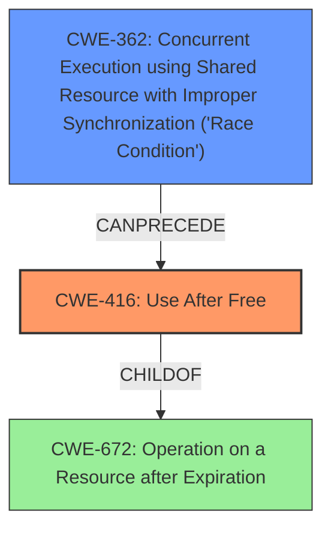

# Final Resolution for CVE-2022-0298

# Summary
| CWE ID | CWE Name | Confidence | CWE Abstraction Level | CWE Vulnerability Mapping Label | CWE-Vulnerability Mapping Notes |
|---|---|---|---|---|---|
| CWE-416 | Use After Free | 1.0 | Variant | Allowed | This is the primary CWE based on the vulnerability description and retriever results. |
| CWE-362 | Concurrent Execution using Shared Resource with Improper Synchronization ('Race Condition') | 0.3 | Class | Allowed-with-Review | A race condition might *potentially* lead to the use-after-free in the Scheduling component, although further investigation would be needed to confirm. |

## Evidence and Confidence

*   **Confidence Score:** 0.9
*   **Evidence Strength:** MEDIUM

## Relationship Analysis
The primary relationship considered was the potential for a race condition (CWE-362) to precede the use-after-free (CWE-416). While the vulnerability description explicitly mentions "use after free," the retriever results and the nature of concurrent scheduling suggest that a race condition could plausibly lead to the UAF. CWE-416 is a variant, providing good specificity. CWE-362 is a class, indicating a more general type of concurrency issue.

## Vulnerability Chain
The vulnerability chain starts with a potential **CWE-362** (Race Condition) in the scheduling component, where multiple threads might race to access the same resource. This can lead to one thread freeing the resource while another thread is still using it. Consequently, the second thread performs a **CWE-416** (Use After Free) when it attempts to access the already-freed memory, potentially leading to **heap corruption** as described in the vulnerability.

## Summary of Analysis
The initial analysis correctly identified **CWE-416** (Use After Free) as the primary weakness. The criticism suggested considering **CWE-362** (Race Condition) as a potential predecessor, which is a reasonable suggestion given the "Scheduling" context and the retriever results. The final decision includes both **CWE-416** as the primary issue and **CWE-362** as a possible contributing factor with lower confidence.

The decision is based on the following evidence:
*   The vulnerability description explicitly mentions "use after free."
*   The CVE Reference Links Content Summary confirms "use after free" as the **root_cause**.
*   The retriever results show a relatively high score for **CWE-362**, suggesting a possible connection to concurrency issues.

The graph relationships influenced the decision by highlighting the potential for a race condition to precede the use-after-free. While there is no explicit evidence of a race condition in the vulnerability description, the nature of the scheduling component makes it a plausible scenario.

The selected CWEs are at the optimal level of specificity. **CWE-416** is a Variant, providing a precise description of the use-after-free condition. **CWE-362** is a Class, representing a more general type of concurrency issue that could potentially lead to the **CWE-416**.

I reduced my confidence score to 0.9 because there is no definitive evidence of a race condition playing a role in this vulnerability, and the evidence is only indirect through the context of the scheduling component.