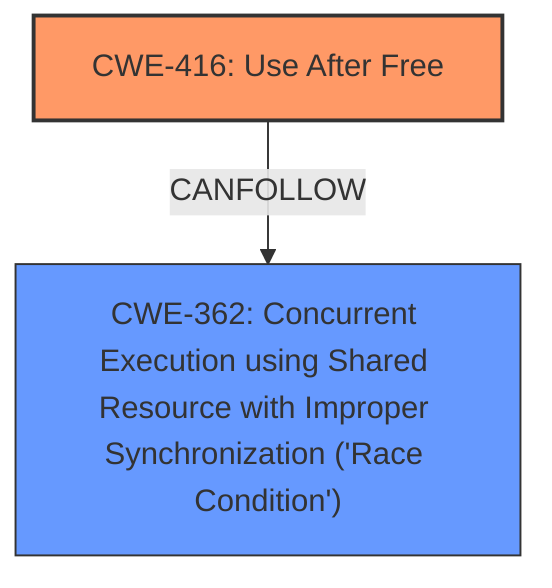

# Final Resolution for CVE-2022-0300

# Summary
| CWE ID | CWE Name | Confidence | CWE Abstraction Level | CWE Vulnerability Mapping Label | CWE-Vulnerability Mapping Notes |
|---|---|---|---|---|---|
| CWE-416 | Use After Free | 1.0 | Variant | Allowed | Primary CWE |
| CWE-362 | Concurrent Execution using Shared Resource with Improper Synchronization ('Race Condition') | 0.4 | Class | Allowed-with-Review | Secondary Candidate |

## Evidence and Confidence

*   **Confidence Score:** 0.9
*   **Evidence Strength:** MEDIUM

## Relationship Analysis
The primary relationship that impacted the decision was the potential chain relationship between **CWE-362 (Concurrent Execution using Shared Resource with Improper Synchronization ('Race Condition'))** and **CWE-416 (Use After Free)**. While the vulnerability description focuses on the **use-after-free**, the reviewer noted that a race condition could *potentially* contribute to the **use-after-free** if multiple threads are involved in the memory management process. The CWE specifications also outline 'CanFollow' relationships from CWE-416 to CWE-362.

## Vulnerability Chain
The vulnerability chain starts with a potential race condition (**CWE-362**) that leads to memory being freed prematurely. Subsequently, the freed memory is accessed (**CWE-416**), resulting in heap corruption and potentially arbitrary code execution.

## Summary of Analysis
The initial analysis correctly identified **CWE-416 (Use After Free)** as the primary **root cause**. The vulnerability description explicitly states "use after free," and the analysis provides a clear justification for this mapping. The reviewer also supports this finding.

The reviewer also considers the retriever results. The retriever results show a high relevance for **CWE-362**. A Use-After-Free can be caused by a race condition. This is reflected in the 'CanFollow' relationship of **CWE-416** and **CWE-362** and as well as in the example: **CVE-2021-0920**: Chain: mobile platform race condition (**CWE-362**) leading to **use-after-free (CWE-416)**.

While concurrency issues *could* contribute to a **use-after-free**, the core description focuses solely on the memory being freed and then *later* accessed, not necessarily on concurrent access. If the vulnerability report mentioned threads or processes racing to free and access the memory, then these CWEs would be more relevant. As such, **CWE-362** is included as a secondary candidate with a lower confidence score.

The selection of **CWE-416** is at the optimal level of specificity because it is a Variant level CWE and directly matches the **root cause** described in the vulnerability.