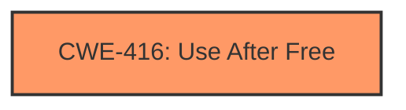

# Analysis Report for CVE-2022-0302

# Vulnerability Analysis Report: CVE-2022-0302

## Description

Use after free in Omnibox in Google Chrome prior to 97.0.4692.99 allowed an attacker who convinced a user to engage in specific user interactions to potentially exploit heap corruption via a crafted HTML page.

## Vulnerability Description Key Phrases

**Rootcause:** use after free
**Weakness:** heap corruption
**Vector:** crafted HTML page
**Attacker:** attacker
**Product:** Google Chrome
**Version:** prior to 97.0.4692.99
**Component:** Omnibox

## Analysis (with Relationship Data)

# Summary
| CWE ID | CWE Name | Confidence | CWE Abstraction Level | CWE Vulnerability Mapping Label | CWE-Vulnerability Mapping Notes |
|---|---|---|---|---|---|
| CWE-416 | Use After Free | 0.95 | Variant | Allowed | Primary CWE |

## Evidence and Confidence

*   **Confidence Score:** 0.95
*   **Evidence Strength:** HIGH

- **Analysis and Justification:**  
  - *Explanation:* The vulnerability description explicitly states "**use after free** in Omnibox" which is further supported by the "CVE Reference Links Content Summary" containing "**root_cause:** Use after free in Omnibox." and "**weaknesses:** Use after free". This aligns directly with CWE-416 (Use After Free). The vulnerability occurs when memory is accessed after it has been freed, potentially leading to **heap corruption**, as indicated in the vulnerability description. CWE-416 is a Variant level CWE, which is the preferred level of abstraction. MITRE mapping guidance for CWE-416 indicates this is ALLOWED.

  - *Relationship Analysis:* There are multiple relationships associated with CWE-416, but none appear to be directly related to the current vulnerability description.

- **Confidence Score:**  
  - Confidence: 0.95 (High evidence from technical description and CVE reference materials)

## Criticism of Analysis

Okay, here's a review of the provided analysis, considering the full CWE specifications, mapping guidance, and potential mitigations:

**Overall Assessment:**

The analysis is generally well-reasoned and arrives at the correct primary CWE (CWE-416). The confidence score of 0.95 is justified given the clear statement of "use after free" in the vulnerability description. The justification is well-explained. The use of the retriever results helps to identify other potential CWEs.

**Specific Points and Critique:**

1.  **Primary CWE: CWE-416 (Use After Free)**
    *   **Correctness:** The mapping to CWE-416 is accurate and well-supported by the vulnerability description and CVE reference content.  The description explicitly states "use after free".
    *   **Abstraction Level:** The analysis correctly identifies CWE-416 as a "Variant" level CWE, which is the preferred level of abstraction.
    *   **Mapping Guidance:** The analysis correctly notes that the "Usage" for CWE-416 is "Allowed".
    *   **Confidence:** The high confidence of 0.95 is appropriate.

2.  **Justification:**
    *   The explanation is clear and concise. It highlights the key phrases from the vulnerability description that support the CWE-416 mapping.
    *   The analysis correctly links the use-after-free condition to the potential for heap corruption, which is also mentioned in the vulnerability description.

3.  **Retriever Results Analysis:**
    *   The analysis mentions that there are multiple relationships associated with CWE-416, but none appear to be directly related to the current vulnerability description. This is a good approach.
    *   It is worth considering if any of the top retriever results suggest potential causes or consequences of the UAF. For example, CWE-362 (Race Condition) and CWE-366 (Race Condition within a Thread) are often related to UAFs in concurrent environments. While not directly stated in this vulnerability description, it could be an underlying cause, especially given the nature of the Omnibox in a browser. However, without more information, it's reasonable to exclude them from being a primary or secondary CWE.
    *   CWE-787 (Out-of-bounds Write) and CWE-122 (Heap-based Buffer Overflow) are potential consequences of a successful UAF exploitation. If the freed memory is reallocated and then corrupted via the UAF, it could lead to either of these. However, without more detail, focusing on the UAF as the root cause is appropriate.
    *  CWE-415 (Double Free) is very similar to CWE-416. The difference between the two is that CWE-416 describes a *use* after free whereas CWE-415 describes the act of freeing the same memory address twice.

4.  **CWE Examples:**
    *   The provided examples are relevant and help illustrate the nature of CWE-416. They also highlight common chains where CWE-416 is present.

5.  **Potential Mitigations (from CWE-416 Specification):**
    *   The analysis doesn't explicitly discuss mitigations, but it would strengthen the analysis to briefly mention potential mitigation strategies. For CWE-416, these could include:
        *   **Language Selection (Architecture/Design):**  Choosing a language with automatic memory management (e.g., Java, Go) can eliminate UAF vulnerabilities.
        *   **Setting Pointers to NULL (Implementation):**  After freeing memory, setting the pointer to NULL makes it less likely that the freed memory will be accessed. This doesn't completely eliminate the risk (e.g., if other pointers to the same memory exist), but it's a useful defense-in-depth technique.
        *   **Smart Pointers (Implementation):** Using smart pointers can help manage the lifecycle of memory.

**Recommendations for Improvement:**

*   **Briefly Discuss Potential Mitigations:** Add a short paragraph mentioning some of the mitigations listed in the CWE-416 specification. This would demonstrate a more comprehensive understanding of the vulnerability.
*   **Consider Race Conditions:** While not explicitly mentioned, briefly consider the possibility of a race condition contributing to the UAF, especially given the browser context.  State why it's excluded if it's not plausible given the available information.
*   **Acknowledge Heap Corruption Consequence:** Expand the explanation to explicitly state how the UAF leads to heap corruption. For example: "The use-after-free condition allows an attacker to potentially overwrite the contents of the reallocated memory, leading to heap corruption and potentially arbitrary code execution."
*   **Address Similarity to CWE-415:** Acknowledge the similarity between CWE-415 and CWE-416 and explain why CWE-416 is more appropriate given that the vulnerability description is about a *use* after free.

**Revised Summary Table (with potential additions):**

| CWE ID | CWE Name | Confidence | CWE Abstraction Level | CWE Vulnerability Mapping Label | CWE-Vulnerability Mapping Notes |
|---|---|---|---|---|---|
| CWE-416 | Use After Free | 0.95 | Variant | Allowed | Primary CWE. The vulnerability description explicitly states "use after free" in the Omnibox component. |

By incorporating these suggestions, the analysis can be made even more thorough and insightful.

## Final Resolution

# Summary
| CWE ID | CWE Name | Confidence | CWE Abstraction Level | CWE Vulnerability Mapping Label | CWE-Vulnerability Mapping Notes |
|---|---|---|---|---|---|
| CWE-416 | Use After Free | 0.95 | Variant | Allowed | Primary CWE. The vulnerability description explicitly states "**use after free**" in the Omnibox component. |

## Evidence and Confidence

*   **Confidence Score:** 0.95
*   **Evidence Strength:** HIGH

## Relationship Analysis
The primary impact on the decision was the explicit mention of "use after free" in the vulnerability description, aligning perfectly with **CWE-416 (Use After Free)**. The relationships of **CWE-416** show potential chains (CanFollow) that might be relevant in other contexts but are not explicitly supported by the provided vulnerability description.

## Vulnerability Chain
The chain of events is:
1.  Memory is freed.
2.  The same memory is accessed again. This is the **CWE-416 (Use After Free)**.
3.  This leads to **heap corruption** as a consequence.

## Summary of Analysis
The initial analysis is accurate. The criticism correctly suggests considering related CWEs such as **CWE-362 (Race Condition)** and **CWE-415 (Double Free)**. However, the vulnerability description focuses on the *use* of freed memory, making **CWE-416** the most appropriate primary classification. The available evidence strongly supports this selection, and the confidence remains high (0.95). The choice of **CWE-416** is at the optimal level of specificity (Variant) based on the provided information. The vulnerability description explicitly states "**use after free** in Omnibox... to potentially exploit **heap corruption** via a crafted HTML page," which directly corresponds to **CWE-416**.

*Report generated on 2025-03-18 05:47:31*
