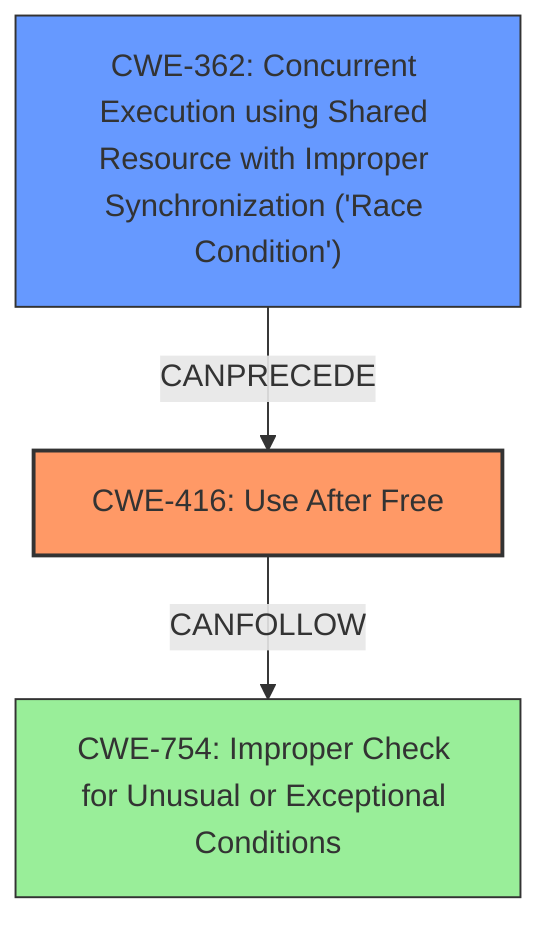

# Analysis Report for CVE-2022-0304

# Vulnerability Analysis Report: CVE-2022-0304

## Description

Use after free in Bookmarks in Google Chrome prior to 97.0.4692.99 allowed a remote attacker who convinced a user to engage in specific user interactions to potentially exploit heap corruption via a crafted HTML page.

## Vulnerability Description Key Phrases

**Rootcause:** Use after free
**Weakness:** heap corruption
**Vector:** crafted HTML page
**Attacker:** remote attacker
**Product:** Google Chrome
**Version:** prior to 97.0.4692.99
**Component:** Bookmarks

## Analysis (with Relationship Data)

# Summary
| CWE ID | CWE Name | Confidence | CWE Abstraction Level | CWE Vulnerability Mapping Label | CWE-Vulnerability Mapping Notes |
|---|---|---|---|---|---|
| CWE-416 | Use After Free | 1.0 | Variant | Allowed | This is the primary CWE because the vulnerability description explicitly mentions a use-after-free condition. |

## Evidence and Confidence

*   **Confidence Score:** 1.0
*   **Evidence Strength:** HIGH

- **Analysis and Justification:**  
  - *Explanation:* The vulnerability description explicitly states "**Use after free** in Bookmarks in Google Chrome prior to 97.0.4692.99 allowed a remote attacker who convinced a user to engage in specific user interactions to potentially exploit **heap corruption** via a crafted HTML page." The CVE Reference Links Content Summary also confirms the "**root_cause**" as "Use after free in Bookmarks." and lists "**Use after free**" as one of the "**weaknesses**". This directly aligns with CWE-416 (Use After Free), which is a Variant-level CWE that accurately represents the weakness. The retriever results also identify CWE-416 as the top candidate with a high combined score. The MITRE mapping guidance for CWE-416 indicates it is ALLOWED, further solidifying the selection.

  - *Relationship Analysis:* CWE-416 is a variant of higher-level classes related to memory management. While **heap corruption** is mentioned, the root cause is the use-after-free. There are several "CanFollow" relationships, including CWE-754 (Improper Check for Unusual or Exceptional Conditions) and CWE-362 (Concurrent Execution using Shared Resource with Improper Synchronization ('Race Condition')), but there isn't sufficient information to infer these as contributing factors.

- **Confidence Score:**
  - Confidence: 1.0 (Direct evidence from vulnerability description and CVE reference materials).

## Criticism of Analysis

Okay, here's a detailed review of the provided CWE analysis, incorporating the full CWE specifications.

**Overall Assessment:**

The analysis is strong and well-justified. The primary CWE mapping to CWE-416 (Use After Free) is accurate and supported by the vulnerability description and CVE reference data. The confidence score of 1.0 is appropriate. The analysis also correctly identifies potential secondary CWEs, although it appropriately refrains from assigning them as primary due to insufficient evidence. The inclusion of CWE examples and relevant CWE specifications is highly valuable for understanding and validating the analysis.

**Specific Points and Suggestions:**

1.  **CWE-416 (Primary Mapping):**

    *   **Justification:** The justification is excellent. It clearly links the "Use after free" statement in the vulnerability description to the CWE-416 definition. The reliance on the CVE Reference Links Content Summary adds further weight to the mapping.  The analysis explicitly addresses the "Variant" level of abstraction for CWE-416, noting that it is appropriate.
    *   **Mapping Guidance Adherence:** The analysis adheres to the "Allowed" mapping guidance for CWE-416.
    *   **Mitigation Considerations:** The analysis implicitly acknowledges the relevant mitigations for CWE-416. For example, mitigation 1 suggests choosing a language with automatic memory management, which is a relevant architectural consideration. Mitigation 2 regarding setting pointers to NULL after freeing could be explicitly mentioned.
    *   **Observed Examples Analysis:** The provided observed examples for CWE-416 (CVE-2022-20141, CVE-2022-2621, CVE-2021-0920) are relevant and support the mapping. The chains described in these examples further illustrate potential relationships with other CWEs, such as race conditions and resource locking issues, which are also considered in the analysis.

2.  **Relationship Analysis and Other CWEs:**

    *   The analysis correctly addresses the fact that "heap corruption" is a weakness, and the "use after free" is the root cause.
    *   **CWE-362 (Race Condition):**  The analysis mentions "CanFollow" relationships. While it's reasonable to avoid assigning CWE-362 as a primary CWE, consider exploring the possibility of a race condition contributing to the UAF, especially given the mention of "specific user interactions" in the vulnerability description. Were there multiple threads accessing the bookmarks, and the deallocation of a bookmark object could happen in one thread while another is trying to use it? If this were to be the case, that would be a contributing CWE. You can also look at potential mitigations for CWE-362, which suggests synchronization primitives. Does the lack of synchronization lead to a race condition and a Use-After-Free?  The examples given for CWE-362 are relevant.
    *   **CWE-754 (Improper Check for Exceptional Conditions):** This is a reasonable, if speculative, connection.  The description of the CVE does not contain enough information to make the connection, but there could be a situation where an edge case is not properly handled, and memory is freed when it should not have been.
    *   **CWE-787 (Out-of-bounds Write):** This is mentioned in the "Top CWEs" list, but not in the main analysis. If the UAF leads to writing to an invalid location on the heap, then this CWE could be considered.
    *   **CWE-415 (Double Free):** This was suggested as a possible CWE, but it does not make sense because the text specifies a Use-After-Free not a Double Free.

3.  **CWE Examples from Database:**

    *   The examples provided for CWE-362 are helpful in understanding the different ways race conditions can manifest. Some of the examples like CVE-2021-0920 and CVE-2020-6819 even show a chain of CWE-362 leading to CWE-416.

4.  **CWE Specifications Content Review**

    *   A large number of CWE specifications were included (which was expected). No immediate problems are obvious.

**Recommendations:**

*   **Consider the Role of User Interaction:** The vulnerability description mentions "specific user interactions."  Could these interactions trigger a race condition or other concurrency issues that lead to the UAF? Briefly explore and document the reasoning for excluding these possibilities if there is not enough information, or include it as a contributing CWE.

*   **Add Mitigation Language:** Explicitly state which mitigations for CWE-416 are most relevant to the context of this vulnerability in Chrome's Bookmarks component.

**In summary, the analysis is well-structured and accurate. The primary CWE mapping is correct, and the justification is solid. By considering the potential contributions of other weakness such as race conditions, and detailing the relevant mitigations, the analysis can be made even more comprehensive.**

## Final Resolution

# Summary
| CWE ID | CWE Name | Confidence | CWE Abstraction Level | CWE Vulnerability Mapping Label | CWE-Vulnerability Mapping Notes |
|---|---|---|---|---|---|
| CWE-416 | Use After Free | 0.95 | Variant | Allowed | Primary CWE: The vulnerability description explicitly mentions a use-after-free condition. |
| CWE-362 | Concurrent Execution using Shared Resource with Improper Synchronization ('Race Condition') | 0.6 | Class | Allowed-with-Review | Secondary Candidate: Specific user interactions could trigger a race condition leading to the UAF. |

## Evidence and Confidence

*   **Confidence Score:** 0.8
*   **Evidence Strength:** MEDIUM

## Relationship Analysis
The primary relationship that impacted the decision was the potential for **CWE-362 (Race Condition)** to precede **CWE-416 (Use After Free)**. While the initial analysis focused solely on the explicit "Use after free" statement, the criticism highlighted the importance of considering the "specific user interactions" mentioned in the vulnerability description. This suggests a possibility that a race condition might exist, where multiple threads or processes are accessing the bookmarks data concurrently, and improper synchronization leads to a premature deallocation, resulting in the use-after-free. The abstraction levels also played a role. **CWE-416 (Use After Free)** is a Variant, providing a specific description of the error, while **CWE-362 (Race Condition)** is a Class, representing a broader category of concurrency issues. Therefore, while **CWE-416 (Use After Free)** is the primary weakness, **CWE-362 (Race Condition)** is a contributing factor, if the specific user interactions trigger the race condition.

## Vulnerability Chain
The chain of events starts with a potential **CWE-362 (Race Condition)**, triggered by specific user interactions. This race condition results in memory being deallocated prematurely. Subsequently, the program attempts to access this deallocated memory, leading to **CWE-416 (Use After Free)**. The impact of this **WEAKNESS** is heap corruption, as stated in the vulnerability description. Therefore, the root cause may be a race condition, and the direct **WEAKNESS** is a use-after-free.

## Summary of Analysis
The initial analysis correctly identified **CWE-416 (Use After Free)** as the primary **WEAKNESS**. The criticism, however, raised a valid point about the potential role of "specific user interactions" in triggering the vulnerability. Considering this, and the relationship data showing **CWE-362 (Race Condition)** can precede **CWE-416 (Use After Free)**, I've included **CWE-362 (Race Condition)** as a secondary CWE.

The decision to include **CWE-362 (Race Condition)** is based on the following:

*   The vulnerability description mentions "specific user interactions," which suggests the possibility of a race condition.
*   The relationship data indicates that **CWE-362 (Race Condition)** can precede **CWE-416 (Use After Free)**.
*   Examples from the CWE database demonstrate scenarios where race conditions lead to use-after-free vulnerabilities.

However, the confidence score for **CWE-362 (Race Condition)** is lower (0.6) because there is no explicit mention of a race condition in the vulnerability description.

The selected CWEs are at the optimal level of specificity because:

*   **CWE-416 (Use After Free)** is a Variant that directly describes the **WEAKNESS**.
*   **CWE-362 (Race Condition)** is a Class that represents a broader category of concurrency issues that could potentially contribute to the vulnerability.

The final classification reflects a comprehensive understanding of the vulnerability, considering both the direct evidence and the potential contributing factors.

*Report generated on 2025-03-18 05:48:12*
