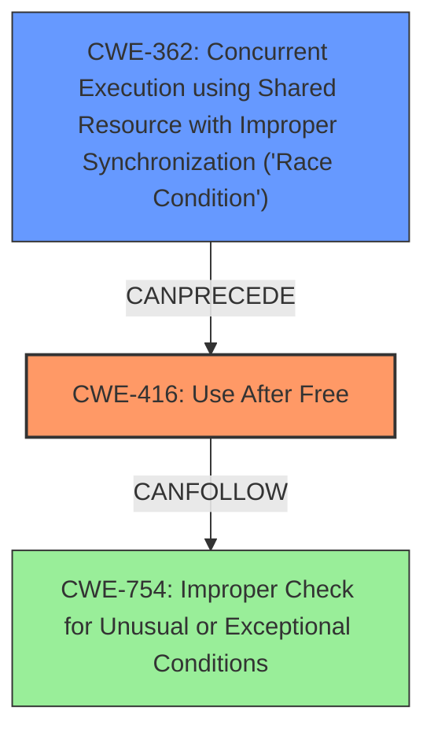

# Final Resolution for CVE-2022-0304

# Summary
| CWE ID | CWE Name | Confidence | CWE Abstraction Level | CWE Vulnerability Mapping Label | CWE-Vulnerability Mapping Notes |
|---|---|---|---|---|---|
| CWE-416 | Use After Free | 0.95 | Variant | Allowed | Primary CWE: The vulnerability description explicitly mentions a use-after-free condition. |
| CWE-362 | Concurrent Execution using Shared Resource with Improper Synchronization ('Race Condition') | 0.6 | Class | Allowed-with-Review | Secondary Candidate: Specific user interactions could trigger a race condition leading to the UAF. |

## Evidence and Confidence

*   **Confidence Score:** 0.8
*   **Evidence Strength:** MEDIUM

## Relationship Analysis
The primary relationship that impacted the decision was the potential for **CWE-362 (Race Condition)** to precede **CWE-416 (Use After Free)**. While the initial analysis focused solely on the explicit "Use after free" statement, the criticism highlighted the importance of considering the "specific user interactions" mentioned in the vulnerability description. This suggests a possibility that a race condition might exist, where multiple threads or processes are accessing the bookmarks data concurrently, and improper synchronization leads to a premature deallocation, resulting in the use-after-free. The abstraction levels also played a role. **CWE-416 (Use After Free)** is a Variant, providing a specific description of the error, while **CWE-362 (Race Condition)** is a Class, representing a broader category of concurrency issues. Therefore, while **CWE-416 (Use After Free)** is the primary weakness, **CWE-362 (Race Condition)** is a contributing factor, if the specific user interactions trigger the race condition.

## Vulnerability Chain
The chain of events starts with a potential **CWE-362 (Race Condition)**, triggered by specific user interactions. This race condition results in memory being deallocated prematurely. Subsequently, the program attempts to access this deallocated memory, leading to **CWE-416 (Use After Free)**. The impact of this **WEAKNESS** is heap corruption, as stated in the vulnerability description. Therefore, the root cause may be a race condition, and the direct **WEAKNESS** is a use-after-free.

## Summary of Analysis
The initial analysis correctly identified **CWE-416 (Use After Free)** as the primary **WEAKNESS**. The criticism, however, raised a valid point about the potential role of "specific user interactions" in triggering the vulnerability. Considering this, and the relationship data showing **CWE-362 (Race Condition)** can precede **CWE-416 (Use After Free)**, I've included **CWE-362 (Race Condition)** as a secondary CWE.

The decision to include **CWE-362 (Race Condition)** is based on the following:

*   The vulnerability description mentions "specific user interactions," which suggests the possibility of a race condition.
*   The relationship data indicates that **CWE-362 (Race Condition)** can precede **CWE-416 (Use After Free)**.
*   Examples from the CWE database demonstrate scenarios where race conditions lead to use-after-free vulnerabilities.

However, the confidence score for **CWE-362 (Race Condition)** is lower (0.6) because there is no explicit mention of a race condition in the vulnerability description.

The selected CWEs are at the optimal level of specificity because:

*   **CWE-416 (Use After Free)** is a Variant that directly describes the **WEAKNESS**.
*   **CWE-362 (Race Condition)** is a Class that represents a broader category of concurrency issues that could potentially contribute to the vulnerability.

The final classification reflects a comprehensive understanding of the vulnerability, considering both the direct evidence and the potential contributing factors.