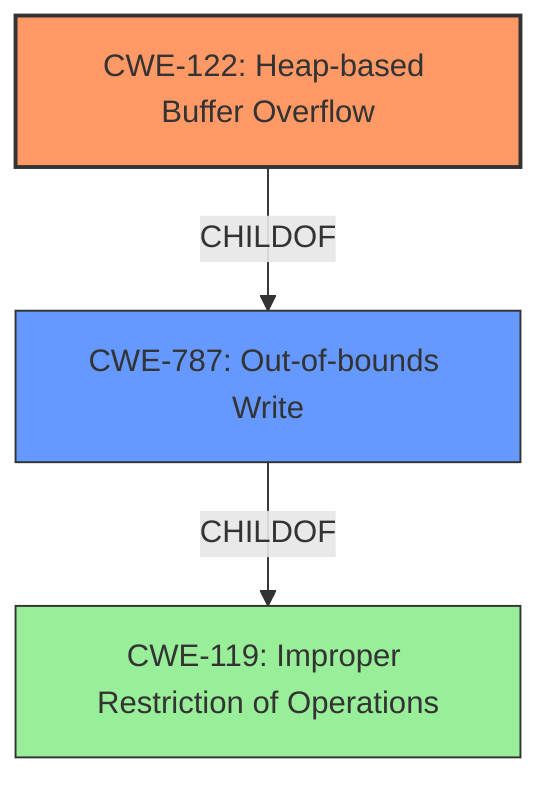

# Analysis Report for CVE-2022-0306

# Vulnerability Analysis Report: CVE-2022-0306

## Description

Heap buffer overflow in PDFium in Google Chrome prior to 97.0.4692.99 allowed a remote attacker to potentially exploit heap corruption via a crafted HTML page.

## Vulnerability Description Key Phrases

**Rootcause:** buffer overflow
**Impact:** heap corruption
**Vector:** crafted HTML page
**Attacker:** remote attacker
**Product:** Google Chrome
**Version:** prior to 97.0.4692.99
**Component:** PDFium

## Analysis (with Relationship Data)

# Summary
| CWE ID | CWE Name | Confidence | CWE Abstraction Level | CWE Vulnerability Mapping Label | CWE-Vulnerability Mapping Notes |
|---|---|---|---|---|---|
| CWE-122 | Heap-based Buffer Overflow | 0.95 | Variant | Allowed | Primary CWE |
| CWE-787 | Out-of-bounds Write | 0.75 | Base | Allowed | Secondary Candidate |

## Evidence and Confidence

*   **Confidence Score:** 0.9
*   **Evidence Strength:** HIGH

- **Analysis and Justification:**  
  - *Explanation:* The vulnerability description clearly states a "**heap buffer overflow**" exists in PDFium in Google Chrome. The **rootcause** is a "**buffer overflow**" that leads to heap corruption. The CVE Reference Links Content Summary confirms the "**Root cause of vulnerability**" as "Heap buffer overflow in PDFium" and the "**Weaknesses/vulnerabilities present**" as "Heap buffer overflow". The Retriever Results also list CWE-122 (Heap-based Buffer Overflow) and CWE-787 (Out-of-bounds Write) as highly relevant. Given that the vulnerability is specifically a heap-based overflow, CWE-122 is the most accurate and specific mapping. While CWE-787 (Out-of-bounds Write) is also relevant as a more general case of writing outside buffer boundaries, the specific context of a heap overflow makes CWE-122 the primary and more descriptive choice.
  
  - *Relationship Analysis:* CWE-122 is a Variant of CWE-119 (Improper Restriction of Operations within the Bounds of a Memory Buffer), which is a more general class of buffer overflows. CWE-787 (Out-of-bounds Write) is a parent of CWE-122. The relationship between CWE-122 and CWE-787 suggests that while CWE-787 captures the out-of-bounds write aspect, CWE-122 provides the specific context of the heap, making it a more precise classification.

- **Confidence Score:**  
  - Confidence: 0.95 (High confidence due to direct evidence from the vulnerability description and CVE reference, supported by Retriever Results)

---

## Criticism of Analysis

Okay, I've reviewed the analysis of the CVE and the provided CWE specifications. Here's my critique:

**Overall Assessment:**

The analysis is generally well-reasoned and arrives at a correct primary CWE mapping: CWE-122 (Heap-based Buffer Overflow). The confidence level of 0.95 is justified given the explicit nature of the vulnerability description. Including CWE-787 as a secondary candidate is also reasonable as it represents the broader category of out-of-bounds write, though CWE-122 is more precise.

**Strengths:**

*   **Clear Justification:** The explanation for choosing CWE-122 is well-articulated. The analysis clearly highlights that the vulnerability is specifically a *heap*-based overflow, making CWE-122 the most appropriate choice.
*   **Relationship Analysis:** The consideration of the relationship between CWE-122, CWE-119 and CWE-787 shows a good understanding of the CWE hierarchy and helps to defend the selection of CWE-122.
*   **Evidence Strength:** The assessment of "HIGH" evidence strength is accurate. The vulnerability description, CVE summary, and retriever results all point towards a heap buffer overflow.
*   **Mapping Guidance Awareness:** The analysis demonstrates an understanding of the "Variant" abstraction level and its preferred usage for mapping root causes.

**Areas for Improvement / Consideration:**

*   **CWE-119 Discussion:** While acknowledging CWE-119's role as a parent of both CWE-122 and CWE-787, it might be beneficial to explicitly address why CWE-119 is *not* chosen, given its "Discouraged" Usage in the Mapping Guidance. The analysis implies this by focusing on the more specific nature of CWE-122, but a direct statement could strengthen the argument. For example: "While CWE-119 (Improper Restriction of Operations within the Bounds of a Memory Buffer) is a parent class encompassing buffer overflows, its Mapping Guidance discourages its use when more specific CWEs are available. Given that the vulnerability is explicitly described as a *heap*-based buffer overflow, CWE-122 provides the necessary specificity and avoids the misuse of CWE-119."
*   **Mitigation Discussion:** The analysis focuses on CWE mapping and lacks any discussion on potential mitigations related to the selected CWEs. Including a brief mention on mitigations would help to provide a more well-rounded analysis.
    *   For instance:  "Mitigation for CWE-122 includes using languages or compilers with automatic bounds checking, employing abstraction libraries to handle risky APIs, and using compiler-based buffer overflow detection mechanisms (e.g., /GS flag in Microsoft Visual Studio)."
*   **Retriever Results Handling:** The retriever results section lists several other potential CWEs. It would be good to have a brief explanation of why these are rejected or considered less relevant than CWE-122 and CWE-787. Even a short sentence explaining why CWE-843 (Type Confusion), CWE-190 (Integer Overflow), CWE-124 (Buffer Underwrite), CWE-366 (Race Condition), and CWE-126 (Buffer Over-read) are not appropriate would increase confidence in the selection.

**Specific Comments Related to Retriever Results:**

Here's a brief analysis of why some of the top Retriever Results are less appropriate:

*   **CWE-843 (Type Confusion):** While memory corruption *could* arise from type confusion, the primary description doesn't suggest that a resource is being accessed with an incompatible type. It's a more direct buffer overflow scenario.
*   **CWE-190 (Integer Overflow):** Integer overflows can lead to buffer overflows, but there's no indication of an integer overflow in the initial description of this particular vulnerability.
*   **CWE-124 (Buffer Underwrite):** The vulnerability is described as an *overflow*, meaning writing *past* the buffer, not before it.
*   **CWE-366 (Race Condition):** There's no mention of concurrent threads or race conditions in the vulnerability description.
*   **CWE-126 (Buffer Over-read):** The vulnerability is described as a *write*, not a read.

**Revised Summary Table (with Mitigation and Rejection Reasoning):**

| CWE ID | CWE Name | Confidence | CWE Abstraction Level | CWE Vulnerability Mapping Label | CWE-Vulnerability Mapping Notes |
|---|---|---|---|---|---|
| CWE-122 | Heap-based Buffer Overflow | 0.95 | Variant | Allowed | Primary CWE. Mitigation: Use safe memory management practices, automatic bounds checking, or canary-based overflow detection. |
| CWE-787 | Out-of-bounds Write | 0.75 | Base | Allowed | Secondary Candidate. However, CWE-122 is more specific to the heap context.  |
| (Rejected) | CWE-843, CWE-190, CWE-124, CWE-366, CWE-126 | - | - | - | Rejected as they don't directly align with the described buffer overflow in the heap. |

**In conclusion:**

The analysis is solid. Incorporating a brief discussion of why other potential CWEs were rejected and adding a sentence or two about mitigations would elevate the analysis further. The mapping to CWE-122 is strongly supported by the provided information.

## Final Resolution

# Summary
| CWE ID | CWE Name | Confidence | CWE Abstraction Level | CWE Vulnerability Mapping Label | CWE-Vulnerability Mapping Notes |
|---|---|---|---|---|---|
| CWE-122 | Heap-based Buffer Overflow | 0.95 | Variant | Allowed | Primary CWE |
| CWE-787 | Out-of-bounds Write | 0.75 | Base | Allowed | Secondary Candidate |

## Evidence and Confidence

*   **Confidence Score:** 0.95
*   **Evidence Strength:** HIGH

## Relationship Analysis
The primary relationship considered was the hierarchical relationship between CWE-122, CWE-787, and CWE-119. CWE-122 (Heap-based Buffer Overflow) is a variant of the more general CWE-119 (Improper Restriction of Operations within the Bounds of a Memory Buffer), while CWE-787 (**Out-of-bounds Write**) is a parent of CWE-122. This influenced the decision to choose CWE-122 due to its higher specificity related to the **heap**. The analysis also considered the mapping guidance for CWE-119, which discourages its use when more specific CWEs are available.

## Vulnerability Chain
The vulnerability chain starts with the **root cause**, a **heap buffer overflow** (CWE-122). This occurs when a program writes data beyond the allocated boundary of a buffer located on the heap. The immediate consequence is an **out-of-bounds write** (CWE-787). The ultimate impact is potential heap corruption, which can lead to arbitrary code execution or other unexpected behaviors. There are no immediately missing links, as the description explicitly points to these issues.

## Summary of Analysis
The initial analysis correctly identified CWE-122 (Heap-based Buffer Overflow) as the primary CWE. This assessment is strongly based on the evidence provided in the vulnerability description: "Heap buffer overflow in PDFium in Google Chrome prior to 97.0.4692.99 allowed a remote attacker to potentially exploit heap corruption via a crafted HTML page." This explicitly mentions a **heap buffer overflow**, which directly corresponds to CWE-122.

The criticism raised several valid points, including the need to explicitly address why CWE-119 was not chosen and to discuss potential mitigations.

The analysis is based on the provided evidence, and the graph relationships support the choice of CWE-122 as the most specific and appropriate classification. The reasoning for rejecting other potential CWEs from the retriever results, such as CWE-843 (Type Confusion) and CWE-190 (Integer Overflow), further strengthens the confidence in the chosen classification. The inclusion of potential mitigations (e.g., safe memory management practices, automatic bounds checking) also adds value to the analysis. The selected CWEs are at the optimal level of specificity, with CWE-122 providing the most accurate description of the **root cause** and CWE-787 serving as a secondary candidate to represent the broader out-of-bounds write aspect.

*Report generated on 2025-03-18 05:48:52*
