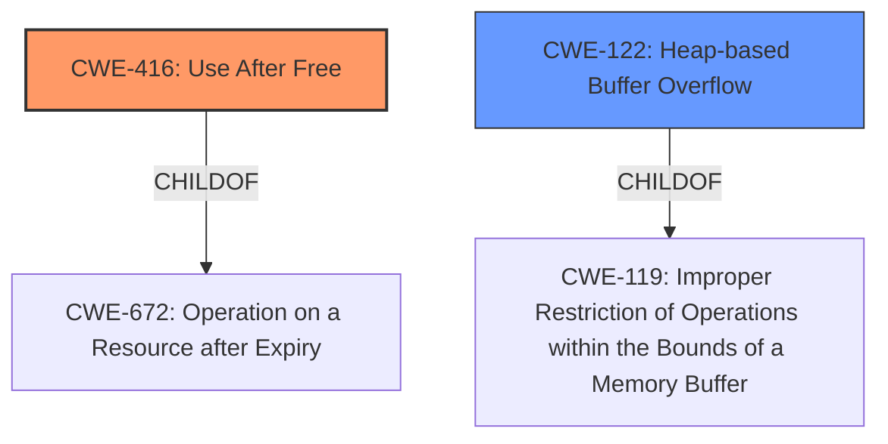

# Analysis Report for CVE-2022-0307

# Vulnerability Analysis Report: CVE-2022-0307

## Description

Use after free in Optimization Guide in Google Chrome prior to 97.0.4692.99 allowed a remote attacker who convinced a user to engage in specific user interaction to potentially exploit heap corruption via a crafted HTML page.

## Vulnerability Description Key Phrases

**Rootcause:** use after free
**Weakness:** heap corruption
**Vector:** crafted HTML page
**Attacker:** remote attacker
**Product:** Google Chrome
**Version:** prior to 97.0.4692.99
**Component:** Optimization Guide

## Analysis (with Relationship Data)

# Summary
| CWE ID | CWE Name | Confidence | CWE Abstraction Level | CWE Vulnerability Mapping Label | CWE-Vulnerability Mapping Notes |
|---|---|---|---|---|---|
| CWE-416 | Use After Free | 1.0 | Variant | Allowed | Primary CWE |
| CWE-122 | Heap-based Buffer Overflow | 0.5 | Variant | Allowed | Secondary Candidate |

## Evidence and Confidence

*   **Confidence Score:** 1.0
*   **Evidence Strength:** HIGH

- **Analysis and Justification:**  
  - *Explanation:* The vulnerability description explicitly states "**use after free** in Optimization Guide" and the CVE Reference Links Content Summary confirms "**root_cause**: Use after free" and "**weaknesses**: Use after free". This aligns directly with CWE-416 (Use After Free), which describes a condition where a product reuses or references memory after it has been freed. The **heap corruption** mentioned in the description further supports this, as use-after-free vulnerabilities often lead to memory corruption. CWE-416 is a Variant level CWE, which is a preferred level of abstraction. The MITRE mapping guidance for CWE-416 indicates that its usage is ALLOWED.

  - *Relationship Analysis:* CWE-416 (Use After Free) is a variant of CWE-672 (Operation on a Resource after Expiry).

- **Confidence Score:**  
  - Confidence: 1.0 (Direct and substantial evidence from the vulnerability description and CVE reference materials)

- **Analysis and Justification:**  
  - *Explanation:* The vulnerability description mentions "**heap corruption**", which could potentially indicate a heap overflow. CWE-122 (Heap-based Buffer Overflow) describes a condition where a buffer overflow occurs in the heap portion of memory. While the primary issue is use-after-free, the resulting heap corruption could manifest as a buffer overflow if the freed memory is reallocated and then overwritten. However, the evidence for this is less direct than for CWE-416. Therefore, I consider this a secondary candidate. CWE-122 is a Variant level CWE, which is a preferred level of abstraction. The MITRE mapping guidance for CWE-122 indicates that its usage is ALLOWED.

  - *Relationship Analysis:* CWE-122 (Heap-based Buffer Overflow) is a variant of CWE-119 (Improper Restriction of Operations within the Bounds of a Memory Buffer).

- **Confidence Score:**  
  - Confidence: 0.5 (Indirect evidence; heap corruption *could* lead to a heap overflow as a secondary effect of the use-after-free)

## Criticism of Analysis

Okay, here's a detailed review of the provided CWE analysis, incorporating the full CWE specifications you've included.

**Overall Assessment:**

The analysis is well-structured, provides clear justifications, and considers alternative CWEs. The confidence scoring is appropriate and reflects the strength of the evidence. The inclusion of examples from the CWE database is helpful. The final CWE assignments are reasonable, with CWE-416 being the primary weakness.

**Detailed Review:**

*   **CWE-416: Use After Free**

    *   **Mapping:** The analysis correctly identifies this as the primary CWE. The vulnerability description and CVE details explicitly state "use after free."
    *   **Confidence:** The confidence level of 1.0 is justified.
    *   **Abstraction Level:** The Variant level of abstraction is appropriate.
    *   **Mapping Guidance:**  The analysis correctly states the MITRE mapping guidance, "Allowed."
    *   **Potential Mitigations:** The analysis doesn't explicitly mention mitigations, but it's understood that it stems from the CWE definition.
        *   *Suggestion:*  While not strictly necessary for the mapping, mentioning a few key mitigations (e.g., using memory-safe languages, setting pointers to NULL after freeing) would strengthen the analysis.
    *   **Relationship Analysis:** The analysis correctly links CWE-416 as a child of CWE-672.
*   **CWE-122: Heap-based Buffer Overflow**

    *   **Mapping:** The analysis correctly identifies this as a secondary candidate, acknowledging that heap corruption *could* lead to a buffer overflow as a consequence of the UAF.
    *   **Confidence:** The confidence level of 0.5 is appropriate, given the indirect nature of the evidence.
    *   **Abstraction Level:** The Variant level of abstraction is appropriate.
    *   **Mapping Guidance:**  The analysis correctly states the MITRE mapping guidance, "Allowed."
    *   **Potential Mitigations:** The analysis doesn't explicitly mention mitigations, but it's understood that it stems from the CWE definition.
    *   **Relationship Analysis:** The analysis correctly links CWE-122 as a variant of CWE-119.
    *   *Suggestion:* Consider adding a sentence stating that the heap corruption resulting from the UAF *might* create conditions that *could* allow for an overflow *if* the freed memory is reallocated, and then *if* attacker-controlled data is written to it. This helps solidify the "secondary" nature of the CWE-122 mapping.

**Other Considerations from Retriever Results:**

The retriever results include other potential CWEs to consider. It's worthwhile examining why these are *not* selected as primary or secondary:

*   **CWE-366: Race Condition within a Thread:** While concurrency issues can sometimes lead to UAF, there is no specific mention or evidence of a race condition in the description. It is plausible but less directly supported than CWE-122.
*   **CWE-843: Access of Resource Using Incompatible Type ('Type Confusion'):** This is less likely because UAF usually involves accessing memory *after* it has been freed, not necessarily accessing it with an *incompatible type*. The primary issue is the memory is no longer valid, regardless of the type used to access it.
*   **CWE-415: Double Free:** This is unlikely, as the initial reports indicate the memory is freed and then *used*, rather than freed *twice*.  Double-free is a distinct issue.
*   **CWE-356: Product UI does not Warn User of Unsafe Actions:** It is possible a UAF could be exposed via the UI, but the connection seems a bit indirect and unsupported by the details.
*   **CWE-1021: Improper Restriction of Rendered UI Layers or Frames:** Same argument as above, there is a possible indirect connection to the UI, but not enough to be a candidate mapping.
*   **CWE-190: Integer Overflow or Wraparound:** No evidence suggests integer overflow is involved.
*   **CWE-367: Time-of-check Time-of-use (TOCTOU) Race Condition:** It is possible there is a TOCTOU, but no evidence to support this in this case.
*   **CWE-451: User Interface (UI) Misrepresentation of Critical Information:**  It is possible a UAF could be exposed via the UI, but the connection seems a bit indirect and unsupported by the details.

**Suggestions for Improvement:**

1.  **Mitigation Mentions:**  Briefly mention a few key mitigations for CWE-416, such as using memory-safe languages or setting pointers to NULL after freeing. This would strengthen the analysis, even though it's inherent in the CWE definition.
2.  **Clarify CWE-122's Secondary Nature:** Explicitly state the conditions under which the UAF *could* manifest as a heap overflow. This reinforces its role as a secondary effect.
3.  **Justification for Exclusion:** Consider adding a short section that explains *why* other highly-ranked CWEs from the Retriever Results (e.g., CWE-366, CWE-843) are *not* considered primary or secondary candidates, highlighting the lack of direct evidence.

**Conclusion:**

This is a solid and well-reasoned CWE analysis. The primary CWE is correctly identified, and the secondary candidate is justified. Incorporating the suggestions above would further enhance its completeness and clarity.

## Final Resolution

# Summary
| CWE ID | CWE Name | Confidence | CWE Abstraction Level | CWE Vulnerability Mapping Label | CWE-Vulnerability Mapping Notes |
|---|---|---|---|---|---|
| CWE-416 | Use After Free | 1.0 | Variant | Allowed | Primary CWE |
| CWE-122 | Heap-based Buffer Overflow | 0.5 | Variant | Allowed | Secondary Candidate |

## Evidence and Confidence

*   **Confidence Score:** 1.0
*   **Evidence Strength:** HIGH

## Relationship Analysis
The primary relationship impacting the decision is the parent-child relationship, where CWE-416 (Use After Free) is a variant of CWE-672 (Operation on a Resource after Expiry). This confirms that CWE-416 is an appropriate level of specificity. Additionally, CWE-122 (Heap-based Buffer Overflow) is a variant of CWE-119 (Improper Restriction of Operations within the Bounds of a Memory Buffer), which supports its role as a potential secondary issue if the freed memory is reallocated and then overwritten. The CanPrecede and CanFollow relationships for CWE-416 show it can lead to other vulnerabilities like race conditions (CWE-364) or be preceded by issues such as buffer copies without checking size (CWE-120). The abstraction levels of Variant for both selected CWEs indicate an appropriate level of detail.

## Vulnerability Chain
The vulnerability chain starts with a **use-after-free** condition (**CWE-416**) in the Optimization Guide. This occurs when memory is accessed after it has been freed. The consequence of this is **heap corruption**. If the freed memory is reallocated and attacker-controlled data is written to it, this **heap corruption** *could* lead to a **heap-based buffer overflow** (**CWE-122**). The final impact is a remote attacker exploiting the heap corruption via a crafted HTML page, leading to potential arbitrary code execution.

## Summary of Analysis
The initial analysis correctly identified **CWE-416 (Use After Free)** as the primary **weakness**. The vulnerability description explicitly states "**use after free** in Optimization Guide" and the CVE Reference Links Content Summary confirms "**root_cause**: Use after free" and "**weaknesses**: Use after free". This provides strong evidence for the selection of **CWE-416**.

The analysis also considered **CWE-122 (Heap-based Buffer Overflow)** as a secondary candidate due to the mention of "**heap corruption**". While the evidence for this is less direct, the potential for a **heap overflow** as a result of the **use-after-free** condition justifies its inclusion.

The criticism provided valuable suggestions for improvement, including mentioning mitigations for **CWE-416** and clarifying the secondary nature of **CWE-122**. It also suggested explaining why other highly-ranked CWEs were not considered.

Based on the evidence and relationship analysis, the final determination is to maintain **CWE-416** as the primary **weakness** and **CWE-122** as a secondary candidate. The selected CWEs are at the optimal level of specificity (Variant), and the mapping guidance from MITRE supports their usage. Other potential CWEs, such as **CWE-366 (Race Condition)** and **CWE-843 (Type Confusion)**, were not selected due to a lack of direct evidence in the vulnerability description.

The relationship analysis reinforces the selection of **CWE-416** as the primary **rootcause**, as it directly addresses the **use-after-free** condition described in the vulnerability.

*Report generated on 2025-03-18 05:50:05*
