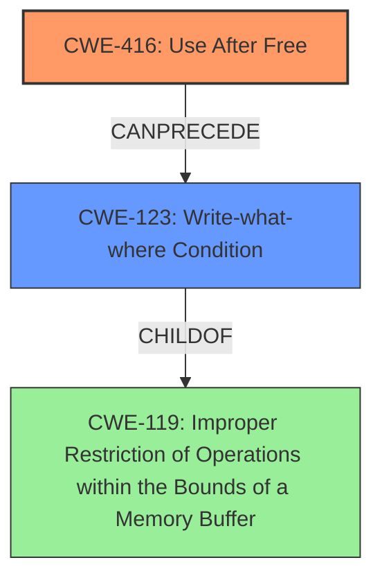

# Final Resolution for CVE-2022-0308

# Summary
| CWE ID | CWE Name | Confidence | CWE Abstraction Level | CWE Vulnerability Mapping Label | CWE-Vulnerability Mapping Notes |
|---|---|---|---|---|---|
| CWE-416 | Use After Free | 1.0 | Variant | Allowed | Primary CWE |
| CWE-123 | Write-what-where Condition | 0.4 | Base | Allowed | Secondary CWE; a potential consequence of CWE-416 |

## Evidence and Confidence

*   **Confidence Score:** 0.9
*   **Evidence Strength:** MEDIUM

## Relationship Analysis
The primary relationship is that **CWE-416 (Use After Free)** can potentially lead to **CWE-123 (Write-what-where)**. The vulnerability description explicitly mentions a use-after-free condition, which is the root cause. The consequence, potentially, is the ability to write to arbitrary memory locations.

## Vulnerability Chain
The vulnerability chain starts with the **ROOTCAUSE**, **CWE-416 (Use After Free)**, which allows an attacker to reuse or reference memory after it has been freed. This can then lead to the ability to control the content and location of memory writes, achieving a "**Write-what-where**" primitive (**CWE-123**). The final impact is potential **heap corruption** and arbitrary code execution.

## Summary of Analysis
The initial analysis correctly identified **CWE-416 (Use After Free)** as the primary **WEAKNESS**. The vulnerability description explicitly states a "use after free" condition in Google Chrome, which aligns perfectly with the definition of **CWE-416**.

The criticism suggested considering secondary CWEs that might be relevant as consequences of the Use-After-Free. I agree with this suggestion, and I'm adding **CWE-123 (Write-what-where Condition)** as a secondary CWE with a lower confidence score (0.4) because it is a potential, but not guaranteed, consequence. The vulnerability description mentions "potential heap corruption," which could be achieved by exploiting the Use-After-Free to write arbitrary data to arbitrary memory locations. If the **CWE-416** is exploited to achieve arbitrary write, it will become a **CWE-123**.

The relationship analysis shows that **CWE-416** can precede **CWE-123**. **CWE-123** is a base-level CWE, which is a preferred level of abstraction.

The final decision is to classify this vulnerability as **CWE-416 (Use After Free)** primarily, with **CWE-123 (Write-what-where Condition)** as a secondary CWE, contingent on whether the use-after-free is exploited to write arbitrary data to arbitrary memory locations. The selected CWEs are at the optimal level of specificity based on the available evidence. The confidence score is slightly lowered to 0.9 overall, reflecting the addition of the secondary CWE with its own lower confidence score.