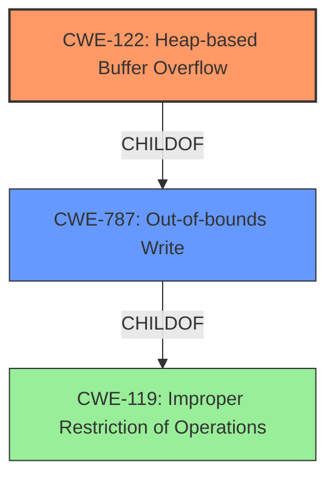

# Final Resolution for CVE-2022-0310

# Summary
| CWE ID | CWE Name | Confidence | CWE Abstraction Level | CWE Vulnerability Mapping Label | CWE-Vulnerability Mapping Notes |
|---|---|---|---|---|---|
| **CWE-122** | **Heap-based Buffer Overflow** | 0.95 | Variant | Allowed | Primary CWE |
| **CWE-787** | **Out-of-bounds Write** | 0.6 | Base | Allowed | Secondary Candidate |

## Evidence and Confidence

*   **Confidence Score:** 0.95
*   **Evidence Strength:** HIGH

## Relationship Analysis
The primary relationship influencing the decision is the parent-child relationship between **CWE-787 (Out-of-bounds Write)** and **CWE-122 (Heap-based Buffer Overflow)**. CWE-122 is a more specific variant of CWE-787, as it identifies the location of the out-of-bounds write as occurring in the heap. This specificity makes it the preferred choice for the primary **weakness**.

## Vulnerability Chain
The vulnerability chain starts with the **ROOTCAUSE**: A heap buffer overflow occurring due to an unspecified programming error. This leads to the **WEAKNESS**: **CWE-122: Heap-based Buffer Overflow**, where data is written beyond the allocated buffer in the heap. The consequence is **heap corruption**, which can be exploited by a remote attacker.
  - Root Cause: Unspecified programming error leads to heap buffer overflow
  - Weakness: **CWE-122: Heap-based Buffer Overflow**
  - Impact: Heap corruption, potential for remote exploitation

## Summary of Analysis
The initial analysis and criticism both converge on the appropriateness of **CWE-122 (Heap-based Buffer Overflow)** as the primary classification. The vulnerability description explicitly mentions "heap buffer overflow," providing strong evidence. The criticism highlights the importance of explaining why other high-ranking CWEs from the retriever results were not chosen. In this case, CWE-843, CWE-190, CWE-366, CWE-126, CWE-416 and others were considered but deemed less relevant because they either lacked direct evidence in the vulnerability description or were more general categories. The criticism also suggests expanding on potential mitigations and acknowledging limitations.

The graph relationships, particularly the parent-child relationship between **CWE-787 (Out-of-bounds Write)** and **CWE-122 (Heap-based Buffer Overflow)**, influenced the final decision to prioritize CWE-122 due to its greater specificity. The choice of CWE-122 is at the optimal level of specificity because it directly reflects the stated vulnerability ("heap buffer overflow") and provides more precise information about the location of the buffer overflow than its parent, CWE-787.