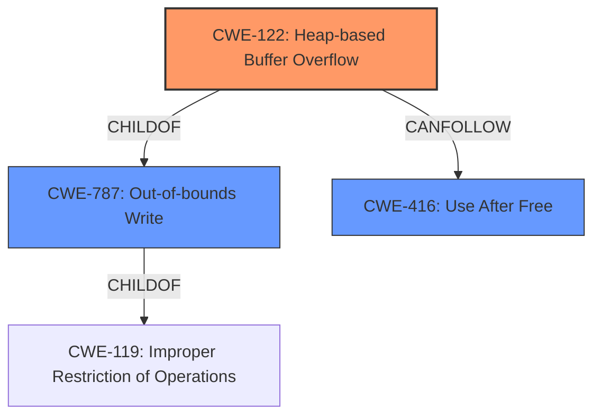

# Final Resolution for CVE-2022-0311

# Summary
| CWE ID | CWE Name | Confidence | CWE Abstraction Level | CWE Vulnerability Mapping Label | CWE-Vulnerability Mapping Notes |
|---|---|---|---|---|---|
| CWE-122 | Heap-based Buffer Overflow | 0.95 | Variant | Allowed | Primary CWE. Explicitly stated in vulnerability description. |
| CWE-787 | Out-of-bounds Write | 0.85 | Base | Allowed | Secondary Candidate. Root cause: writing data beyond buffer's boundary. CWE-122 is a child of CWE-787. |
| CWE-416 | Use After Free | 0.60 | Variant | Allowed | Secondary Candidate. Potential consequence of heap corruption, but not explicitly stated. |

## Evidence and Confidence

*   **Confidence Score:** 0.92
*   **Evidence Strength:** HIGH

## Relationship Analysis
The primary CWE is CWE-122 (**CWE-122: Heap-based Buffer Overflow**), a variant of the base CWE-787 (**CWE-787: Out-of-bounds Write**). CWE-787 in turn is a child of CWE-119 (**CWE-119: Improper Restriction of Operations within the Bounds of a Memory Buffer**). The vulnerability description explicitly mentions a heap buffer overflow, making CWE-122 the most specific and appropriate choice. CWE-416 (**CWE-416: Use After Free**) is included as a potential consequence of the heap corruption, establishing a 'CanFollow' relationship from CWE-122 to CWE-416. Since CWE-119 is discouraged, specifying a child of CWE-119 is preferred, and CWE-122 is the best child to pick, which influenced the confidence in CWE-122.

## Vulnerability Chain
The vulnerability chain begins with a crafted HTML page convincing a user to engage in specific user interaction leading to a **CWE-122: Heap-based Buffer Overflow**. This overflow results in **heap corruption**. As a potential consequence of heap corruption, a **CWE-416: Use After Free** vulnerability may arise if memory management metadata is overwritten and a pointer is later used after the memory has been freed. The chain illustrates how an initial malicious input can lead to memory corruption and potentially further exploitation.

## Summary of Analysis
The analysis of the vulnerability description, "Heap buffer overflow in Task Manager in Google Chrome prior to 97.0.4692.99 allowed a remote attacker who convinced a user to engage in specific user interaction to potentially exploit heap corruption via a crafted HTML page," confirms the initial assessment and criticism. The primary **WEAKNESS** is the **buffer overflow** on the heap, hence CWE-122 is the most accurate and specific classification. The explicit mention of "heap buffer overflow" provides strong evidence for this classification.

The relationship analysis reinforces this decision, as CWE-122 is a variant of CWE-787 (**CWE-787: Out-of-bounds Write**), reflecting the broader category of writing beyond the allocated buffer. Increasing the confidence level for CWE-787 to 0.85 is justified because the heap overflow inherently involves writing out of bounds. While CWE-119 (**CWE-119: Improper Restriction of Operations within the Bounds of a Memory Buffer**) is a parent of CWE-787, using a child of CWE-119 is more specific.

CWE-416 (**CWE-416: Use After Free**) remains a secondary candidate due to the mention of "heap corruption," which could potentially lead to a use-after-free condition. However, this is not explicitly stated, hence the moderate confidence level.

The selected CWEs are at the optimal level of specificity, with CWE-122 providing the most precise description of the vulnerability as a heap-based buffer overflow, and CWE-787 capturing the underlying out-of-bounds write condition.