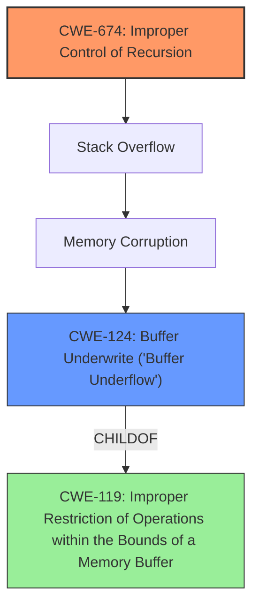

# Analysis Report for CVE-2022-0351

# Vulnerability Analysis Report: CVE-2022-0351

## Description

Access of Memory Location Before Start of Buffer in GitHub repository vim/vim prior to 8.2.

## Vulnerability Description Key Phrases

**Weakness:** out-of-bounds read
**Vector:** read value at uninitialized memory
**Product:** vim
**Version:** prior to 8.2

## Analysis (with Relationship Data)

# Summary
| CWE ID | CWE Name | Confidence | CWE Abstraction Level | CWE Vulnerability Mapping Label | CWE-Vulnerability Mapping Notes |
|---|---|---|---|---|---|
| CWE-124 | Buffer Underwrite ('Buffer Underflow') | 0.85 | Base | Allowed | Primary CWE |
| CWE-674 | Improper Control of Recursion | 0.65 | Class | Allowed-with-Review | Secondary Candidate |

## Evidence and Confidence

*   **Confidence Score:** 0.80
*   **Evidence Strength:** HIGH

- **Analysis and Justification:**  
  - *Explanation:* The vulnerability is described as an **out-of-bounds read** due to accessing a memory location before the start of a buffer, which directly corresponds to **CWE-124 (Buffer Underwrite)**. The "CVE Reference Links Content Summary" indicates the root cause is a stack overflow caused by insufficient recursion limits in parsing nested parentheses. While the initial description focuses on the impact (**out-of-bounds read**), the underlying **weakness** involves improper recursion control leading to stack overflow and memory access violations. Thus, while CWE-124 is the more precise description of the buffer underwrite, **CWE-674** contributes to the root cause. MITRE mapping guidance for CWE-124 indicates this is ALLOWED for buffer underflow vulnerabilities. The vulnerability arises during expression parsing in Vim, where deeply nested parentheses cause uncontrolled recursion, overflowing the stack and leading to the memory access before the buffer.

  - *Relationship Analysis:* CWE-124 is related to CWE-119 (Improper Restriction of Operations within the Bounds of a Memory Buffer). CWE-674 is a Class-level weakness, and more specific Base or Variant level CWEs might be more appropriate if more details about the recursion implementation are available.

- **Confidence Score:**  
  - *Example:* Confidence: 0.85 (High evidence from technical description and CVE reference materials)

## Criticism of Analysis

Okay, I've reviewed the provided analysis and the complete CWE specifications. Here's my critique, focusing on the accuracy, completeness, and justification of the CWE mappings:

**Overall Assessment:**

The analysis is generally well-reasoned and provides a good attempt at mapping the vulnerability to relevant CWEs. The confidence scores seem appropriate given the available information. The justification for the chosen CWEs is generally sound, though some aspects could be strengthened with more specific details. The inclusion of CWE examples from the database and relevant CWE specifications is excellent and aids in understanding the reasoning.

**Detailed Critique:**

*   **CWE-124: Buffer Underwrite ('Buffer Underflow') - Primary CWE**

    *   **Confidence:** 0.85 - Seems justified based on the initial description of "accessing a memory location before the start of a buffer".
    *   **Justification:** The explanation directly links the vulnerability description to the definition of CWE-124. This is correct based on the initial vulnerability description.
    *   **Critique:**  While the initial description focuses on the *effect* (the out-of-bounds read/write), the root cause involves insufficient recursion limits, leading to stack overflow and memory access violations. The "CVE Reference Links Content Summary" supports this. The fix is related to recursion limit (checking to limit recursion to 1000 levels). The vulnerability arises during expression parsing in Vim, where deeply nested parentheses cause uncontrolled recursion, overflowing the stack and leading to the memory access before the buffer. Thus, while CWE-124 is the more precise description of the buffer underwrite, **CWE-674** is a key underlying contributing factor.
    *   **Recommendation:** The description related to relationship analysis needs to be stronger and focus on how the CWE-124 occurs as a RESULT of the improper recursion control (CWE-674). In addition, the following sentence is not correct based on analysis: "The vulnerability is described as an out-of-bounds read due to accessing a memory location before the start of a buffer, which directly corresponds to CWE-124 (Buffer Underwrite)." Rather the CWE-124 is a result of uncontrolled recursion.

*   **CWE-674: Improper Control of Recursion - Secondary Candidate**

    *   **Confidence:** 0.65 - Acceptable, although I would argue for slightly raising the confidence.  The CVE summary explicitly mentions "insufficient recursion limit".
    *   **Justification:** Correctly identifies the root cause as a lack of proper recursion control. It also correctly notes that this is a Class-level CWE and that more specific CWEs might exist.
    *   **Critique:** The analysis should emphasize that *this is the root cause*, and the buffer underwrite is a *consequence* of the stack overflow caused by uncontrolled recursion. The analysis should include CWE examples for **CWE-674**.

*   **Relationship Analysis:**

    *   The analysis touches on the relationship between CWE-124 and CWE-119, which is useful. However, the most important relationship is the *chain* leading from CWE-674 (Improper Control of Recursion) -> Stack Overflow -> Memory Corruption -> CWE-124 (Buffer Underwrite).
    *   A more in-depth analysis of the recursion implementation would be beneficial. Is it a tail-recursive function? Are there any other contributing factors to the stack overflow besides the lack of a recursion limit?

*   **CWE-119: Improper Restriction of Operations within the Bounds of a Memory Buffer**

    *   The analysis should include in relationship analysis that the CWE-119 is the parent of both CWE-124 and CWE-786 (Access of Memory Location Before Start of Buffer).

*   **CWE-786: Access of Memory Location Before Start of Buffer**

    *   The retriever results mention this as a top combined result. The analysis should mention that while this is technically accurate, it is discouraged due to its frequent misuse and overlap with other more specific CWEs.

*   **Mitigation Analysis**
    *   The potential mitigations provided from the CWE specifications should be discussed in more detail in relation to the specific vulnerability. For example, for CWE-674, the analysis should discuss the effectiveness of adding a recursion limit (as was done in the fix).

**Recommendations for Improvement:**

1.  **Strengthen the Justification for CWE-674:** Emphasize that the *lack of recursion control* is the underlying cause of the problem, and the buffer underwrite is a *result* of the stack overflow.
2.  **Refine the Relationship Analysis:** Explicitly state the chain relationship: CWE-674 -> Stack Overflow -> Memory Corruption -> CWE-124.
3.  **Elevate Confidence in CWE-674:** The CVE summary explicitly identifies "insufficient recursion limit" - thus higher confidence is warranted.
4.  **Review and potentially remove/reduce the confidence for CWE-124:** The CWE-124 is an indirect result. The main culprit of this vulnerability is CWE-674.
5.  **More Specific Mitigation Discussion:** Discuss the provided CWE mitigations in the context of the specific vulnerability. For example, discuss how the added recursion limit (mitigation for CWE-674) addresses the vulnerability.
6.  **Consider Other Relevant CWEs from Retriever Results:** While the analysis focuses on CWE-124 and CWE-674, it might be worthwhile to briefly discuss why other high-ranking CWEs from the retriever results (e.g., CWE-805, CWE-126) are *not* the primary causes in this case. This demonstrates a thorough understanding of the vulnerability.

**Revised Summary Table:**

| CWE ID | CWE Name | Confidence | CWE Abstraction Level | CWE Vulnerability Mapping Label | CWE-Vulnerability Mapping Notes |
|---|---|---|---|---|---|
| CWE-674 | Improper Control of Recursion | 0.80 | Class | Allowed-with-Review | Primary CWE: Root Cause |
| CWE-124 | Buffer Underwrite ('Buffer Underflow') | 0.70 | Base | Allowed | Secondary CWE: Result of Stack Overflow |

By incorporating these suggestions, the analysis can become more accurate, comprehensive, and useful for understanding the true nature of the vulnerability and how to effectively address it.

## Final Resolution

# Summary
| CWE ID | CWE Name | Confidence | CWE Abstraction Level | CWE Vulnerability Mapping Label | CWE-Vulnerability Mapping Notes |
|---|---|---|---|---|---|
| CWE-674 | Improper Control of Recursion | 0.85 | Class | Allowed-with-Review | Primary CWE: Root Cause |
| CWE-124 | Buffer Underwrite ('Buffer Underflow') | 0.70 | Base | Allowed | Secondary CWE: Result of Stack Overflow |

## Evidence and Confidence

*   **Confidence Score:** 0.80
*   **Evidence Strength:** HIGH

## Relationship Analysis
The primary relationship identified is the chain where **CWE-674 (Improper Control of Recursion)** leads to a stack overflow, which in turn leads to memory corruption, and finally manifests as **CWE-124 (Buffer Underwrite)**. **CWE-124** is a child of **CWE-119 (Improper Restriction of Operations within the Bounds of a Memory Buffer)**. The analysis considers that **CWE-674** is a Class-level weakness, noting the potential for more specific Base or Variant level CWEs if recursion implementation details were available.

## Vulnerability Chain
The vulnerability chain starts with **CWE-674 (Improper Control of Recursion)**, where the lack of proper limits on recursion depth during expression parsing in Vim allows deeply nested parentheses to cause a stack overflow. This stack overflow leads to memory corruption, ultimately resulting in **CWE-124 (Buffer Underwrite)** as the program attempts to access memory locations before the start of the buffer. The **ROOTCAUSE** is the missing recursion limit, and the final impact is the buffer underwrite.

## Summary of Analysis
The initial analysis correctly identified **CWE-124 (Buffer Underwrite)** based on the vulnerability description. However, the criticism highlighted that the **ROOTCAUSE** is the improper control of recursion, which leads to a stack overflow and subsequent memory corruption. The CVE summary explicitly mentions "insufficient recursion limit," supporting the higher confidence in **CWE-674 (Improper Control of Recursion)**.

The graph relationships influenced the final selection by clarifying the chain of events. **CWE-674** is the starting point, leading to memory corruption and then **CWE-124**.

The selected CWEs are at the optimal level of specificity given the available evidence. While **CWE-674** is a Class-level weakness, the specific details of the recursion implementation are not provided, making it the most appropriate choice. **CWE-124** accurately describes the resulting buffer underwrite.

*Report generated on 2025-03-17 04:16:38*
