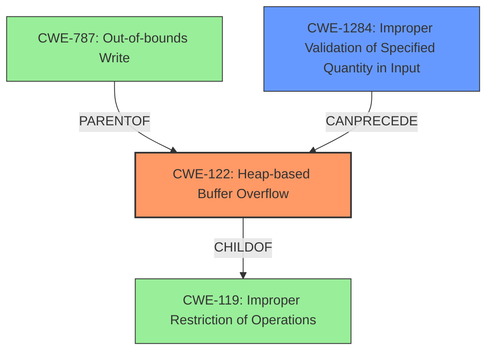

# Analysis Report for CVE-2022-0367

# Vulnerability Analysis Report: CVE-2022-0367

## Description

A heap-based buffer overflow flaw was found in libmodbus in function modbus_reply() in src/modbus.c.

## Vulnerability Description Key Phrases

**Weakness:** heap-based buffer overflow
**Product:** libmodbus
**Component:** modbus_reply() in src/modbus.c

## Analysis (with Relationship Data)

# Summary
| CWE ID | CWE Name | Confidence | CWE Abstraction Level | CWE Vulnerability Mapping Label | CWE-Vulnerability Mapping Notes |
|---|---|---|---|---|---|
| CWE-122 | Heap-based Buffer Overflow | 0.9 | Variant | Allowed | Acceptable-Use |
| CWE-1284 | Improper Validation of Specified Quantity in Input | 0.6 | Base | Allowed | Acceptable-Use |

## Evidence and Confidence

*   **Confidence Score:** 0.75
*   **Evidence Strength:** HIGH

- **Analysis and Justification:**  
  - *Explanation:* The vulnerability is explicitly described as a **heap-based buffer overflow** in `libmodbus`, specifically within the `modbus_reply()` function. The root cause is a copy-paste error in the sanity check that leads to insufficient input validation when handling `MODBUS_FC_WRITE_AND_READ_REGISTERS` requests. This allows an attacker to send a crafted Modbus request with an invalid address offset for writing, which is not properly validated, leading to out-of-bounds access. Given the specific mention of **heap-based buffer overflow** and the description of the mechanism by which it occurs, CWE-122 is the most accurate primary mapping.
  CWE-122 (Heap-based Buffer Overflow) is a variant of buffer overflow that occurs in the heap portion of memory.

  The Retriever results contain CWE-122 with a relatively high score.

  CWE-1284 (Improper Validation of Specified Quantity in Input) is considered as a secondary weakness, since the **heap-based buffer overflow** occurs because of missing validation of the write offset address.

  - *Relationship Analysis:* CWE-122 is a variant of CWE-119 (Improper Restriction of Operations within the Bounds of a Memory Buffer). CWE-787 (Out-of-bounds Write) is a parent of CWE-122.

- **Confidence Score:**
  - Confidence: 0.9 (High evidence from technical description and CVE reference materials)

## Criticism of Analysis

Okay, I've reviewed the analysis and the complete CWE specifications. Here's my critique:

**Overall Assessment:**

The analysis is generally strong and well-reasoned. The primary mapping to CWE-122 (Heap-based Buffer Overflow) is accurate and well-supported by the provided evidence. The secondary mapping to CWE-1284 (Improper Validation of Specified Quantity in Input) is also reasonable and helps explain the underlying cause.  The use of the full CWE specifications is helpful in understanding the nuances of each CWE and justifying the choices.

**Strengths:**

*   **Clear Justification:** The analysis provides a clear and detailed explanation for choosing CWE-122 as the primary mapping. The explanation links the vulnerability description (heap-based buffer overflow) with the function and the specific error (copy-paste leading to insufficient validation).
*   **Accurate Abstraction Level:** Both CWE-122 and CWE-1284 are at the recommended abstraction levels (Variant and Base, respectively).
*   **Relationship Analysis:** The inclusion of relationship analysis (parents/children) for CWE-122 demonstrates a good understanding of the CWE hierarchy. Mentioning the relationship to CWE-119 and CWE-787 was a good way to showcase the hierarchical placement in the CWE structure.
*   **Evidence Strength:** The analysis correctly identifies the evidence strength as HIGH, given the explicit mention of "heap-based buffer overflow" in the vulnerability description and the support from CVE reference content.
*   **Retriever Results Utilization:** The Retriever results are included.

**Areas for Potential Improvement:**

1.  **Confidence Level for CWE-1284:** While the analysis correctly identifies CWE-1284, the confidence level of 0.6 seems a bit too low. The vulnerability *directly* stems from the *lack* of proper validation of the write address offset. Because insufficient validation is what *caused* the heap-based buffer overflow, the confidence level could be higher (e.g., 0.7 or 0.75). You could strengthen the justification by explicitly stating that the buffer overflow *could have been prevented* by proper input validation.
2.  **Alternative CWE Considerations:** While the selected CWEs are appropriate, it would strengthen the analysis to briefly address and *exclude* other closely related CWEs, *especially* those that appeared high in the Retriever Results.
    *   **CWE-119 (Improper Restriction of Operations within the Bounds of a Memory Buffer):** It's a parent class of CWE-122 and CWE-787, but the analysis correctly avoids it as being too general.  A short statement *explicitly* saying "CWE-119 is too general for this vulnerability, as the specific cause is a heap-based overflow" would add extra clarity.
    *   **CWE-787 (Out-of-bounds Write):**  This is the parent of CWE-122.  You could explicitly mention that while CWE-787 *applies* (since there *is* an out-of-bounds write), CWE-122 is a *more specific* description of the vulnerability.
    *   **CWE-131 (Incorrect Calculation of Buffer Size):** The retriever ranked this highly. Explain why this is *not* the primary cause. Was the buffer size calculated incorrectly, or was there simply no check on whether the input exceeded the pre-allocated buffer size? The latter indicates missing input validation (CWE-1284).
    *   **Integer Errors:** Some integer related errors were highly ranked in the retriever results. A brief statement as to why integer overflows/underflows are not the root cause would be helpful.
3.  **Mitigation Discussion (Optional):** While not strictly required, briefly mentioning how the mitigations for CWE-122 and CWE-1284 apply to this specific case could further strengthen the analysis.  For example:
    *   "A key mitigation for CWE-122 in this case is to implement proper bounds checking on the write address offset before copying data into the buffer."
    *   "The mitigation for CWE-1284 focuses on implementing a strict 'accept known good' input validation strategy, verifying that the write offset address falls within the allowed mapping range before processing the Modbus request."
4.  **Vulnerability Chain Consideration:** This vulnerability can be considered to have a chain, where improper input validation (CWE-1284) directly leads to a heap-based buffer overflow (CWE-122). It may be helpful to state this relationship explicitly to highlight the importance of secure coding practices in preventing such vulnerabilities.

**Detailed Comments based on CWE Specifications:**

*   **CWE-122 (Heap-based Buffer Overflow):** The analysis correctly notes this as a *Variant* and an *Acceptable-Use*. The description and extended description of CWE-122 perfectly match the vulnerability. The Potential Mitigations listed in the CWE specification (language with bounds checking, abstraction libraries, and compiler-based overflow detection) are all relevant to preventing this type of vulnerability.
*   **CWE-1284 (Improper Validation of Specified Quantity in Input):** The analysis accurately classifies this as a *Base* and *Acceptable-Use*. The specified quantity in this case is the write address offset. The description of CWE-1284 perfectly applies - the product "does not validate or incorrectly validates that the quantity has the required properties." The mitigation of "Assume all input is malicious. Use an 'accept known good' input validation strategy" is highly relevant here. This is the *fundamental* fix needed.
*   **Other CWEs mentioned in relation to CWE-122/CWE-1284 (As discussed above):** Considering and excluding other relevant CWEs, especially CWE-119, CWE-787, CWE-131 and relevant integer errors, strengthens the overall analysis.

**Revised Summary Table (with minor adjustments):**

| CWE ID | CWE Name | Confidence | CWE Abstraction Level | CWE Vulnerability Mapping Label | CWE-Vulnerability Mapping Notes |
|---|---|---|---|---|---|
| CWE-122 | Heap-based Buffer Overflow | 0.9 | Variant | Allowed | Acceptable-Use |
| CWE-1284 | Improper Validation of Specified Quantity in Input | 0.75 | Base | Allowed | Acceptable-Use |

**In summary,** the analysis is good. Addressing the suggestions above (especially the confidence level for CWE-1284 and the alternative CWE considerations) would make it even more robust and convincing. The use of the full CWE specifications is very helpful in providing context and justifying the chosen mappings.

## Final Resolution

# Summary
| CWE ID | CWE Name | Confidence | CWE Abstraction Level | CWE Vulnerability Mapping Label | CWE-Vulnerability Mapping Notes |
|---|---|---|---|---|---|
| **CWE-122** | **Heap-based Buffer Overflow** | 0.9 | Variant | Allowed | Acceptable-Use |
| **CWE-1284** | **Improper Validation of Specified Quantity in Input** | 0.75 | Base | Allowed | Acceptable-Use |

## Evidence and Confidence

*   **Confidence Score:** 0.9
*   **Evidence Strength:** HIGH

## Relationship Analysis
The primary weakness is **CWE-122 (Heap-based Buffer Overflow)**, which is a variant of **CWE-119 (Improper Restriction of Operations within the Bounds of a Memory Buffer)**. The overflow occurs because of **CWE-1284 (Improper Validation of Specified Quantity in Input)**. **CWE-787 (Out-of-bounds Write)** is a parent of **CWE-122** and represents the actual write beyond buffer boundaries, but **CWE-122** is more specific. The vulnerability chain starts with missing input validation (**CWE-1284**), which leads to the **heap-based buffer overflow** (**CWE-122**).

## Vulnerability Chain
The vulnerability chain begins with **CWE-1284 (Improper Validation of Specified Quantity in Input)**, where the write offset address is not validated. This lack of validation leads directly to **CWE-122 (Heap-based Buffer Overflow)** when an attacker provides an invalid offset, resulting in out-of-bounds memory access. The root cause is the missing input validation, and the impact is a heap overflow.

## Summary of Analysis
The initial analysis and criticism were both accurate and helpful. The vulnerability is indeed a **heap-based buffer overflow**, as explicitly stated in the vulnerability description: "A **heap-based buffer overflow** flaw was found in libmodbus in function modbus_reply() in src/modbus.c."

The decision to classify this as **CWE-122 (Heap-based Buffer Overflow)** is justified because it accurately reflects the type of buffer overflow. The secondary classification of **CWE-1284 (Improper Validation of Specified Quantity in Input)** is also correct, as the overflow is caused by insufficient input validation of the write offset address.

The criticism suggested increasing the confidence level for **CWE-1284** and considering alternative CWEs, which was helpful. The confidence level for **CWE-1284** has been increased to 0.75 to reflect its direct role in the vulnerability.

The following alternative CWEs were considered and excluded:

*   **CWE-119 (Improper Restriction of Operations within the Bounds of a Memory Buffer):** This is too general, as the specific issue is a **heap-based buffer overflow**.
*   **CWE-787 (Out-of-bounds Write):** While this applies, **CWE-122** is a more specific description of the vulnerability.
*   **CWE-131 (Incorrect Calculation of Buffer Size):** This is not the primary cause; the buffer size itself might be correctly calculated, but there is no check on whether the input exceeds the pre-allocated buffer size.
*   **Integer Errors:** Integer overflows/underflows are not the root cause of this vulnerability.

The selected CWEs are at the optimal level of specificity because **CWE-122** accurately describes the type of overflow, and **CWE-1284** explains the root cause (missing input validation).

*Report generated on 2025-03-18 05:53:49*
