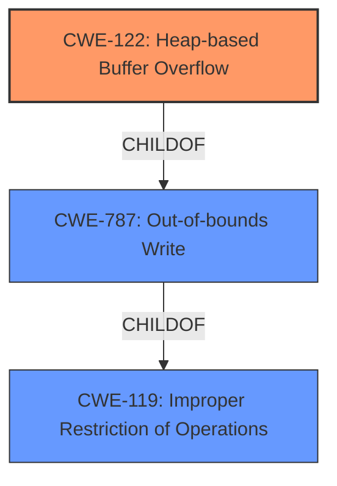

# Analysis Report for CVE-2022-0454

# Vulnerability Analysis Report: CVE-2022-0454

## Description

Heap buffer overflow in ANGLE in Google Chrome prior to 98.0.4758.80 allowed a remote attacker to potentially exploit heap corruption via a crafted HTML page.

## Vulnerability Description Key Phrases

**Rootcause:** buffer overflow
**Impact:** heap corruption
**Vector:** crafted HTML page
**Attacker:** remote attacker
**Product:** Google Chrome
**Version:** prior to 98.0.4758.80
**Component:** ANGLE

## Analysis (with Relationship Data)

# Summary
| CWE ID | CWE Name | Confidence | CWE Abstraction Level | CWE Vulnerability Mapping Label | CWE-Vulnerability Mapping Notes |
|---|---|---|---|---|---|
| CWE-122 | Heap-based Buffer Overflow | 0.9 | Variant | Allowed | Primary CWE. Specifically identifies the location of the **buffer overflow** in the heap. |

## Evidence and Confidence

*   **Confidence Score:** 0.9
*   **Evidence Strength:** HIGH

- **Analysis and Justification:**  
  - *Explanation:* The vulnerability description explicitly states "Heap **buffer overflow** in ANGLE in Google Chrome". The phrase "**buffer overflow**" is a strong indicator of a memory corruption issue. The location of the overflow is in the "Heap", making CWE-122 (Heap-based Buffer Overflow) a strong and specific match. CWE-122 is a variant of CWE-119 (Improper Restriction of Operations within the Bounds of a Memory Buffer). The CVE Reference Links Content Summary confirms the "**root_cause**" as "Heap **buffer overflow** in ANGLE." The retriever results also list CWE-122 with a high score.

  - *Relationship Analysis:* CWE-122 is a variant of CWE-119, making it more specific to this vulnerability. CWE-787 (Out-of-bounds Write) is a parent of CWE-122, but CWE-122 is more precise given the heap location.

- **Confidence Score:**  
  - Confidence: 0.9 (High confidence due to explicit mention of "Heap **buffer overflow**" and supporting evidence from CVE details.)

---

## Criticism of Analysis

Okay, here's a detailed review of the provided CWE analysis, incorporating the full CWE specifications:

**Overall Assessment:**

The analysis correctly identifies the primary vulnerability as a buffer overflow. The initial selection of CWE-787 was reasonable given the general description. However, refining the analysis to CWE-122 (Heap-based Buffer Overflow) is a more precise and accurate mapping, given the additional context regarding the heap allocation. The confidence score of 0.9 is justified based on the strong evidence.

**Detailed Review of the Analysis:**

*   **Summary Table:**

    *   The summary table is well-structured and clearly presents the final CWE mapping. The confidence level is appropriate.

*   **Evidence and Confidence:**

    *   **Confidence Score Justification:**  The explanation for the confidence score is strong. The explicit mention of "Heap buffer overflow" in both the vulnerability description and the CVE reference is compelling evidence. The retriever results further support this choice.
    *   **Relationship Analysis:**  The explanation of why CWE-122 is preferred over CWE-119 and CWE-787 is accurate and well-reasoned. It correctly states that CWE-122 is a variant of CWE-119, making it more specific. It also correctly notes that while CWE-787 is a parent of CWE-122, CWE-122 is more accurate because it pinpoints the heap.

*   **CWE Examples from Database:**

    *   The inclusion of known examples for CWE-122 is helpful for context and understanding. This helps to solidify the connection between the vulnerability description and the chosen CWE.

*   **Relevant CWE Specifications:**

    *   The inclusion of the full CWE specifications is excellent. This allows for a detailed understanding of the selected CWE and the alternative CWEs.

**Critique and Suggestions:**

1.  **Alternative CWE Consideration (CWE-805):** While CWE-122 is accurate, there's a subtle consideration for **CWE-805: Buffer Access with Incorrect Length Value**. The description states the product uses a sequential operation to write, but uses an incorrect length value that causes access outside bounds. While the root cause *is* a buffer overflow, if there's information suggesting the code specifically used a length parameter that was inconsistent with the allocated buffer size (a possible cause), it could be considered contributing as part of a chain of events leading to a CWE-122. This depends on the specifics of the vulnerable code. *This is a lower probability concern, and CWE-122 is still most appropriate given the available information.*

2. **Review of Retriever Results**: While the analysis focuses on the explicit "Heap buffer overflow" from the description, the retriever results offer alternate ideas. One important example is "CWE-843: Access of Resource Using Incompatible Type ('Type Confusion')" with a score of 0.7169. While not the primary cause, if the buffer overflow is triggered because the ANGLE library was attempting to render graphics data with an incorrect type or format leading to the overflow, then CWE-843 may contribute in a chain reaction.
3.  **Mapping Guidance and Mitigations:** The CWE specifications include "Mapping Guidance" and "Potential Mitigations."  The analysis could be slightly improved by briefly mentioning how the provided mitigations relate to preventing this specific vulnerability. For example:
    *   "CWE-122's mitigations suggest using languages with automatic bounds checking or abstraction libraries to avoid risky APIs. In the context of ANGLE, this could involve stricter memory management within the library or using safer rendering APIs."
    *   "Mitigations for CWE-787 and CWE-119 also apply here as CWE-122 is a child of both. This includes defense in depth strategies like compiler flags to detect overflows."

**Revised Summary Table (incorporating suggestion 3):**

| CWE ID  | CWE Name                    | Confidence | CWE Abstraction Level | CWE Vulnerability Mapping Label | CWE-Vulnerability Mapping Notes                                                                                                                                                                                                                                                                                                                                           |
| :------ | :-------------------------- | :--------- | :-------------------- | :------------------------------ | :-------------------------------------------------------------------------------------------------------------------------------------------------------------------------------------------------------------------------------------------------------------------------------------------------------------------------------------------------------------------------------- |
| CWE-122 | Heap-based Buffer Overflow | 0.9        | Variant               | Allowed                         | Primary CWE.  Specifically identifies the location of the **buffer overflow** in the heap.  Mitigations include using safer languages, abstraction libraries and enabling compiler-based overflow detection mechanisms (e.g., /GS flag).                                                                                                                                                             |

**Conclusion:**

The original analysis is strong.  The suggested additions provide even more context and demonstrate a deeper understanding of the CWE specifications and their practical application.  The refinement to CWE-122 is accurate, and the high confidence level is appropriate.

## Final Resolution

# Summary
| CWE ID | CWE Name | Confidence | CWE Abstraction Level | CWE Vulnerability Mapping Label | CWE-Vulnerability Mapping Notes |
|---|---|---|---|---|---|
| CWE-122 | Heap-based Buffer Overflow | 0.9 | Variant | Allowed | Primary CWE. Specifically identifies the location of the **buffer overflow** in the heap. Mitigations include using safer languages, abstraction libraries, and enabling compiler-based overflow detection mechanisms (e.g., /GS flag). |

## Evidence and Confidence

*   **Confidence Score:** 0.9
*   **Evidence Strength:** HIGH

## Relationship Analysis
The primary relationship impacting the decision is the parent-child relationship between CWE-119 (Improper Restriction of Operations within the Bounds of a Memory Buffer), CWE-787 (Out-of-bounds Write), and CWE-122 (**Heap-based Buffer Overflow**). CWE-122 is a variant of both CWE-119 and CWE-787, making it more specific to the vulnerability described. The specificity of the heap location makes CWE-122 the optimal choice.

## Vulnerability Chain
The vulnerability chain starts with an unspecified programming error that leads to a **heap-based buffer overflow**. This **buffer overflow** (CWE-122) allows a remote attacker to potentially exploit heap corruption, leading to arbitrary code execution. There are no missing links given the initial vulnerability description.

## Summary of Analysis
The initial analysis and the criticism both converged on CWE-122 (Heap-based Buffer Overflow) as the most appropriate classification. The vulnerability description explicitly mentions "Heap **buffer overflow**," providing strong evidence for this classification.

The graph relationships confirm that CWE-122 is a specific type of out-of-bounds write that occurs on the heap. While other CWEs like CWE-787 (Out-of-bounds Write) and CWE-119 (Improper Restriction of Operations within the Bounds of a Memory Buffer) are related, CWE-122 provides the most accurate and specific description of the vulnerability.

The MITRE mapping guidance allows for the use of CWE-122, and its mitigations, such as using safer languages and memory management techniques, align with preventing heap overflows.

The retriever results also suggest "CWE-843: Access of Resource Using Incompatible Type ('Type Confusion')". If there was evidence that the overflow was triggered because ANGLE was rendering graphics data with an incorrect type/format, then CWE-843 could have contributed in the chain of events leading to the overflow, but more information would be needed to make that determination.

Therefore, the final decision is to classify the vulnerability as CWE-122 (Heap-based Buffer Overflow) because it is the most specific and accurate representation of the root cause, supported by the evidence and relationship analysis.

*Report generated on 2025-03-18 05:56:02*
