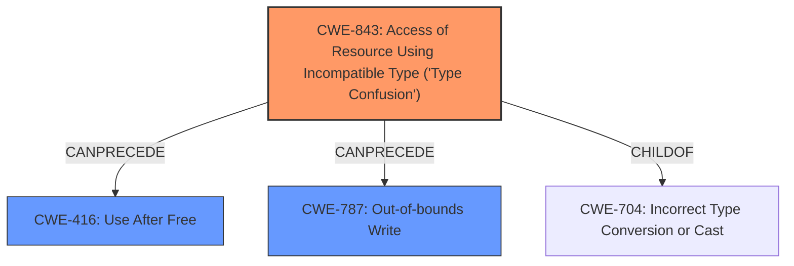

# Final Resolution for CVE-2022-0457

# Summary 

| CWE ID  | CWE Name                                                                | Confidence | CWE Abstraction Level | CWE Vulnerability Mapping Label | CWE-Vulnerability Mapping Notes |
| :-------- | :---------------------------------------------------------------------- | :--------- | :-------------------- | :------------------------------ | :------------------------------ |
| CWE-843 | Access of Resource Using Incompatible Type ('**Type Confusion**') | 0.95       | Base                  | Allowed                         | Primary CWE Root Cause                      |
| CWE-416 | Use After Free | 0.60       | Variant                  | Allowed                         | Secondary Candidate Potential Consequence                      |
| CWE-787 | Out-of-bounds Write | 0.50       | Base                  | Allowed                         | Secondary Candidate Potential Consequence                      |

## Evidence and Confidence

*   **Confidence Score:** 0.90
*   **Evidence Strength:** HIGH

## Relationship Analysis
The primary relationship that impacted the decision was the parent-child relationship between CWE-704 (Incorrect Type Conversion or Cast) and CWE-843 (**Type Confusion**). While CWE-704 is a parent, CWE-843 is more specific and directly relates to the vulnerability description mentioning "**Type Confusion**". The chain relationships indicate that CWE-843 can precede both CWE-416 and CWE-787, suggesting a potential sequence where **type confusion** leads to memory corruption, resulting in either use-after-free or out-of-bounds write conditions. The abstraction levels also played a role, as CWE-843 is a base-level CWE, making it a more suitable choice than the class-level CWE-704 or pillar-level CWEs.

## Vulnerability Chain
The vulnerability chain starts with the **type confusion** (**CWE-843**) within the V8 engine. This **type confusion** can lead to incorrect memory operations, potentially resulting in **heap corruption**. The **heap corruption** can then lead to either a use-after-free condition (**CWE-416**) or an out-of-bounds write (**CWE-787**). The final impact is the ability for a remote attacker to potentially exploit the **heap corruption** via a crafted HTML page.

## Summary of Analysis
The initial analysis correctly identified CWE-843 as the primary **root cause**, given the direct match with the vulnerability description that mentions "**type confusion**". The criticism correctly points out that CWE-416 and CWE-787 are potential consequences of **heap corruption**, and the analysis has been updated to reflect this. The graph relationships confirm the potential chain of events, where **type confusion** can precede use-after-free or out-of-bounds write. The selected CWEs are at the optimal level of specificity, with CWE-843 being a base-level CWE that directly addresses the **type confusion** issue, and CWE-416 and CWE-787 being variant and base-level CWEs respectively, representing potential consequences. The decision is primarily based on the provided evidence, specifically the vulnerability description stating "**Type Confusion in V8**". The mapping guidance for CWE-843 indicates that it is ALLOWED for this type of vulnerability, further supporting the decision. The confidence remains high due to the direct match and the clear relationship between **type confusion** and potential memory corruption consequences. The description only mentions **heap corruption**, and if the type confusion occurs without actually overflowing any buffers or freeing memory and then using it, out-of-bounds write or use after free may not occur.