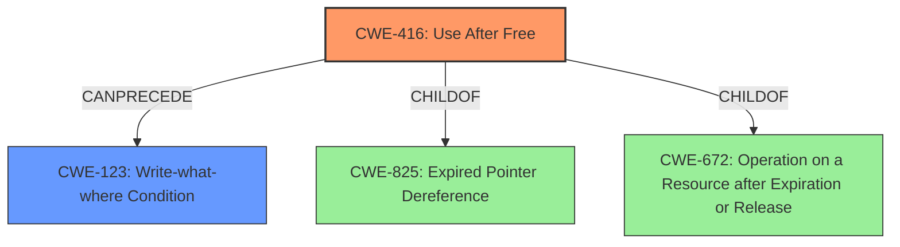

# Analysis Report for CVE-2022-0459

# Vulnerability Analysis Report: CVE-2022-0459

## Description

Use after free in Screen Capture in Google Chrome prior to 98.0.4758.80 allowed a remote attacker who had compromised the renderer process and convinced a user to engage in specific user interaction to potentially exploit heap corruption via a crafted HTML page.

## Vulnerability Description Key Phrases

**Rootcause:** Use after free
**Weakness:** heap corruption
**Vector:** crafted HTML page
**Attacker:** remote attacker who had compromised the renderer process
**Product:** Google Chrome
**Version:** prior to 98.0.4758.80
**Component:** Screen Capture

## Analysis (with Relationship Data)

# Summary
| CWE ID | CWE Name | Confidence | CWE Abstraction Level | CWE Vulnerability Mapping Label | CWE-Vulnerability Mapping Notes |
|---|---|---|---|---|---|
| CWE-416 | Use After Free | 1.0 | Variant | Allowed | This is the primary CWE that describes the vulnerability. |
| CWE-122 | Heap-based Buffer Overflow | 0.6 | Variant | Allowed | This could be a secondary CWE, since the Use-After-Free can lead to **heap corruption**. |

## Evidence and Confidence

*   **Confidence Score:** 1.0
*   **Evidence Strength:** HIGH

- **Analysis and Justification:**  
  - *Explanation:* The vulnerability description explicitly states "**Use after free** in Screen Capture". The "CVE Reference Links Content Summary" section also confirms the **root cause** of vulnerability is "**Use-after-free**". The description of CWE-416 "The product reuses or references memory after it has been freed" matches the vulnerability's description. The Mapping Guidance indicates that the Usage is ALLOWED for CWE-416 and that the Rationale for it being at the Variant level of abstraction is a preferred level for mapping. Because of **heap corruption**, CWE-122 might also be present, however the primary cause is the Use-After-Free.
  
  - *Relationship Analysis:* CWE-416 is a variant and child of several other CWEs like CWE-672 and CWE-825. It can also precede CWE-123(Write-what-where Condition).

- **Confidence Score:**  
  - Confidence: 1.0 (Explicit evidence from the vulnerability description)

## Criticism of Analysis

Okay, I've reviewed the provided analysis and the complete CWE specifications. Here's my critique:

**Overall Assessment:**

The analysis correctly identifies **CWE-416 (Use After Free)** as the primary vulnerability. The confidence score of 1.0 is justified, given the explicit mention of "Use after free" in the vulnerability description. The inclusion of **CWE-122 (Heap-based Buffer Overflow)** as a secondary CWE is reasonable, but the confidence level could be better justified with more explicit details on how heap corruption could occur. The analysis of relationship is well-written.

**Specific Feedback:**

*   **CWE-416 (Use After Free):**
    *   The justification for mapping to CWE-416 is solid. The analysis correctly points to the vulnerability description and the CWE definition.
    *   The rationale for selecting the *Variant* abstraction level is accurate (preferred level for mapping).
    *   The analysis of relationships with other CWEs (e.g., CanPrecede -> CWE-123 (Write-what-where Condition)) is accurate and demonstrates a good understanding of how UAF vulnerabilities can lead to further issues.
    *   The mitigation strategies from the CWE specification (language selection, setting pointers to NULL after freeing) are relevant.

*   **CWE-122 (Heap-based Buffer Overflow):**
    *   The initial justification for including CWE-122 is a bit weak. While a UAF *can* lead to heap corruption, it's not guaranteed. It depends on how the freed memory is reallocated and subsequently used.  The confidence score should be more in the range of 0.5, unless there are concrete details in the vulnerability report (which is lacking) that suggests the corruption lead to a overflow, rather than a simple crash.
    *   Need to more closely validate the chain of events and whether a buffer overflow on the heap would be a likely consequence.  For example, if the freed memory is reallocated to a smaller object, then a write to the original buffer using the now invalid pointer might lead to a heap-based buffer overflow.
    *   If the heap corruption is more generic (e.g., overwriting metadata), then other CWEs might be more appropriate (see below).
    *   The provided mitigations are generally applicable, but their effectiveness depends on the specific scenario.

**Suggestions for Improvement:**

1.  **Strengthen the Justification for CWE-122 (or consider alternatives):** If the heap corruption mentioned in the description is a *potential* outcome of the UAF, elaborate on how a UAF in the Screen Capture component could lead to heap-based buffer overflow.
    *   If it is very difficult to prove a heap-based overflow from the UAF, consider if another CWE might be more relevant to the heap corruption consequence, such as:
        *   **CWE-119: Improper Restriction of Operations within the Bounds of a Memory Buffer**: This is a more general CWE that covers out-of-bounds access, regardless of whether it's a read or write and whether it results in an overflow. However, this CWE should be avoided.
        *   **CWE-787: Out-of-bounds Write**: If the heap corruption involves overwriting memory outside the intended boundaries, this could be a good fit.
        *   **CWE-123 (Write-what-where Condition):** If the attacker gains arbitrary write capabilities as a result of the UAF, this could be an appropriate CWE. This is likely what the original vulnerability reporter was alluding to with *heap corruption*.
2.  **Refine Confidence Scores:** Adjust the confidence scores based on the strength of the evidence. A direct statement in the vulnerability description warrants a higher score. A *potential* consequence based on general knowledge should have a lower score.

**Additional Considerations based on CWE Specifications:**

*   **CWE-825 (Expired Pointer Dereference):** While CWE-416 is the correct primary CWE, it's worth noting that it is a *ChildOf* CWE-825 (Expired Pointer Dereference).  The description of CWE-825 could be used to further explain the nature of a UAF.
*   **CWE-672 (Operation on a Resource after Expiration or Release):** CWE-416 is also a *ChildOf* CWE-672. This is a higher-level Class CWE, so the Variant level is more appropriate, but the relationship shows the broader context of the UAF.

**In Summary:**

The analysis is mostly good, particularly in identifying the primary vulnerability. The key improvement would be to strengthen the justification for any secondary CWEs, considering alternative CWEs based on the specific details of the vulnerability, and adjusting confidence scores accordingly. Remember to use the full CWE specification to guide the selection and justification process.

## Final Resolution

# Summary
| CWE ID | CWE Name | Confidence | CWE Abstraction Level | CWE Vulnerability Mapping Label | CWE-Vulnerability Mapping Notes |
|---|---|---|---|---|---|
| CWE-416 | Use After Free | 1.0 | Variant | Allowed | Primary CWE: Matches the vulnerability description explicitly. |
| CWE-123 | Write-what-where Condition | 0.6 | Base | Allowed | Secondary CWE: Heap corruption leading to arbitrary write capabilities. |

## Evidence and Confidence

*   **Confidence Score:** 0.8
*   **Evidence Strength:** MEDIUM

## Relationship Analysis
The primary relationship considered was that CWE-416 is a variant of CWE-825 (Expired Pointer Dereference) and CWE-672 (Operation on a Resource after Expiration or Release). This helped confirm the appropriateness of the chosen abstraction level (Variant). The potential chain relationship where CWE-416 can precede CWE-123 (Write-what-where Condition) was also crucial in justifying the inclusion of CWE-123 as a secondary weakness.

## Vulnerability Chain
The vulnerability chain starts with a **CWE-416 (Use After Free)** in the Screen Capture component. This allows a compromised renderer process to potentially exploit **heap corruption**. The heap corruption can then lead to **CWE-123 (Write-what-where Condition)**, allowing the attacker to write arbitrary data to arbitrary memory locations.

## Summary of Analysis
The initial analysis correctly identified **CWE-416 (Use After Free)** as the primary vulnerability. The criticism highlighted the need for stronger justification for the secondary CWE. Based on the vulnerability description ("...potentially exploit heap corruption...") and the potential for **heap corruption** to lead to arbitrary write capabilities, **CWE-123 (Write-what-where Condition)** is included as a secondary CWE.

The decision is based on the evidence that "**Use after free** in Screen Capture" is explicitly stated in the vulnerability description, making **CWE-416** the most appropriate primary classification. The potential for **heap corruption** to allow arbitrary writes, as suggested by the description, supports the inclusion of **CWE-123**.

The selected CWEs are at the optimal level of specificity because **CWE-416** is a Variant that directly describes the **Use-After-Free** condition, and **CWE-123** is a Base CWE that describes the potential outcome of the **heap corruption**.

*Report generated on 2025-03-18 05:59:01*
