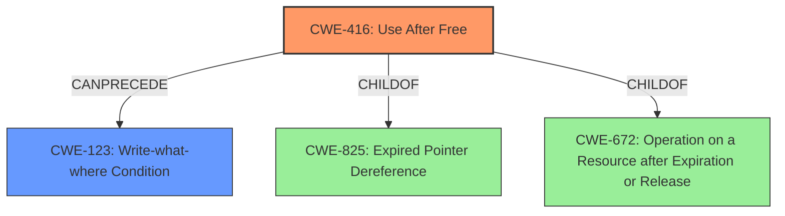

# Final Resolution for CVE-2022-0459

# Summary
| CWE ID | CWE Name | Confidence | CWE Abstraction Level | CWE Vulnerability Mapping Label | CWE-Vulnerability Mapping Notes |
|---|---|---|---|---|---|
| CWE-416 | Use After Free | 1.0 | Variant | Allowed | Primary CWE: Matches the vulnerability description explicitly. |
| CWE-123 | Write-what-where Condition | 0.6 | Base | Allowed | Secondary CWE: Heap corruption leading to arbitrary write capabilities. |

## Evidence and Confidence

*   **Confidence Score:** 0.8
*   **Evidence Strength:** MEDIUM

## Relationship Analysis
The primary relationship considered was that CWE-416 is a variant of CWE-825 (Expired Pointer Dereference) and CWE-672 (Operation on a Resource after Expiration or Release). This helped confirm the appropriateness of the chosen abstraction level (Variant). The potential chain relationship where CWE-416 can precede CWE-123 (Write-what-where Condition) was also crucial in justifying the inclusion of CWE-123 as a secondary weakness.

## Vulnerability Chain
The vulnerability chain starts with a **CWE-416 (Use After Free)** in the Screen Capture component. This allows a compromised renderer process to potentially exploit **heap corruption**. The heap corruption can then lead to **CWE-123 (Write-what-where Condition)**, allowing the attacker to write arbitrary data to arbitrary memory locations.

## Summary of Analysis
The initial analysis correctly identified **CWE-416 (Use After Free)** as the primary vulnerability. The criticism highlighted the need for stronger justification for the secondary CWE. Based on the vulnerability description ("...potentially exploit heap corruption...") and the potential for **heap corruption** to lead to arbitrary write capabilities, **CWE-123 (Write-what-where Condition)** is included as a secondary CWE.

The decision is based on the evidence that "**Use after free** in Screen Capture" is explicitly stated in the vulnerability description, making **CWE-416** the most appropriate primary classification. The potential for **heap corruption** to allow arbitrary writes, as suggested by the description, supports the inclusion of **CWE-123**.

The selected CWEs are at the optimal level of specificity because **CWE-416** is a Variant that directly describes the **Use-After-Free** condition, and **CWE-123** is a Base CWE that describes the potential outcome of the **heap corruption**.