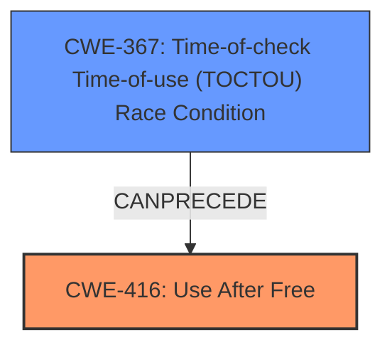

# Analysis Report for CVE-2022-0463

# Vulnerability Analysis Report: CVE-2022-0463

## Description

Use after free in Accessibility in Google Chrome prior to 98.0.4758.80 allowed a remote attacker who convinced a user to engage in specific user interaction to potentially exploit heap corruption via user interaction.

## Vulnerability Description Key Phrases

**Rootcause:** use after free
**Impact:** heap corruption
**Vector:** user interaction
**Attacker:** remote attacker
**Product:** Google Chrome
**Version:** prior to 98.0.4758.80
**Component:** Accessibility

## Analysis (with Relationship Data)

# Summary
| CWE ID | CWE Name | Confidence | CWE Abstraction Level | CWE Vulnerability Mapping Label | CWE-Vulnerability Mapping Notes |
|---|---|---|---|---|---|
| CWE-416 | Use After Free | 1.0 | Variant | Allowed | Primary CWE |

## Evidence and Confidence

*   **Confidence Score:** 1.0
*   **Evidence Strength:** HIGH

- **Analysis and Justification:**  
  - *Explanation:* The vulnerability description explicitly states "**use after free** in Accessibility". This directly aligns with the description of CWE-416, which is "The product reuses or references memory after it has been freed." The CVE Reference Links Content Summary also states "**root_cause**: Use after free in Accessibility" and lists "Use after free" as a weakness. The retriever results also list CWE-416 with the highest score and the graph score is high. This is a clear match.
  
  - *Relationship Analysis:* CWE-416 is a variant-level CWE, which is preferred. The description indicates it is a direct cause and not an impact.

- **Confidence Score:**  
  - Confidence: 1.0 (Direct match from the vulnerability description and confirmed by reference materials)

## Criticism of Analysis

## Critique of the Analysis

The analysis is generally very good, with a clear and well-justified mapping to CWE-416. The reasoning is sound, and the evidence is strong. However, there are a few minor points that can be improved.

**Strengths:**

*   **Clear and Concise:** The analysis is easy to understand and directly addresses the vulnerability description.
*   **Strong Justification:** The explanation for choosing CWE-416 is excellent. It directly quotes the vulnerability description and explains how it maps to the CWE definition.
*   **High Confidence:** The confidence score of 1.0 is appropriate given the direct match.
*   **Proper Abstraction Level:** The selection of the Variant level (CWE-416) is correct and in line with CWE guidance.
*   **Comprehensive Evidence:** The analysis considers the vulnerability description, reference links content summary, and retriever results.
*   **Known Examples:** The inclusion of Known Examples of CWE-416 provides helpful context.
*   **Relevant CWE Specifications:** The inclusion of the full CWE specification provides helpful context.

**Areas for Improvement:**

1.  **Contextualizing User Interaction:** While the primary CWE is correctly identified, it would be valuable to explore how the "user interaction" aspect of the attack vector might relate to other CWEs, *without* necessarily changing the primary CWE.  For example, could the user interaction involve manipulating UI elements in a way that leads to the UAF?  This might not be a *direct* cause, but it could be a contributing factor.  Consider if a related CWE exists that could be added in addition to CWE-416 (or in the vulnerability notes).
2.  **Mitigations Specific to Accessibility:** The mitigations provided for CWE-416 are general memory management practices. Since the vulnerability occurs in the Accessibility component, it would strengthen the analysis to discuss mitigations specific to accessibility features. This might include:
    *   Robust error handling and validation of accessibility API calls.
    *   Careful management of object lifetimes within the accessibility tree.
    *   Security reviews focused on the interaction between accessibility features and other browser components.
3.  **Briefly Address the Top Retriever Results (Besides CWE-416):** While CWE-416 is the correct primary CWE, the retriever results show other CWEs with relatively high scores (CWE-366, CWE-843, CWE-1021). The analysis should briefly explain *why* these are not the primary cause. For example:
    *   **CWE-366 (Race Condition within a Thread):** "While concurrency *could* be involved, the core issue is the use of freed memory, not necessarily a race condition. A race condition might *lead* to the UAF, but it's not the direct root cause as described."
    *   **CWE-843 (Access of Resource Using Incompatible Type):** "Although data corruption occurs due to use after free, the UAF is the direct root cause, rather than type confusion."
    *   **CWE-1021 (Improper Restriction of Rendered UI Layers or Frames):** "The attack requires user interaction, but not necessarily in the context of UI redress."
4.  **Chain Considerations:** While the description focuses on UAF, consider briefly if this UAF is part of a longer chain, and what could *cause* the memory to be freed prematurely. For example, is it possible a race condition could free the memory at the wrong time? If this is possible, it might suggest a secondary CWE. Note that the CWE-416 examples from the database include CVEs where race conditions led to use-after-free.

**Revised Summary Table (with a potential addition)**

| CWE ID | CWE Name | Confidence | CWE Abstraction Level | CWE Vulnerability Mapping Label | CWE-Vulnerability Mapping Notes |
|---|---|---|---|---|---|
| CWE-416 | Use After Free | 1.0 | Variant | Allowed | Primary CWE |
| (Optional) CWE-362 | Concurrent Execution using Shared Resource with Improper Synchronization ('Race Condition') | Low | Class | Allowed-with-Review |  A race condition may contribute to the UAF, but further analysis needed.  |
**Impact of Improvements:**

Addressing these points would make the analysis more robust by demonstrating a deeper understanding of the vulnerability and its potential complexities. It would also provide more actionable information for developers looking to mitigate the issue.

In summary, the analysis is already strong, and these suggestions are intended to refine it further and address potential nuances related to the attack vector and the specific component involved (Accessibility).

## Final Resolution

# Summary
| CWE ID | CWE Name | Confidence | CWE Abstraction Level | CWE Vulnerability Mapping Label | CWE-Vulnerability Mapping Notes |
|---|---|---|---|---|---|
| **CWE-416** | **Use After Free** | 1.0 | Variant | Allowed | Primary CWE |
| CWE-367 | Time-of-check Time-of-use (TOCTOU) Race Condition | 0.4 | Base | Allowed | Secondary Candidate: Possible race condition leading to the UAF |

## Evidence and Confidence

*   **Confidence Score:** 0.8
*   **Evidence Strength:** MEDIUM

## Relationship Analysis
The primary relationship considered is the potential for a race condition (CWE-367) to precede the use-after-free (CWE-416). While the initial vulnerability description focuses on the UAF, the critique raises the possibility of a race condition leading to premature freeing of memory. This relationship is plausible, given that the vulnerability is in the Accessibility component of Chrome, where concurrent operations are likely.

## Vulnerability Chain
The primary **WEAKNESS** is **CWE-416 (Use After Free)**. A possible preceding condition could be **CWE-367 (TOCTOU Race Condition)**.

Chain:
1.  A race condition (**CWE-367**) might cause memory to be freed prematurely.
2.  The code attempts to access this freed memory (**CWE-416**).
3.  This results in heap corruption and potential for arbitrary code execution.

Missing links:
- The exact mechanism causing the premature free is not explicitly described in the vulnerability report.

## Summary of Analysis
The initial analysis correctly identifies **CWE-416 (Use After Free)** as the primary **ROOTCAUSE**, based on the explicit statement in the vulnerability description: "Use after free in Accessibility." The confidence is justifiably high (1.0) due to this direct match.

However, the critique raises a valid point about the potential role of user interaction and concurrency. While the user interaction itself doesn't directly translate into a specific CWE without more information, the possibility of a race condition leading to the UAF is worth considering.

The retriever results include several concurrency-related CWEs (e.g., CWE-366, CWE-362). Of these, **CWE-367 (TOCTOU Race Condition)** seems most plausible as a contributing factor. It's possible that a race condition could cause the memory to be freed at an inappropriate time, leading to the UAF.

Therefore, I am adding **CWE-367** as a secondary CWE with a lower confidence score (0.4). This acknowledges the possibility of a race condition contributing to the vulnerability chain, without detracting from the primary role of the UAF. The evidence is indirect, based on the nature of the affected component (Accessibility) and the general prevalence of concurrency issues in such contexts.

**Justification for CWE Selection:**

*   **CWE-416:** Direct match from the vulnerability description. Variant level of abstraction, which is preferred.
*   **CWE-367:** Plausible contributing factor. The vulnerability occurs in the Accessibility component, which likely involves concurrent operations. The race condition could lead to premature freeing of memory. This selection is made with lower confidence due to the lack of direct evidence.

The selected CWEs are at the optimal level of specificity, given the available information. **CWE-416** is a variant-level CWE that accurately describes the core **WEAKNESS**. **CWE-367** is a base-level CWE that captures the potential contributing factor of a race condition.

*Report generated on 2025-03-18 06:00:17*
