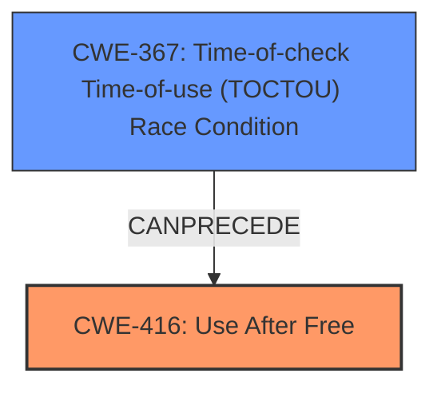

# Final Resolution for CVE-2022-0463

# Summary
| CWE ID | CWE Name | Confidence | CWE Abstraction Level | CWE Vulnerability Mapping Label | CWE-Vulnerability Mapping Notes |
|---|---|---|---|---|---|
| **CWE-416** | **Use After Free** | 1.0 | Variant | Allowed | Primary CWE |
| CWE-367 | Time-of-check Time-of-use (TOCTOU) Race Condition | 0.4 | Base | Allowed | Secondary Candidate: Possible race condition leading to the UAF |

## Evidence and Confidence

*   **Confidence Score:** 0.8
*   **Evidence Strength:** MEDIUM

## Relationship Analysis
The primary relationship considered is the potential for a race condition (CWE-367) to precede the use-after-free (CWE-416). While the initial vulnerability description focuses on the UAF, the critique raises the possibility of a race condition leading to premature freeing of memory. This relationship is plausible, given that the vulnerability is in the Accessibility component of Chrome, where concurrent operations are likely.

## Vulnerability Chain
The primary **WEAKNESS** is **CWE-416 (Use After Free)**. A possible preceding condition could be **CWE-367 (TOCTOU Race Condition)**.

Chain:
1.  A race condition (**CWE-367**) might cause memory to be freed prematurely.
2.  The code attempts to access this freed memory (**CWE-416**).
3.  This results in heap corruption and potential for arbitrary code execution.

Missing links:
- The exact mechanism causing the premature free is not explicitly described in the vulnerability report.

## Summary of Analysis
The initial analysis correctly identifies **CWE-416 (Use After Free)** as the primary **ROOTCAUSE**, based on the explicit statement in the vulnerability description: "Use after free in Accessibility." The confidence is justifiably high (1.0) due to this direct match.

However, the critique raises a valid point about the potential role of user interaction and concurrency. While the user interaction itself doesn't directly translate into a specific CWE without more information, the possibility of a race condition leading to the UAF is worth considering.

The retriever results include several concurrency-related CWEs (e.g., CWE-366, CWE-362). Of these, **CWE-367 (TOCTOU Race Condition)** seems most plausible as a contributing factor. It's possible that a race condition could cause the memory to be freed at an inappropriate time, leading to the UAF.

Therefore, I am adding **CWE-367** as a secondary CWE with a lower confidence score (0.4). This acknowledges the possibility of a race condition contributing to the vulnerability chain, without detracting from the primary role of the UAF. The evidence is indirect, based on the nature of the affected component (Accessibility) and the general prevalence of concurrency issues in such contexts.

**Justification for CWE Selection:**

*   **CWE-416:** Direct match from the vulnerability description. Variant level of abstraction, which is preferred.
*   **CWE-367:** Plausible contributing factor. The vulnerability occurs in the Accessibility component, which likely involves concurrent operations. The race condition could lead to premature freeing of memory. This selection is made with lower confidence due to the lack of direct evidence.

The selected CWEs are at the optimal level of specificity, given the available information. **CWE-416** is a variant-level CWE that accurately describes the core **WEAKNESS**. **CWE-367** is a base-level CWE that captures the potential contributing factor of a race condition.