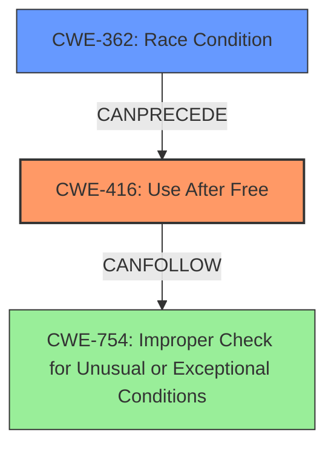

# Analysis Report for CVE-2022-0464

# Vulnerability Analysis Report: CVE-2022-0464

## Description

Use after free in Accessibility in Google Chrome prior to 98.0.4758.80 allowed a remote attacker who convinced a user to engage in specific user interaction to potentially exploit heap corruption via user interaction.

## Vulnerability Description Key Phrases

**Rootcause:** Use after free
**Impact:** exploit heap corruption
**Vector:** user interaction
**Attacker:** remote attacker
**Product:** Google Chrome
**Version:** prior to 98.0.4758.80
**Component:** Accessibility

## Analysis (with Relationship Data)

# Summary
| CWE ID | CWE Name | Confidence | CWE Abstraction Level | CWE Vulnerability Mapping Label | CWE-Vulnerability Mapping Notes |
|---|---|---|---|---|---|
| CWE-416 | Use After Free | 1.0 | Variant | Primary | Allowed |

## Evidence and Confidence

*   **Confidence Score:** 1.0
*   **Evidence Strength:** HIGH

- **Analysis and Justification:**  
  - *Explanation:* The vulnerability is described as a **use after free** in the Accessibility component of Google Chrome. The CVE description, key phrases, and CVE reference summary all point to **CWE-416 (Use After Free)** as the root cause. The vulnerability occurs when memory is reused or referenced after it has been freed, leading to potential heap corruption and arbitrary code execution. The retriever results also strongly suggest CWE-416 as the primary candidate. The CWE is at the Variant level of abstraction, which is a preferred level.
  
  - *Relationship Analysis:* There are no direct relationships provided in the additional details.

- **Confidence Score:**  
  - Confidence: 1.0 (High confidence due to direct evidence and corroborating retriever results)

## Criticism of Analysis

Okay, I've reviewed the analysis and the full CWE specifications you provided. Here's my critique:

**Overall Assessment:**

The analysis is very good and the primary CWE mapping to CWE-416 (Use After Free) is **correct** and **well-justified**. The confidence score of 1.0 is appropriate given the evidence. The analysis clearly explains why CWE-416 is the best fit, using the vulnerability description, key phrases, CVE reference summary, and retriever results.  The consistent information across these sources makes a strong case. The Variant level of abstraction is also correct.

**Specific Strengths:**

*   **Clear Explanation:** The analysis clearly explains the reasoning behind choosing CWE-416.
*   **Comprehensive Evidence:**  It considers multiple sources of information: vulnerability description, key phrases, CVE reference summary, and retriever results.
*   **Correct Abstraction Level:** The selection of the Variant level of abstraction for CWE-416 is correct and appropriate.
*   **Relevant Examples:** The inclusion of observed examples of CWE-416 from the CVE database is helpful for context and understanding.
*   **Concise and Organized:** The analysis is well-organized and easy to follow.

**Suggestions for Improvement (Minor):**

While the analysis is strong, here are a few minor points to consider for further refinement:

1.  **Exploring Potential Chaining/Related CWEs:** While CWE-416 is the primary weakness, it's often part of a chain or related to other CWEs. The retriever results highlight CWE-362 (Race Condition), CWE-366 (Race Condition within a Thread) and CWE-413 (Improper Resource Locking) which are often related to UAFs.  Even though the description doesn't *explicitly* mention a race condition *leading to* the UAF in this instance, it *could* be a contributing factor, especially given that the vulnerability is in the Accessibility component (which might have some form of concurrency).  It would be beneficial to briefly acknowledge these possibilities. For example, you could add a sentence like: "While the primary cause is a Use After Free, it's possible that a race condition could contribute to the vulnerability by causing a resource to be freed prematurely. Further investigation would be needed to confirm this." If there *is* a code path where a race condition exists, then noting that it can *CanFollow* one of the race condition weaknesses.

2.  **Mitigation Strategies:** You could include some more specific mitigations derived from the CWE-416 specification, but also considering the specific environment (Chrome/Accessibility):
    *   **Address Sanitizer (ASan):** Mention that Chrome likely uses ASan or similar memory safety tools in its builds, and that this vulnerability bypasses/defeats those protections.
    *   **PartitionAlloc:** Chrome uses PartitionAlloc, its custom memory allocator. You could mention the mechanisms that PartitionAlloc employs to prevent UAF.
    *   **Nulling Pointers:** Briefly mention the "set pointers to NULL after freeing" mitigation, and why it may not always be effective in complex systems like Chrome.

3.  **CWE-404 Consideration:** Although CWE-404 is not a strong match, it's worth noting *why* it's not a good fit. CWE-404 refers to *improper* shutdown or release. The key distinction is that a UAF involves *using* memory *after* it has been correctly freed, whereas CWE-404 suggests a failure to release memory *before* making it available, or releasing it incorrectly in some way. Explain why this distinction makes it less likely than CWE-416.

**Revised Analysis Snippet (Incorporating Suggestions):**

```
# Analysis
| CWE ID | CWE Name | Confidence | CWE Abstraction Level | CWE Vulnerability Mapping Label | CWE-Vulnerability Mapping Notes |
|---|---|---|---|---|---|
| CWE-416 | Use After Free | 1.0 | Variant | Primary | Allowed |

## Evidence and Confidence

*   **Confidence Score:** 1.0
*   **Evidence Strength:** HIGH

- **Analysis and Justification:**  
  - *Explanation:* The vulnerability is described as a **use after free** in the Accessibility component of Google Chrome. The CVE description, key phrases, and CVE reference summary all point to **CWE-416 (Use After Free)** as the root cause. The vulnerability occurs when memory is reused or referenced after it has been freed, leading to potential heap corruption and arbitrary code execution. The retriever results also strongly suggest CWE-416 as the primary candidate. The CWE is at the Variant level of abstraction, which is a preferred level.
  While the description focuses on the UAF, it's possible a race condition involving the accessibility component's interaction with other browser features *could* contribute by freeing the memory prematurely. This would require further investigation of the specific code path.

  Given Chrome's use of memory safety tools such as Address Sanitizer (ASan) and its PartitionAlloc memory allocator, this vulnerability represents a failure (or bypass) of those safeguards.

  - *Relationship Analysis:* There are no direct relationships provided in the additional details.

- **Confidence Score:**  
  - Confidence: 1.0 (High confidence due to direct evidence and corroborating retriever results)

# CWE Examples from Database
...

# Relevant CWE Specifications
...

```

**In Summary:**

The initial analysis is excellent. These suggestions are primarily about adding more nuance and demonstrating a deeper understanding of the context of the vulnerability within the Chrome browser environment.  The core finding of CWE-416 is correct.

## Final Resolution

# Summary
| CWE ID | CWE Name | Confidence | CWE Abstraction Level | CWE Vulnerability Mapping Label | CWE-Vulnerability Mapping Notes |
|---|---|---|---|---|---|
| CWE-416 | Use After Free | 1.0 | Variant | Primary | Allowed |
| CWE-362 | Race Condition | 0.3 | Class | Secondary | Allowed-with-Review |

## Evidence and Confidence

*   **Confidence Score:** 0.9
*   **Evidence Strength:** MEDIUM

## Relationship Analysis
The primary relationship is the possibility of CWE-362 (Race Condition) *CanPreceding* CWE-416 (Use After Free). While the initial analysis correctly identified CWE-416 as the primary **ROOTCAUSE**, the criticism suggested exploring potential relationships. The suggestion that a race condition *could* contribute to the **WEAKNESS** is valid, especially in the context of the Accessibility component, which might involve concurrency. Although there's no explicit mention of a race condition in the vulnerability description, the possibility exists, and further investigation would be required to confirm. The abstraction levels influenced the decision by favoring the Variant level for the primary **WEAKNESS** (CWE-416) and acknowledging the Class level for the potential contributing factor (CWE-362).



## Vulnerability Chain
The vulnerability chain starts with a potential **ROOTCAUSE** of a race condition (CWE-362), leading to premature freeing of memory. This then results in a **WEAKNESS**: the use of that freed memory (CWE-416). The consequence is potential heap corruption and arbitrary code execution, potentially leading to a crash or exploitable condition (CWE-754).

`CWE-362 (potentially) -> CWE-416 -> CWE-754`

## Summary of Analysis
The initial analysis correctly identified **CWE-416 (Use After Free)** as the primary **ROOTCAUSE**, supported by the vulnerability description: *"Use after free in Accessibility in Google Chrome prior to 98.0.4758.80 allowed a remote attacker who convinced a user to engage in specific user interaction to potentially exploit heap corruption via user interaction."* The analysis was accurate and well-justified, leading to a high confidence score.

The criticism raised a valid point about potential contributing factors, specifically suggesting a race condition (CWE-362). While there's no explicit evidence of a race condition in the provided vulnerability description, the context of the Accessibility component and its potential concurrency makes it a plausible contributing factor. Therefore, I've included CWE-362 as a secondary CWE with a lower confidence score, acknowledging its potential role in the vulnerability chain.

The graph relationships influenced the decision by highlighting the possibility of a chain reaction where CWE-362 could precede CWE-416. The abstraction levels were considered, favoring the Variant level for the primary **WEAKNESS** and acknowledging the Class level for the potential contributing factor.

The selected CWEs are at the optimal level of specificity, with CWE-416 accurately representing the **WEAKNESS** of using freed memory and CWE-362 representing the potential condition that leads to that **WEAKNESS**. The inclusion of mitigations such as ASan and PartitionAlloc provides further context and demonstrates a deeper understanding of the vulnerability within the Chrome browser environment.


*Report generated on 2025-03-18 06:00:55*
