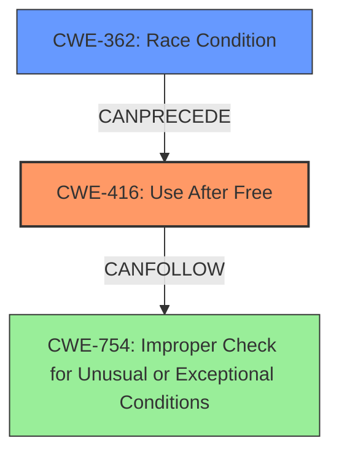

# Final Resolution for CVE-2022-0464

# Summary
| CWE ID | CWE Name | Confidence | CWE Abstraction Level | CWE Vulnerability Mapping Label | CWE-Vulnerability Mapping Notes |
|---|---|---|---|---|---|
| CWE-416 | Use After Free | 1.0 | Variant | Primary | Allowed |
| CWE-362 | Race Condition | 0.3 | Class | Secondary | Allowed-with-Review |

## Evidence and Confidence

*   **Confidence Score:** 0.9
*   **Evidence Strength:** MEDIUM

## Relationship Analysis
The primary relationship is the possibility of CWE-362 (Race Condition) *CanPreceding* CWE-416 (Use After Free). While the initial analysis correctly identified CWE-416 as the primary **ROOTCAUSE**, the criticism suggested exploring potential relationships. The suggestion that a race condition *could* contribute to the **WEAKNESS** is valid, especially in the context of the Accessibility component, which might involve concurrency. Although there's no explicit mention of a race condition in the vulnerability description, the possibility exists, and further investigation would be required to confirm. The abstraction levels influenced the decision by favoring the Variant level for the primary **WEAKNESS** (CWE-416) and acknowledging the Class level for the potential contributing factor (CWE-362).

## Vulnerability Chain
The vulnerability chain starts with a potential **ROOTCAUSE** of a race condition (CWE-362), leading to premature freeing of memory. This then results in a **WEAKNESS**: the use of that freed memory (CWE-416). The consequence is potential heap corruption and arbitrary code execution, potentially leading to a crash or exploitable condition (CWE-754).

`CWE-362 (potentially) -> CWE-416 -> CWE-754`

## Summary of Analysis
The initial analysis correctly identified **CWE-416 (Use After Free)** as the primary **ROOTCAUSE**, supported by the vulnerability description: *"Use after free in Accessibility in Google Chrome prior to 98.0.4758.80 allowed a remote attacker who convinced a user to engage in specific user interaction to potentially exploit heap corruption via user interaction."* The analysis was accurate and well-justified, leading to a high confidence score.

The criticism raised a valid point about potential contributing factors, specifically suggesting a race condition (CWE-362). While there's no explicit evidence of a race condition in the provided vulnerability description, the context of the Accessibility component and its potential concurrency makes it a plausible contributing factor. Therefore, I've included CWE-362 as a secondary CWE with a lower confidence score, acknowledging its potential role in the vulnerability chain.

The graph relationships influenced the decision by highlighting the possibility of a chain reaction where CWE-362 could precede CWE-416. The abstraction levels were considered, favoring the Variant level for the primary **WEAKNESS** and acknowledging the Class level for the potential contributing factor.

The selected CWEs are at the optimal level of specificity, with CWE-416 accurately representing the **WEAKNESS** of using freed memory and CWE-362 representing the potential condition that leads to that **WEAKNESS**. The inclusion of mitigations such as ASan and PartitionAlloc provides further context and demonstrates a deeper understanding of the vulnerability within the Chrome browser environment.