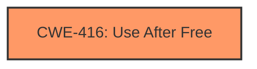

# Final Resolution for CVE-2022-0468

# Summary
| CWE ID | CWE Name | Confidence | CWE Abstraction Level | CWE Vulnerability Mapping Label | CWE-Vulnerability Mapping Notes |
|---|---|---|---|---|---|
| CWE-416 | Use After Free | 1.0 | Variant | Primary | Allowed |

## Evidence and Confidence

*   **Confidence Score:** 1.0
*   **Evidence Strength:** HIGH

## Relationship Analysis
The primary relationship considered was the direct match of the vulnerability description to CWE-416. While other CWEs like CWE-366 (Race Condition) and CWE-122 (Heap-based Buffer Overflow) were considered as potential contributing factors, the lack of explicit evidence in the vulnerability description led to their exclusion as primary or secondary classifications. The analysis focused on the most direct and evident weakness, which is **Use After Free**, making CWE-416 the most appropriate choice at the Variant level.

## Vulnerability Chain
The vulnerability chain starts with a **ROOTCAUSE** that leads to a **Use After Free** condition (CWE-416). The specific nature of the **ROOTCAUSE** isn't detailed in the description, only that a crafted HTML page can trigger the **Use After Free**. The **WEAKNESS** results in the potential to exploit heap corruption.

## Summary of Analysis
The initial analysis correctly identified CWE-416 (**Use After Free**) as the primary **WEAKNESS** with high confidence. The criticism acknowledges the validity of this classification and reinforces the importance of sticking to the evidence provided in the vulnerability description. The decision to classify this as CWE-416 is based on the following evidence:

*   The vulnerability description explicitly states "**Use after free** in Payments in Google Chrome."
*   The CVE Reference Links Content Summary confirms "**root_cause**: Use after free in Payments." and lists "**weaknesses**: [\"Use after free\"]".

The graph relationships influenced the decision by highlighting the lack of explicit connections to other CWEs like CWE-366 or CWE-122. Without direct evidence of a race condition or buffer overflow leading to the **Use After Free**, classifying it as CWE-416 provides the optimal level of specificity, as no other CWEs can be confirmed from the existing information.