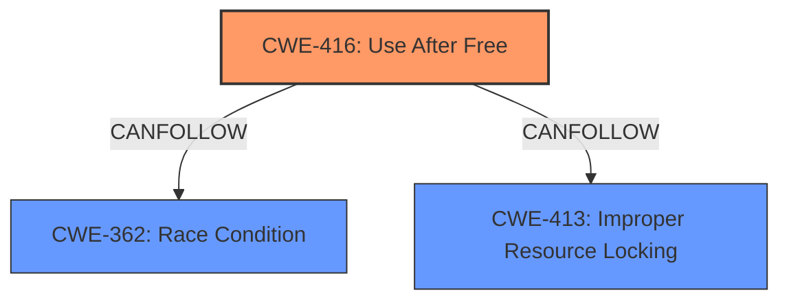

# Final Resolution for CVE-2022-0469

# Summary
| CWE ID | CWE Name | Confidence | CWE Abstraction Level | CWE Vulnerability Mapping Label | CWE-Vulnerability Mapping Notes |
|---|---|---|---|---|---|
| CWE-416 | Use After Free | 1.0 | Variant | Allowed | Primary CWE. Exploitation occurs via crafted HTML. Mitigations include setting freed pointers to NULL, although effectiveness varies. Often part of a chain. For example, race conditions can lead to use-after-free. Specifically, after memory is freed, it could be reallocated for a different purpose. Then, when the original, dangling pointer is used, it corrupts this newly allocated memory region. |

## Evidence and Confidence

*   **Confidence Score:** 1.0
*   **Evidence Strength:** HIGH

## Relationship Analysis
The primary relationship is that CWE-416 (Use After Free) is a variant-level CWE, making it a good fit for describing the specific nature of the vulnerability. The criticism suggests considering that CWE-416 often exists within a chain of vulnerabilities. While not explicitly stated in the description, a race condition (CWE-362) or improper resource locking (CWE-413) could potentially precede the **use-after-free**. However, without further evidence, focusing on CWE-416 as the direct cause is most appropriate.

## Vulnerability Chain
The vulnerability chain starts with a crafted HTML page that triggers the **use-after-free** condition in the Cast feature of Google Chrome. The root cause is the improper management of memory, specifically the failure to prevent access to freed memory. This leads to **heap corruption** because the freed memory might be reallocated and then corrupted when the original dangling pointer is used. The impact is that a remote attacker can potentially exploit the **heap corruption** to execute arbitrary code.

## Summary of Analysis
The initial analysis correctly identifies CWE-416 (Use After Free) as the primary weakness. The vulnerability description explicitly states "**use after free**," providing direct evidence for this classification. The criticism's suggestion to consider potential vulnerability chaining is valid, but without specific evidence of a preceding race condition or improper resource locking, focusing on CWE-416 as the direct cause is most appropriate. The chosen CWE is at the optimal level of specificity (Variant) and aligns with MITRE's mapping guidance. The confidence level remains at 1.0 due to the strong evidence supporting the classification. The phrase "**use after free** in Cast in Google Chrome prior to 98.0.4758.80 allowed a remote attacker who convinced a user to engage in specific interactions to potentially exploit **heap corruption** via a crafted HTML page" is the primary evidence.