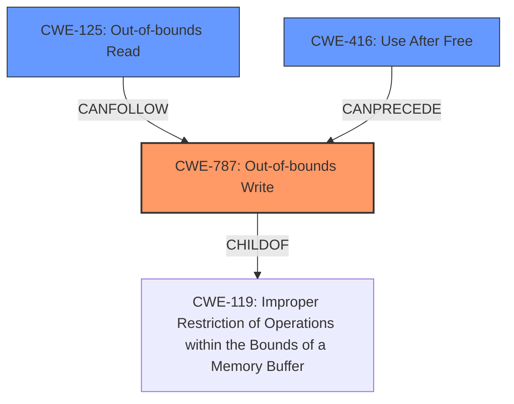

# Final Resolution for CVE-2022-0470

# Summary
| CWE ID | CWE Name | Confidence | CWE Abstraction Level | CWE Vulnerability Mapping Label | CWE-Vulnerability Mapping Notes |
|---|---|---|---|---|---|
| CWE-787 | Out-of-bounds Write | 0.9 | Base | Primary | Allowed |
| CWE-125 | Out-of-bounds Read | 0.6 | Base | Secondary | Allowed |
| CWE-416 | Use After Free | 0.5 | Variant | Secondary | Allowed |

## Evidence and Confidence

*   **Confidence Score:** 0.8
*   **Evidence Strength:** MEDIUM

## Relationship Analysis
The primary relationship that impacted the decision was the parent-child relationship between CWE-787 (**Out-of-bounds Write**) and CWE-119 (Improper Restriction of Operations within the Bounds of a Memory Buffer). CWE-787 is a child of CWE-119, providing a more specific classification for the **out-of-bounds write**. The selection of CWE-125 (**Out-of-bounds Read**) and CWE-416 (Use After Free) was influenced by the potential for these weaknesses to be related to **heap corruption**, although the evidence for these is weaker. The base abstraction level of CWE-787 and CWE-125 makes them preferable to class or pillar level CWEs.

## Vulnerability Chain
The vulnerability chain starts with an **out-of-bounds write** (CWE-787) in the V8 engine, potentially triggered by a crafted HTML page. This **write** can lead to **heap corruption**. A potential consequence of the **out-of-bounds write** is an **out-of-bounds read** (CWE-125), allowing an attacker to read sensitive information. The **heap corruption** could also be caused by a **use-after-free** condition (CWE-416).

## Summary of Analysis
The initial analysis correctly identified CWE-787 (**Out-of-bounds Write**) as the primary **weakness** due to the explicit mention of "out of bounds memory access" and "heap corruption" in the vulnerability description. The criticism correctly points out that the justification for CWE-125 (**Out-of-bounds Read**) and CWE-416 (Use After Free) is weaker, as they are based on potential consequences and causes rather than direct evidence. The evidence is "Out of bounds memory access in V8 in Google Chrome prior to 98.0.4758.80 allowed a remote attacker to potentially exploit heap corruption via a crafted HTML page."

The graph relationships influenced the selection by highlighting the parent-child relationship between CWE-787 and CWE-119, ensuring the most specific CWE is chosen. The abstraction levels were also considered, favoring base-level CWEs over class or pillar-level ones.

The selected CWEs are at the optimal level of specificity based on the available evidence. While other CWEs like CWE-843 (Type Confusion) and CWE-823 (Use of Out-of-range Pointer Offset) were considered, the current evidence does not strongly support their inclusion. The confidence score has been adjusted to 0.8 to reflect the weaker evidence for the secondary CWEs.